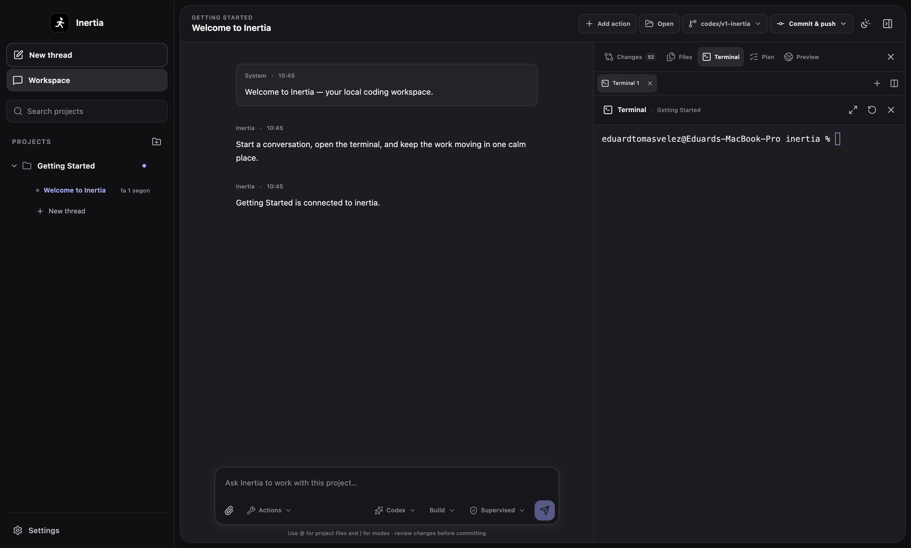
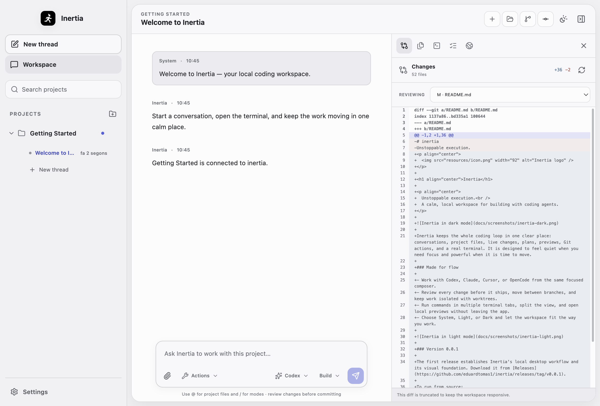

<p align="center">
  
</p>

<h1 align="center">Inertia</h1>

<p align="center">
  Unstoppable execution.<br />
  A calm, local workspace for building with coding agents.
</p>



Inertia keeps the whole coding loop in one clear place: conversations, project files, live changes, plans, previews, Git actions, and a real terminal. It is designed to feel quiet when you need focus and powerful when it is time to move.

### Made for flow

- Work with Codex, Claude, Cursor, or OpenCode from the same focused composer.
- Review every change before it ships, move between branches, and keep work isolated with worktrees.
- Run commands in multiple terminal tabs, split the view, and open local previews without leaving the app.
- Choose System, Light, or Dark and let the workspace fit the way you work.



### Version 0.0.1

The first release establishes Inertia's local desktop workflow and its visual foundation. Download it from [Releases](https://github.com/eduardtomas1/inertia/releases/tag/v0.0.1).

To run from source:

```bash
npm install
npm run dev
```

Inertia is available under the [MIT License](LICENSE).
