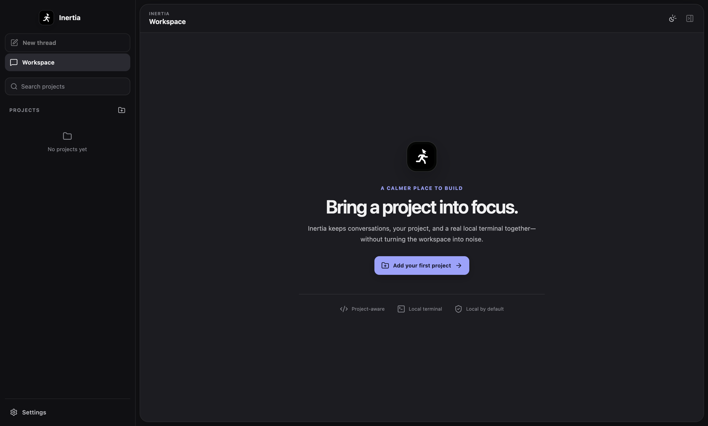
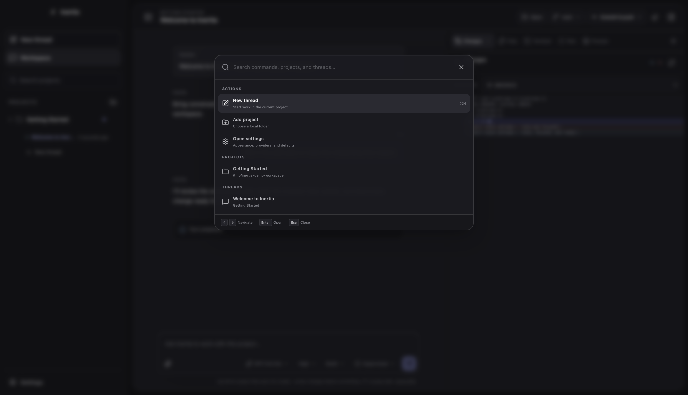
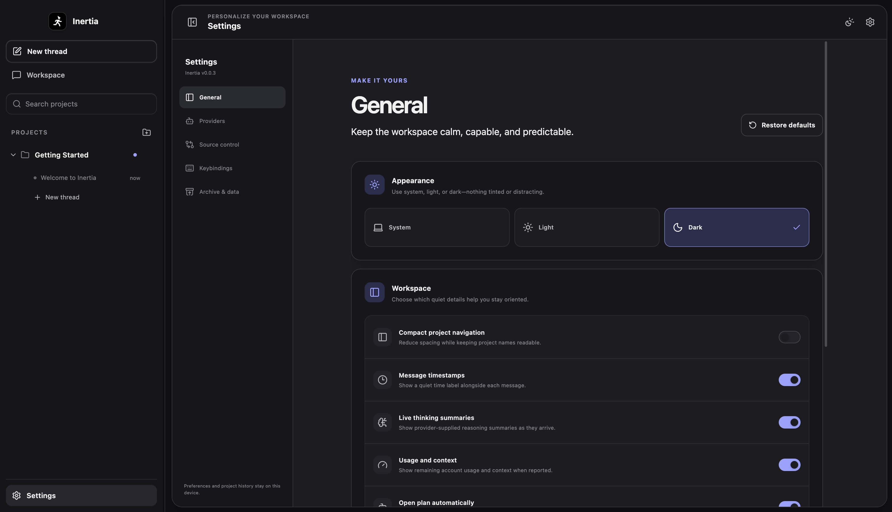

<p align="center">
  
</p>

<h1 align="center">Inertia</h1>

<p align="center">
  Unstoppable execution.<br />
  A calm desktop workspace for building with coding agents.
</p>


Inertia keeps the coding loop in one clear place: agent conversations, project files, live changes, plans, previews, Git actions, and a real terminal. It stays spacious and quiet when you need focus, then puts the right controls close by when it is time to move.



### Made for flow

- Connect locally installed Codex, Claude, Cursor, or OpenCode accounts without leaving the app.
- Choose from the models and reasoning levels your provider actually offers.
- See provider-supplied thinking summaries, remaining context, and account usage as work progresses.
- Work with streaming Codex conversations, resumable threads, native plans, agent questions, and supervised approvals.
- Review changes line by line, ask or request revisions in place, add a selection to the next prompt, and safely revert only the selected edits.
- Generate concise agent summaries for each changed file and hunk before reading the full patch.
- Follow agents, checks, services, and source-control work from a compact Activity Center.
- Move between branches and keep parallel work isolated with worktrees.
- Keep terminal tabs alive while moving through Changes, Files, Plan, and Preview.
- Search commands, projects, and threads from one keyboard-friendly palette.
- Resize or collapse either side of the workspace whenever the conversation needs more room.
- Choose System, Light, or Dark with a restrained glass finish and clear contrast.


### Find anything without leaving the flow



### Settings that stay understandable



### Version 0.0.4

This release gives every supported agent a first-class runtime. Codex now runs through its app server, Claude through the Claude Agent SDK, Cursor through ACP, and OpenCode through its SDK—each with native sessions, streaming, approvals, questions, plans, reasoning, usage, and cancellation where the provider reports them. The local service now runs outside Electron's main process, can recover after a crash, and shuts down cleanly with the app. Provider metadata stays fresh across restarts, menus are easier to dismiss, and the frameless macOS header carries a sharper Inertia identity.

Download Inertia for macOS, Windows, or Linux from the [v0.0.4 release](https://github.com/eduardtomas1/inertia/releases/tag/v0.0.4). See the [changelog](CHANGELOG.md) for the useful details.

To run from source:

```bash
npm install
npm run dev
```

Inertia is available under the [Apache 2.0 License](LICENSE).
