<p align="center">
  
</p>

<h1 align="center">Inertia</h1>

<p align="center">
  Unstoppable execution.<br />
  A calm desktop workspace for building with coding agents.
</p>

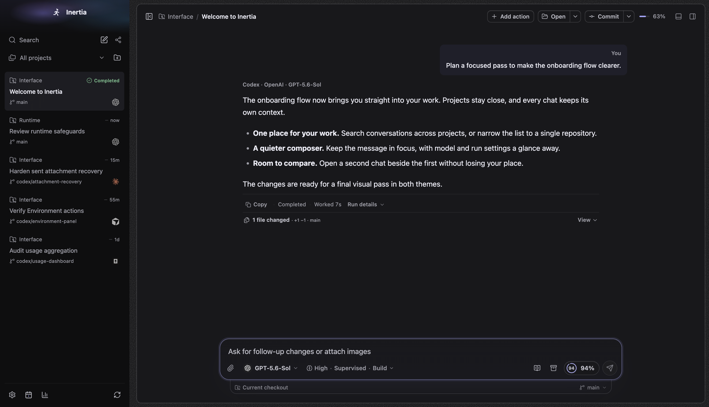

Inertia keeps the coding loop in one clear place: agent conversations, project files, live changes, plans, previews, Git actions, and a real terminal. It stays spacious and quiet when you need focus, then puts the right controls close by when it is time to move.

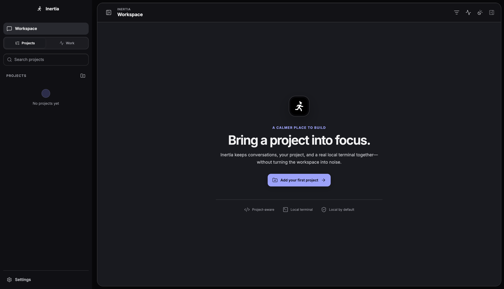

### The whole coding loop, without the noise

- Connect locally installed Codex, Claude, Cursor, Kimi Code, or OpenCode accounts without leaving the app.
- Find models quickly through a searchable provider-aware palette, then save complete harness, backend, model, and reasoning routes as Favorites.
- See provider-supplied thinking summaries, remaining context, and account usage through one compact context control.
- Work with streaming conversations, resumable sessions, native plans, agent questions, image, PDF, text, CSV, and Excel inputs, cancellation, and supervised approvals whenever the selected provider supports them; open goals and verified native sessions directly with `/goal` and `/resume`.
- Launch a saved Duo from one shared prompt into two independently named chats, each with its own project, model route, reasoning, and access mode, with an optional independent third-model judgment.
- Open any second chat beside the current one—even from another project—with its own transcript, draft, files, Git changes, terminal sessions, plan, and preview.
- Move up to eight chats into independent native windows with remembered bounds, optional always-on-top, and an explicit return to the main workspace while their agent work continues.
- Bring exact visible messages from another chat into the next request with a reviewable, bounded context packet whose source remains visible after reload.
- While an agent is running, press Enter to send an immediate text follow-up or Tab to queue it for the next completed turn. Each chat keeps its own visible FIFO queue across reloads and detached windows, with explicit send-now and remove controls; failed or cancelled work never consumes the queued draft.
- Keep up to 12 unfinished text prompts in a local stash with their exact harness, backend, model, and reasoning route, then restore one into either side of a split workspace without moving attachments or credentials.
- Save up to 30 reusable prompt presets, search and organize them, and insert one into the selected composer without sending it. Optional route binding stores only harness, backend, model, and reasoning identity—never attachments, chat context, endpoints, continuation state, or credentials.
- Start from a compact Environment summary with Changes, worktree, branch, Git actions, validated local servers, provider context, repository, editor, sent attachments, and delegated work, while keeping the full workspace tools one click away.
- Keep terminal tabs alive while moving through Changes, Files, Plan, and Preview.
- Continue an eligible native Codex, Claude, Cursor, Kimi Code, or OpenCode session in its owning integrated terminal only when Inertia can verify the exact saved identity, route, checkout, and process lifecycle.
- Receive quiet provider-scoped warnings when an authoritative five-hour or weekly quota reaches 25%, 15%, or 5% remaining.
- Generate a Discord release summary from the latest GitHub or GitLab release diff, grouped into improvements, implementations, bugs, and other changes.
- Recover local history from validated rotating SQLite backups, or use explicit native-dialog export and import flows when manual recovery is required.
- Open the optional Inertia Private Connect PWA through your private Tailscale network without exposing files, terminals, approvals, Git, provider settings, or Full Access to the browser.
- Search commands, projects, and threads from one keyboard-friendly palette.
- Resize or collapse either side of the workspace whenever the conversation needs more room.
- Pair System, Light, or Dark appearance with Inertia, Grove, Ocean, Ember, or Iris color themes, each tuned for clear semantic contrast.

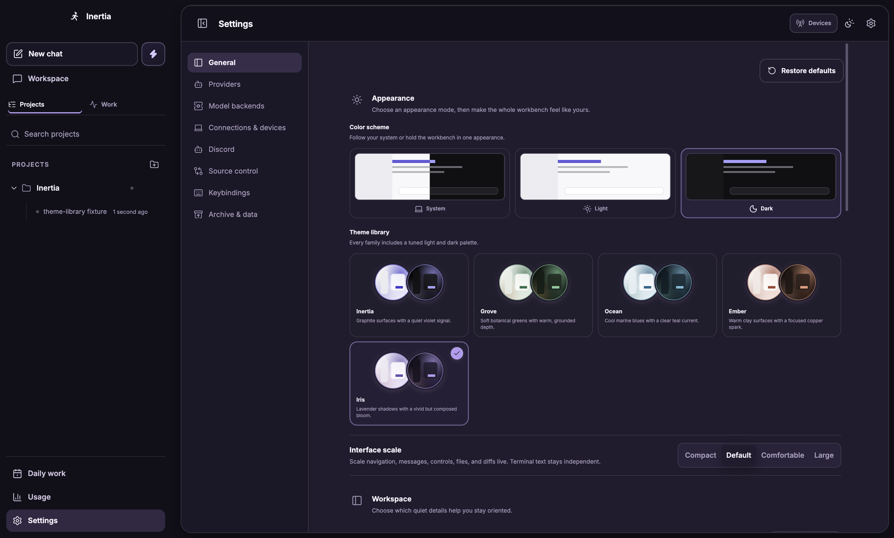

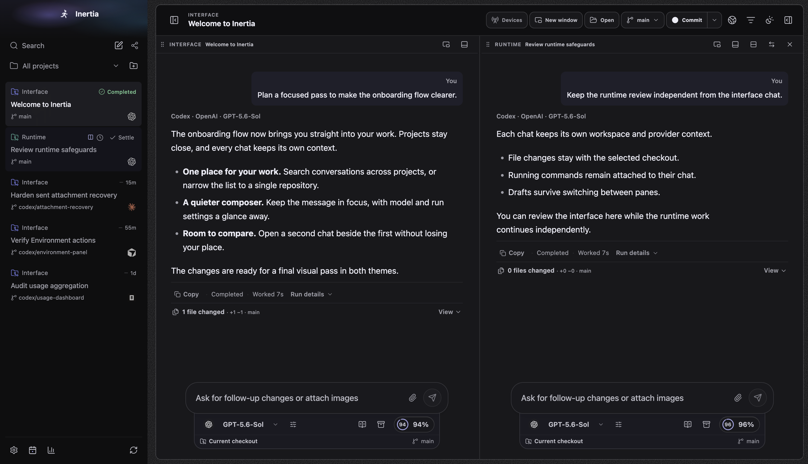

### One focused chat, its own window

Open a chat in a native window when it needs a separate screen or desktop space. The window keeps only that conversation, its transcript, and its one authoritative composer—no project sidebar or cross-chat controls. Text drafts move with the composer, while attachments, references, selected context, skills, route changes, and other transient state must be sent or removed before ownership can move. Closing the window leaves the chat and any active work alive; **Return chat to main window** docks it explicitly.

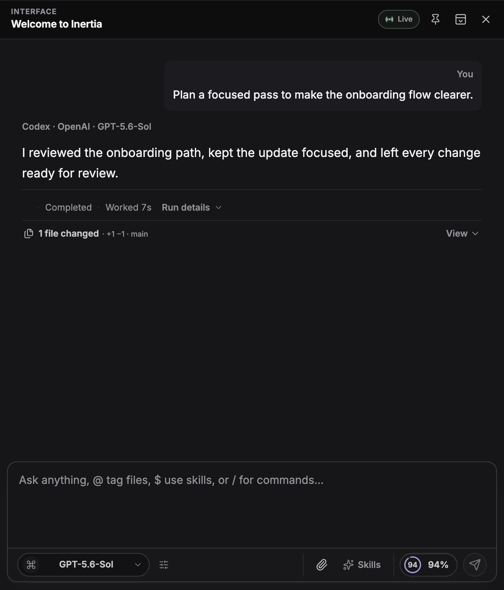

### Share only the context you choose

**Add context from another chat** opens a source-and-preview flow for selecting exact visible user or assistant messages. Inertia stores an immutable bounded packet with source provenance—not the source session, tools, reasoning, credentials, or an open-ended transcript—and shows it beside the request after sending. Different workspaces require an explicit acknowledgement because referenced files may not exist in the destination. Codex, Claude, Cursor, and OpenCode can request this same chooser through a provider-neutral host action, but the agent cannot browse chats or select the messages itself.

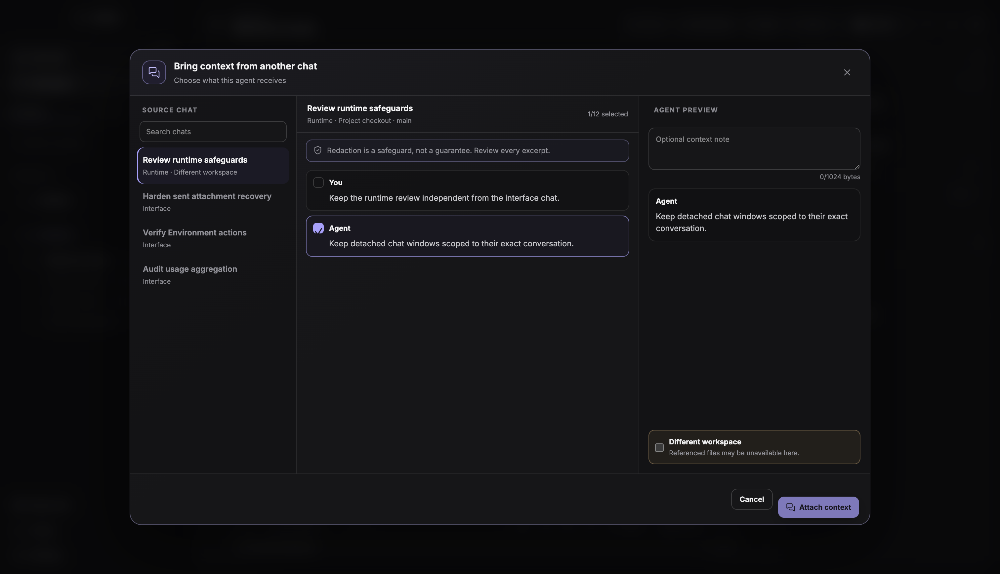

### Two perspectives, one prompt

The lightning action beside **New chat** opens a focused Duo setup. Give both chats a name, choose their projects and complete provider routes, then send one shared prompt to both. Inertia creates the conversations safely, starts the acknowledged pair together, and opens the results in the split workspace without pretending that their sessions, permissions, tools, or working directories are shared.

Save one bounded default Duo for the combinations you use often. The preset stores only safe route identity and chat names—not prompts, projects, credentials, or provider-specific secrets—and Inertia warns when both agents will edit the same checkout.

When you explicitly enable third-model comparison, Inertia locks the two source chats and their first Duo turns against deletion, waits for both turns to reach authoritative terminal states, then starts a separately configured judge chat. The compact judge disclosure stays out of the way during setup. If you remain on that Duo, the completed judge becomes the primary chat automatically; newer navigation, split changes, Settings, or source follow-ups cancel the handoff. The judge receives only the bounded shared brief, each source status, and attributed visible assistant output—not source sessions, tools, permissions, credentials, attachments, reasoning, or hidden context. Failed or interrupted judgments are never retried silently; you can retry explicitly or cancel the lock.

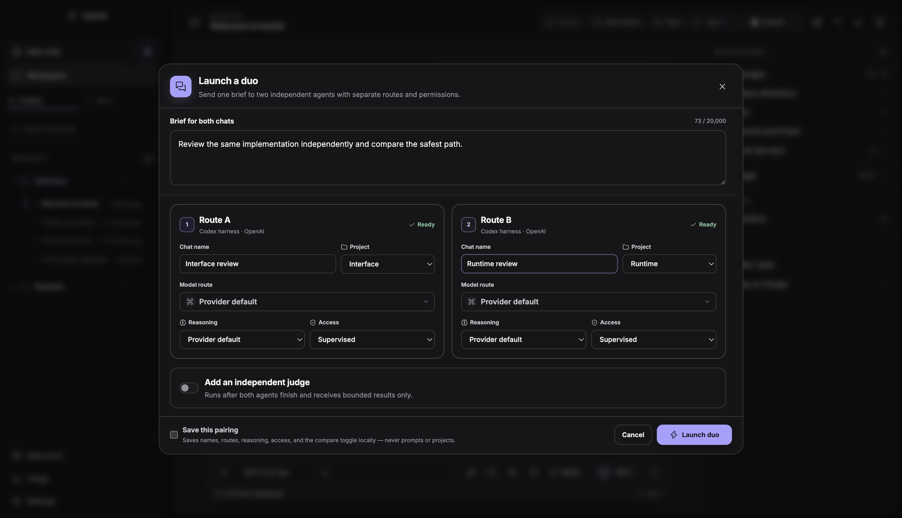

### Review changes without losing context

- Read every file and hunk in a focused diff view, then mark progress as you review.
- Review modified files across a project-root repository and nested module repositories without flattening their Git identity.
- Use the branch-aware header action or complete Git menu for Commit, Pull, Push or Publish, and Pull request, with ahead/behind state and exact explanations when an action is unavailable.
- Select a line range to ask a read-only question beside the matching hunk, request a focused revision, save a note, or carry the exact context into the next prompt.
- Generate a concise agent summary for every current file and hunk, including evidence-backed hints for areas worth extra attention.
- Revert only selected changed lines across staged, unstaged, and mixed files with current-state validation, a recovery backup, and Undo.
- Commit only the exact prospective content you reviewed and the paths you chose, while leaving unrelated staged work alone and seeing which selected hunks remain unreviewed.

Nested module repositories keep their own review marks, notes, questions, and selective reverts. Agent revision requests and generated whole-repository summaries remain limited to the project-root repository because their recovery checkpoint must cover the same Git worktree; Inertia explains that boundary instead of presenting nested repositories as temporarily unavailable.

### Conversations that explain the work

- The transcript reads like one calm engineering document: a light request, an understandable workstream, a clean final answer, and a quiet supporting ledger.
- Responses render polished Markdown with safe project links, highlighted code, copy and wrap controls, and tables that can be copied as Markdown or CSV.
- Provider updates and compact tool activity appear in the order they happened. Only adjacent calls fold together, so a new update naturally starts the next stretch of work.
- The search-first Work sidebar groups recent, earlier, done, and snoozed tasks into compact rows with their genuine provider mark, repository, branch, status, and time.
- Sent images, documents, CSV files, and Excel workbooks stay visible beside the message that owns them after sending, reload, and restart; every accepted type has a private preview, with bounded worksheet tables for `.xlsx` and `.xls`.
- Open project-file references from prose or fenced-code labels directly in Files, then edit supported text files in a focused dialog that refuses to overwrite content changed since it was opened.
- Reasoning summaries, approvals, questions, warnings, final answers, and turn checkpoints stay together in the same chronological turn.
- Codex-native goals and Inertia-local objectives keep their source visible. Native goals can start before the first ordinary message, continue across automatic turns, and resume truthfully after Stop or restart, while next-turn skills stay route-bound and never expose provider paths or contents.
- Each completed request keeps its original agent, model backend, and model attribution together with a turn-specific before-and-after Git record, when available, that remains useful after the workspace moves on.
- Completed work logs can collapse quietly; failures and important warnings never disappear inside a successful summary.
- Long transcripts keep stable rows, use a responsive longer minimap with richer previews of distant requests, and load heavier detail only when opened, while bounded runtime updates resume safely after a restart.
- The transcript follows live work only while you are near the bottom, so reading earlier context is not interrupted.
- New final answers can settle at the beginning of the viewport for immediate reading without reclaiming the transcript after deliberate navigation; **Jump to completed answers** controls the behavior in Settings.
- Provider-reported delegated work remains attached to its parent turn with provider and harness identity, live elapsed time, hierarchy, progress, and terminal outcome. **Guide parent** prepares an ordinary parent follow-up, while direct Stop appears only for an exact live Claude Agent SDK task.

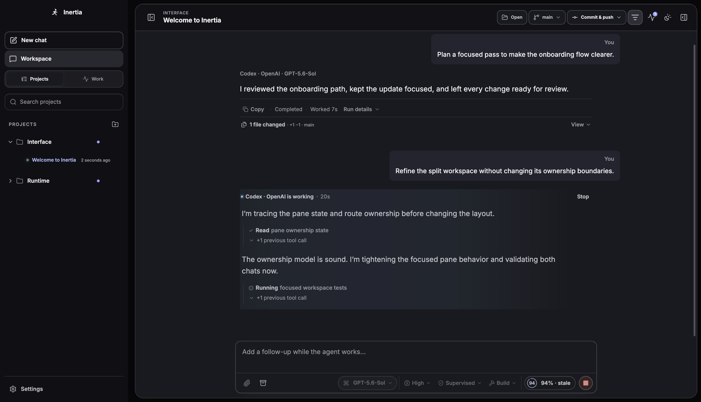

### Truthful goals, skills, and delegated work

- Codex-native goals and Inertia-local objectives are labeled separately, persisted across reconnects, and never substituted for one another.
- Skills are discovered from the selected Codex or Claude route and attached only to the next turn after privileged revalidation; typing `$` autocompletes only the enabled names reported for that route, and the renderer never receives their filesystem path or content.
- Delegated agent trees preserve provider-reported parentage, status, ownership, route identity, and elapsed time. Compact views keep separate live or failed branches represented; Guide parent prepares an ordinary supported follow-up, and direct Stop appears only for an exact live Claude Agent SDK task.
- Codex, Claude, Cursor, and OpenCode chats can use host-owned tools to list, inspect, create, dispatch, follow up, observe, stop, and archive independent top-level Inertia chats after exact user approval. Inertia injects a scoped bridge through each provider's audited native tool or MCP surface, derives project authority locally, bounds recursion and per-turn work, revokes authority at turn settlement, and persists provenance without transcripts, credentials, or provider sessions.

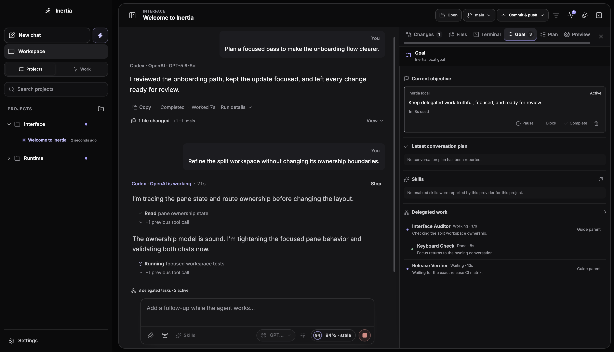

### Keep the workspace moving

- The Work sidebar and transcript keep active, blocked, completed, and failed agent work close to the conversation that owns it, while Environment retains the exact Stop, preview, acknowledge, and dismiss controls for work that still needs action.
- Native previews, terminals, files, and Git reviews stay scoped to their owning chat when two different projects share the split workspace.
- App turns, native provider terminals, project actions, reviews, and Git operations share canonical checkout authority, so independent entry points cannot silently edit the same worktree at once.
- Work-first navigation surfaces chats that are running, waiting for approval or input, completed in the background, unread, failed, or settled.
- Related checkouts and worktrees can group by their real Git identity, while repository folders remain clearly labeled and independently controllable.
- Move between branches, use isolated worktrees for parallel threads, and open detected service previews from their owning workspace.

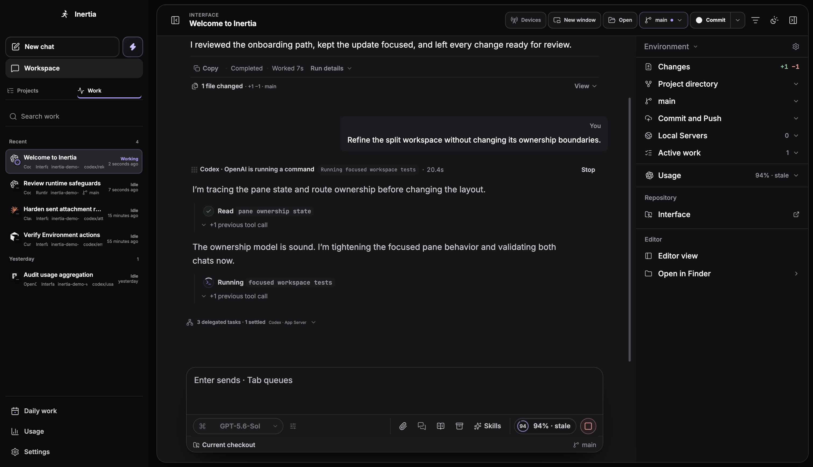

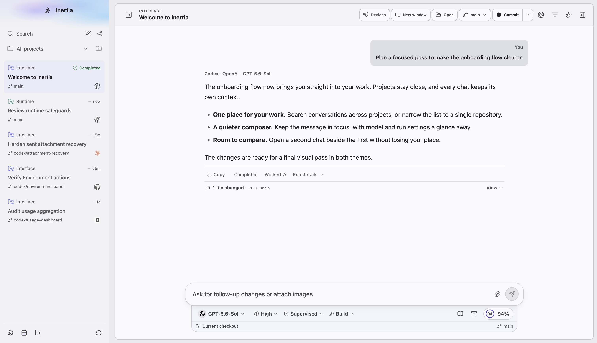

### Find anything without leaving the flow

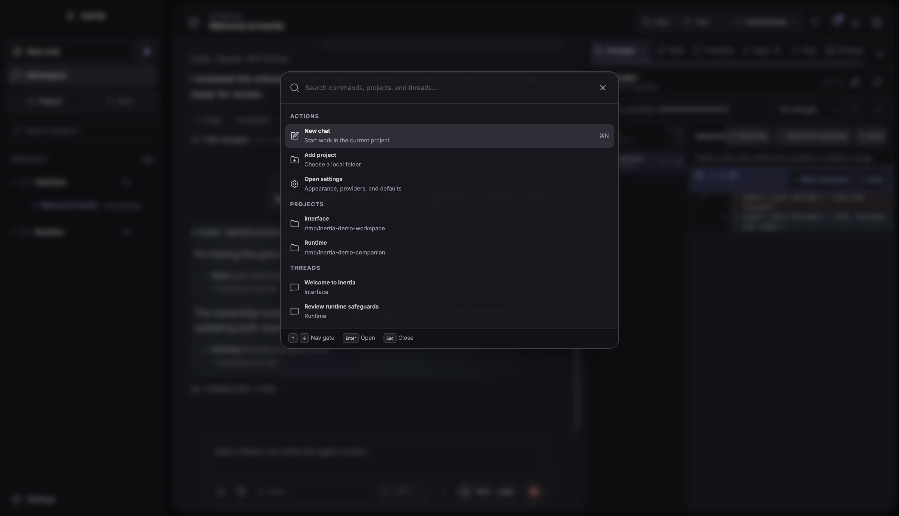

### Understand local agent usage without invented numbers

Usage turns locally recorded terminal-turn token snapshots into a clear 7-, 30-, or 90-day view. Compare measured provider totals, explore daily activity, move between every retained Daily Work date, and switch the breakdown between models and days while coverage labels explain which turns expose enough data to count. Dates before Daily Work existed remain unavailable because Inertia does not invent historical records retroactively.

Inertia does not estimate price from a model name or send usage to a hosted analytics service. When providers do not expose cost, the Cost control stays unavailable and says why. Provider account windows remain separate in Environment because context usage, account quota, and historical processed tokens are different measurements.

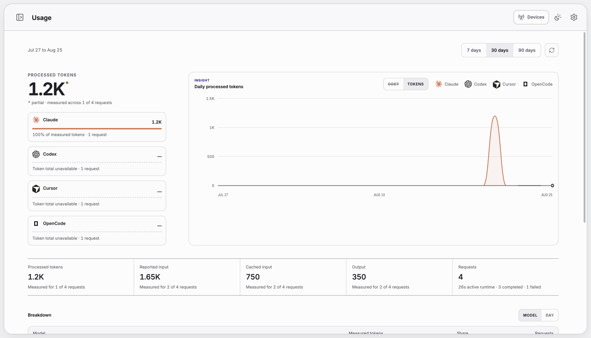

### Settings that stay understandable

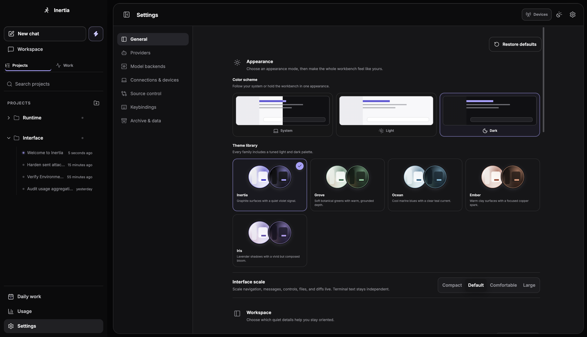

- Create, test, enable, and choose model backend profiles without mixing them into the agent harness that runs the conversation.
- See when a supported provider CLI has an update and run the official update flow without leaving Inertia.
- Use native Kimi Code, the built-in Kimi coding profile through the Claude harness, or a compatible custom endpoint with explicit models and routing.
- Existing conversations keep their original execution route. Supported same-backend model changes can continue in place; changing the harness or backend opens a clearly separated new chat.
- Choose whether Inertia opens on the compact Environment summary or the full workspace tools; fresh installs use Environment, and no decorative Ready label competes with its actionable rows.

### Discord release summaries

Open **Settings → Discord** to configure release posts. Add the public GitHub or GitLab repository URL, then paste a Discord incoming webhook URL from the target channel's **Edit Channel → Integrations → Webhooks** settings. Inertia stores that webhook only in the operating system credential vault; the renderer and SQLite database receive configured/unconfigured state, never the saved URL. Press **Generate** to compare the latest release tag with the previous one and post a bounded local diff summary with **Millores**, **Implementacions**, **Bugs**, and **Altres**. Empty Discord settings stay blank and do not block startup.

### Private Connect, without surrendering the desktop

Inertia Private Connect is an opt-in, Tailscale-only companion for a running desktop. Inertia keeps the authority, binds its gateway to loopback, and asks the local Tailscale CLI to expose only that gateway through Tailscale Serve. There is no VPS, relay, Cloudflare, Clerk, custom domain, public fallback, or separate companion artifact.

Open **Settings → Connections & devices** to enable it, create a five-minute fragment-only pairing link or QR code, and approve the browser from the desktop. Each paired device receives an explicit Monitor or Collaborate grant for selected projects. Monitor is read-only; Collaborate can send a prompt to an existing supervised conversation, answer non-secret agent questions, and stop an active run.

The desktop must remain online and unlocked. Locking it pauses live access but preserves a non-expired encrypted browser grant for reconnect after unlock; disabling Private Connect revokes active sessions. Project scope, access level, expiry, and revocation remain editable from the desktop.

The packaged React PWA never receives credentials, files, terminals, approvals, provider settings, Git operations, secrets, Full Access, or arbitrary command execution. Pairing is single-use and device approval is explicit. App cookies are `Secure`, `HttpOnly`, and `SameSite=Strict`; state-changing requests require a same-origin check and CSRF token, while WebSocket access uses a short-lived single-use ticket. Transcript output is sanitized and bounded before it leaves the supervised runtime.

See the [Private Connect guide](docs/PRIVATE_CONNECT.md), [security model](docs/PRIVATE_CONNECT_SECURITY.md), and [internals](docs/PRIVATE_CONNECT_INTERNALS.md). The implemented [database recovery model](docs/DATABASE_RECOVERY.md), [data-throughput design](docs/DATA_THROUGHPUT.md), [renderer isolation](docs/RENDERER_ISOLATION.md), and [security boundary coverage expectations](docs/SECURITY_BOUNDARY_COVERAGE.md) are documented separately.

### Provider-native, local by default

Inertia uses the coding tools and accounts already installed on your computer. Codex, Claude, Cursor, Kimi Code, and OpenCode keep their own sessions, authentication, models, approvals, plans, reasoning, usage, and cancellation behavior; when a provider does not expose something, Inertia says so instead of imitating it.

Provider account credentials remain in each provider's own storage. Credentials added for custom model backends are encrypted through the operating system's secure credential storage; only non-secret profile settings live in Inertia's local database. Inertia stores workspace history and preferences locally, and its optional runtime diagnostics exclude prompts, source, token values, credentials, and connection capabilities.

Access mode is a real safety boundary. Supervised keeps the selected provider's approval flow active. Auto-edit pre-approves supported file edits while leaving other provider permissions in place. Full Access is an explicit opt-in that asks the provider for its unrestricted mode—for example, Codex uses its danger-full-access sandbox/approval configuration and Claude uses its `--dangerously-skip-permissions` mode. Use it only in a workspace where you trust the request, repository, and commands the agent may run.

### Get started

Download the build for your platform, add a project, then open **Settings → Providers**. Inertia checks Codex, Claude, Cursor, Kimi Code, and OpenCode locally and shows the exact Install, Connect, or Refresh action each route needs. Authentication stays in the provider's own official flow.

You only need one ready provider to begin. If none is available yet, projects, files, Git review, and terminals still work; agent runs remain disabled with a route-specific explanation instead of failing after you send a message.

To run Inertia from source, use Node.js 22.13 or newer in the Node 22 line:

```bash
npm ci
npm run dev
```

Contributors can run the complete local gate with `npm run check`. It covers architecture, lint, type safety, unit and integration tests, and the production bundle.

After a production build, a credential-free headless readiness report is also
available without starting Electron or opening a listener:

```bash
npm run --silent status:runtime -- --cwd /path/to/project --pretty
```

The JSON reports platform and workspace access, installation/protocol checks
for supported provider CLIs, and detected source-control kinds. It never checks
provider authentication, exposes executable paths, or claims mutation support
for detected non-Git systems.

### Troubleshooting

If something goes wrong, first refresh the affected provider in **Settings → Providers**. For a reproducible app or runtime problem, open **Settings → Runtime diagnostics**, choose **Copy diagnostic report**, review the report once more, and attach it to the [public bug form](https://github.com/eduardtomas1/inertia/issues/new?template=bug_report.yml). The built-in report excludes prompts, source content, token values, credentials, and provider capabilities; do not substitute raw logs, databases, or unredacted diagnostic archives.

Report suspected vulnerabilities privately through the [security policy](SECURITY.md), never through a public issue.

### Version 0.0.40

Chats can now move into independent native windows, bring exact reviewed messages from another conversation, and—after explicit approval—let Codex, Claude, Cursor, or OpenCode coordinate independent top-level Inertia chats through bounded host-owned tools. Drafts, context, ownership, access, and provider sessions remain tied to the exact conversation rather than being treated as shared.

Native Kimi Code joins the provider catalog, provider runtimes gain stricter lifecycle and cumulative-output boundaries, and sent images, PDFs, text, Markdown, JSON, CSV, and Excel workbooks retain private bounded previews. Linux can recover exact runtime-owned processes after a crash without guessing by name or workspace.

The responsive composer, explicit skill tokens, Claude sign-in, Markdown navigation recovery, Daily Work state, and truthful Send, Stop, follow-up, and Copy feedback complete the visible pass. This version is prepared through a release PR whose Windows job runs the same full gate as the exact-tag workflow before a tag exists.

Download [Inertia v0.0.40](https://github.com/eduardtomas1/inertia/releases/tag/v0.0.40):

| Platform | Download |
| --- | --- |
| macOS · Apple silicon | DMG or ZIP |
| Windows · x64 | Installer |
| Linux · x64 | AppImage |

Every release also includes `SHA256SUMS.txt`. See the [changelog](CHANGELOG.md) for the complete release story.

Inertia is available under the [Apache 2.0 License](LICENSE). Packaged builds also include the generated notices and original license texts supplied by their production dependencies and Electron.
