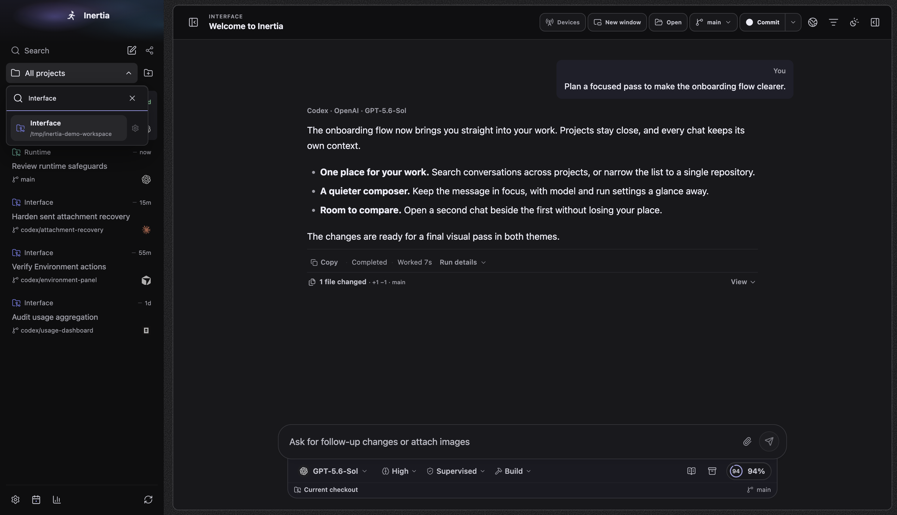

<p align="center">
  
</p>

<h1 align="center">Inertia</h1>
<p align="center">A calm desktop workspace for coding with agents.</p>


Inertia brings agent conversations, project files, Git review, and terminals into one local workspace. Use the coding accounts you already have with **Codex, Claude, Cursor, Gemini CLI, Kimi Code, or OpenCode**.

[Download the latest release](https://github.com/eduardtomas1/inertia/releases/latest) · [Installation guide](docs/INSTALLING.md) · [Changelog](CHANGELOG.md)

## Start working

1. Install the build for your platform: macOS, Windows, or Linux, on Intel/AMD or ARM64.
2. Add a local folder or clone a repository from its HTTPS or SSH Git URL.
3. Open **Settings → Providers**, connect a provider, and start a chat.

Search chats across projects, or narrow the list through **All projects**. Open project actions from the picker. Running, waiting, completed, and snoozed chats stay in the same sidebar.



## One workspace for the coding loop

- **Chat with context.** Attach images, documents, and spreadsheets; mention files; choose a model, reasoning level, and access mode. Send follow-ups immediately or queue them for the next turn.
- **Work side by side.** Open two chats in a split workspace, launch a saved Duo, or move a chat into its own window. Each keeps its own project, files, terminal, and draft.
- **Review and ship.** Inspect diffs, ask about selected code, commit chosen files, manage branches and worktrees, and check PR readiness.
- **Keep useful work close.** Pin or snooze tasks, save prompts, follow plans and goals, and inspect locally recorded usage.


## Local by default

History and preferences stay on your computer. Providers retain their own authentication; custom backend credentials use the operating system credential vault. Provider capabilities remain explicit, including approvals, cancellation, context, and usage.

**Supervised** keeps provider approvals active. **Auto-edit** allows supported file edits. **Full Access** is an explicit choice for a workspace and task you trust.

Optional [Private Connect](docs/PRIVATE_CONNECT.md) provides scoped access from another device over Tailscale while the desktop stays online. Read the [security model](docs/PRIVATE_CONNECT_SECURITY.md) for its boundaries.


## Run from source

Use Node.js **22.13 or newer in the Node 22 line**.

```sh
npm ci
npm run dev
```

Run `npm run check` for architecture, lint, type checking, unit/integration tests, and the production build. Desktop interaction tests run with `npm run test:e2e`.

See [AGENTS.md](AGENTS.md) for repository conventions and [RELEASING.md](docs/RELEASING.md) for packaging, Stable/Canary channels, signing, and updates.

## Help

Refresh a provider in **Settings → Providers** if it stops responding. For app problems, use **Settings → Runtime diagnostics → Copy diagnostic report**, review it, and attach it to a [bug report](https://github.com/eduardtomas1/inertia/issues/new?template=bug_report.yml). Avoid sharing raw logs, databases, or credentials.

[Apache 2.0](LICENSE). Packaged builds include third-party notices and dependency licenses.
