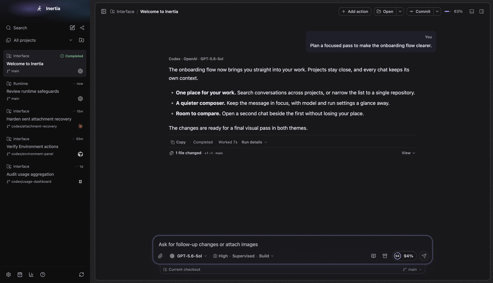
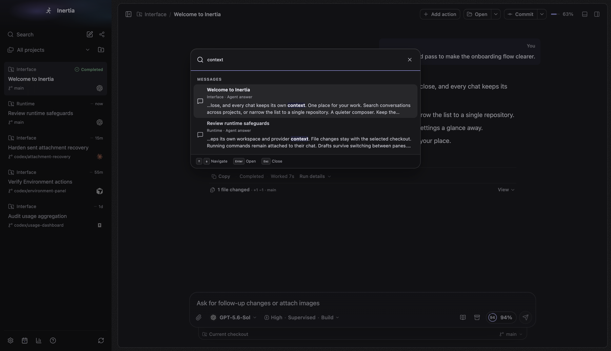
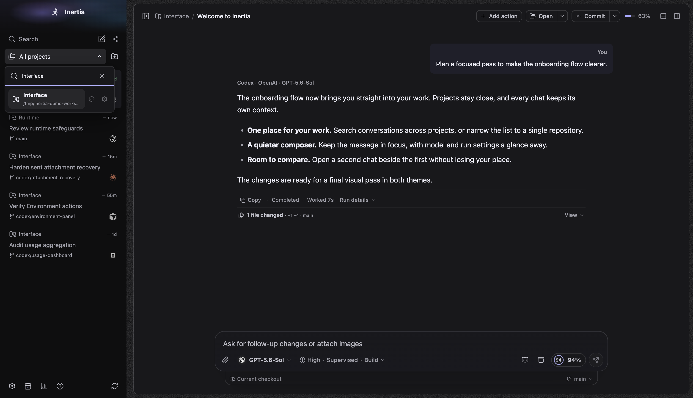
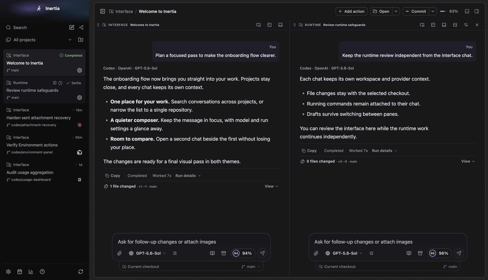
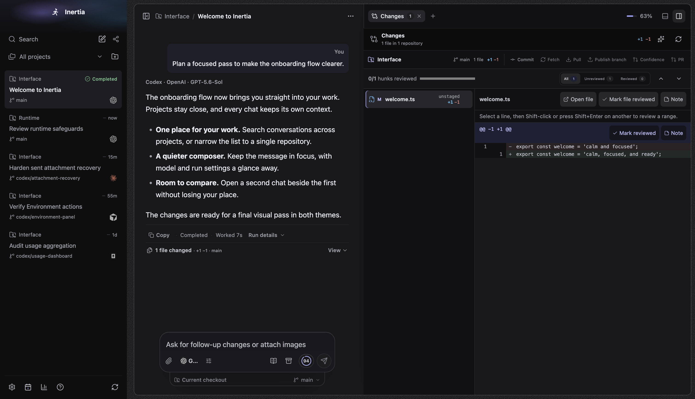
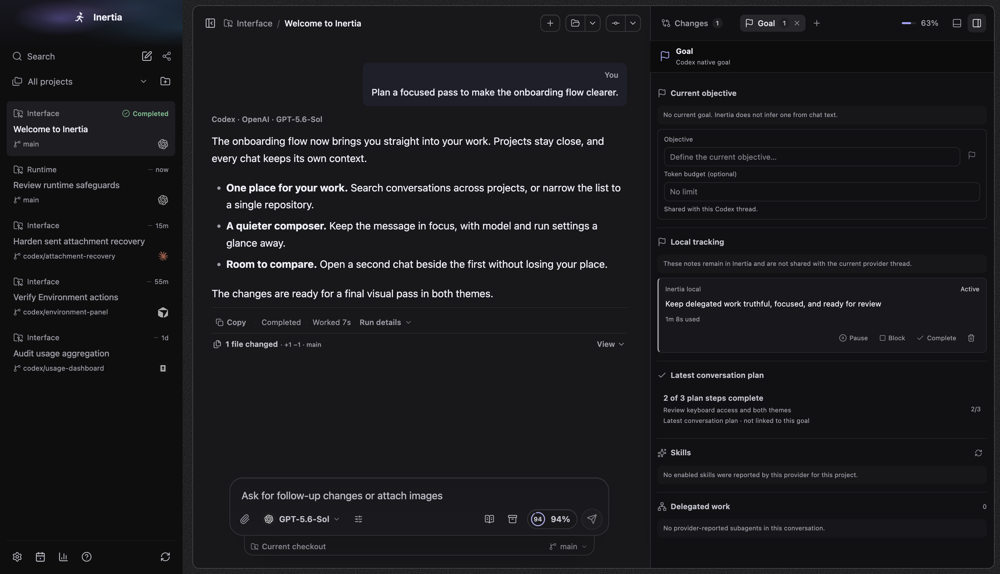
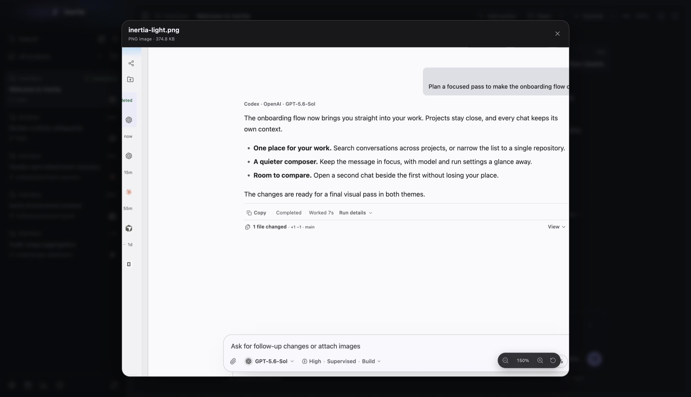
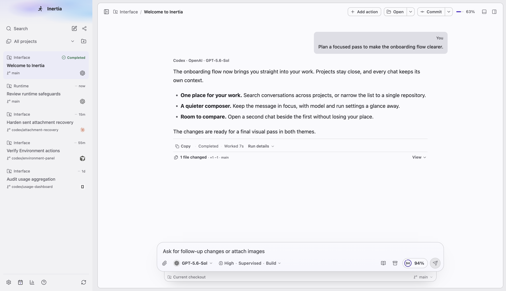

<p align="center">
  
</p>

<h1 align="center">Inertia</h1>
<p align="center">
  Unstoppable execution.<br />
  A calm desktop workspace for building with coding agents.
</p>

[Download the latest release](https://github.com/eduardtomas1/inertia/releases/latest) · [User guide](docs/user/README.md) · [Installation guide](docs/INSTALLING.md) · [Changelog](CHANGELOG.md)



Inertia brings agent conversations, project files, Git review, and terminals into one local workspace. Use the coding accounts you already have with **Codex, Claude, Cursor, Antigravity, Kimi Code, or OpenCode**.

## Start working

1. Install the build for your platform: macOS, Windows, or Linux, on Intel/AMD or ARM64.
2. Add a local folder or clone a repository from its HTTPS or SSH Git URL.
3. Open **Settings → Agents**, connect a provider, and start a chat.

Use **Ctrl/Cmd+K** to find commands, settings, projects, chats, and saved messages. Type at least two characters to search your messages and final agent answers across unarchived chats, then open a snippet to jump to its turn, including in a detached chat window. Message search matches literal phrases, ignores case, and shows up to 20 newest matches. Very large histories may return partial results, which the palette labels explicitly.



Choose **All projects** to search by name or folder path, filter the sidebar, or open project actions. Pin favourite projects and give each one a colour to keep them easy to find.

Choose **No project** in a new chat’s project selector, or **Start without a project** in the command palette, to work without opening a folder. Each chat gets a separate folder under Inertia’s runtime data directory (`scratch/<date>-<title>-<chat-id>`) when its workspace is first created. These are plain folders, with no automatic Git initialization. Deleting a chat keeps its files. Project-free chats have a separate **No project** sidebar section that appears only when it has chats; they stay out of the project list and filters.

When a stopped chat has a reported subscription reset time, the composer offers **Resume at reset** and **Snooze until reset**. Resuming is an explicit, cancellable action that survives restarts and rechecks the account, chat route and available quota before continuing once; if the provider has not reported new quota within an hour of the reset, nothing is sent and **Resume now** waits for you. Inertia must be running to resume; snoozing alone never sends a message. Supported native accounts include Codex, Claude, Cursor, Kimi Code and OpenCode Go. Other OpenCode backends, custom routes and the current Antigravity CLI do not expose compatible reset data; Limits explains availability for each provider. Accounts without enough identity information still support snoozing but cannot schedule automatic resume.



## One workspace for the coding loop

- **Chat with context.** Attach images, documents, spreadsheets, and plain-text source or configuration files; mention files or reference up to three chats, including this chat's own earlier messages with `@this-chat`; invoke skills with `$`; choose a model, reasoning level, and access mode. Send follow-ups immediately or queue them for the next turn.
- **Capture a window.** On Linux, use **Take reviewed screenshot** in the composer to select, crop, mask, and approve an image. Enable protected [Snapshots](docs/SNAPSHOTS_AND_COMPACTION.md) in **Settings → Devices & integrations → Snapshots** for foreground capture with inspectable accessibility context. Successful `/compact` operations retain a timeline receipt with provider-reported context counts.
- **Bring CLI conversations into Inertia.** In **Settings → Projects → CLI conversations**, choose **Import conversations…** to preview and import Codex or Claude Code text history for the selected project folder. The chat resumes its original native session; close that session in your terminal before continuing here. Archived Codex sessions continue in a new session with the imported messages as context. Already imported sessions are marked, including after restarting Inertia.
- **See visual replies.** Agents can answer with a chart, table, diagram, or mockup that appears in the chat above their reply, themed like the app and sandboxed so it cannot fetch from the network or reach your files. Open it full size from the page. See [Visual replies](docs/user/chats-and-agents.md#visual-replies).
- **Work side by side.** Drag chats into a split workspace with up to four panes, launch a saved Duo, or move a chat into its own window. Each keeps its own project, files, terminal, and draft.
- **Open the tools you need.** Choose Terminal in **Open a surface** for multiple terminal tabs and splits, or use the bottom dock. Find sent files in the dedicated **Attachments** surface. New chats start with the panel closed; each chat remembers its own surfaces and visibility.
- **Review and ship.** Inspect diffs, ask about selected code, commit chosen files, manage branches and worktrees, and check PR readiness.
- **Keep useful work close.** Pin or snooze tasks, save prompts, follow plans and goals, and inspect locally recorded usage.
- **Follow active work.** The Work tab shows activity and elapsed time for running threads, with a brief cue when a thread needs input or finishes. Choose a Working indicator in Settings for the Work tab and working cue; Automatic can also match individual tool and agent activity.
- **Optional desktop mascot.** Enable it in **Settings → Notifications → Desktop mascot** for a movable companion with progress, question, approval, and result previews in a compact bubble above its head. Pick up the character to move it between screens; it returns to its current activity when released and remembers its position. Click the bubble to open the relevant chat; right-click to pause or hide. Export a sprite template and preview your own artwork before applying it. Reduced motion uses still artwork. Wayland manages placement through the window manager.



Review changed files on the current branch, mark completed hunks, and commit only the paths you choose.



Keep an objective in view alongside the latest conversation plan. Goals distinguish provider-native controls from local tracking, so progress and available actions stay explicit.



Open image attachments without leaving the chat, zoom into details, and pan across larger images. Browse sent files in **Open a surface → Attachments**, with previews and a scrollable gallery.

See [supported attachment formats and provider limits](docs/ATTACHMENTS.md) for text/log encodings, source/configuration files, documents, and spreadsheets.



## Local by default

History and preferences stay on your computer. Providers retain their own authentication; custom backend credentials use the operating system credential vault. Provider capabilities remain explicit, including approvals, cancellation, context, and usage.

**Supervised** keeps provider approvals active. **Auto-edit** allows supported file edits. **Full Access** is an explicit choice for a workspace and task you trust.

Optional [Private Connect](docs/PRIVATE_CONNECT.md) provides scoped access from another device over Tailscale while the desktop stays online. Read the [security model](docs/PRIVATE_CONNECT_SECURITY.md) for its boundaries.



## Run from source

Use Node.js **22.13 or newer in the Node 22 line**.

```sh
npm ci
npm run dev
```

Run `npm run check` for architecture, lint, type checking, unit/integration tests, and the production build. Desktop interaction tests run with `npm run test:e2e`.

See [AGENTS.md](AGENTS.md) for repository conventions and [RELEASING.md](docs/RELEASING.md) for packaging, Stable/Canary channels, signing, and updates.

## Help

If an older Windows update leaves startup blocked by unconfirmed process cleanup, follow the [profile recovery steps](docs/WINDOWS_STARTUP_RECOVERY.md).

See [Troubleshooting](docs/user/troubleshooting.md) for fixes grouped by symptom. Refresh a provider in **Settings → Agents** if it stops responding. For app problems, use **Settings → Help → Diagnostics → Copy support summary**, review it, and attach it to a [bug report](https://github.com/eduardtomas1/inertia/issues/new?template=bug_report.yml). Avoid sharing raw logs, databases, or credentials.

[Apache 2.0](LICENSE). Packaged builds include third-party notices and dependency licenses.
