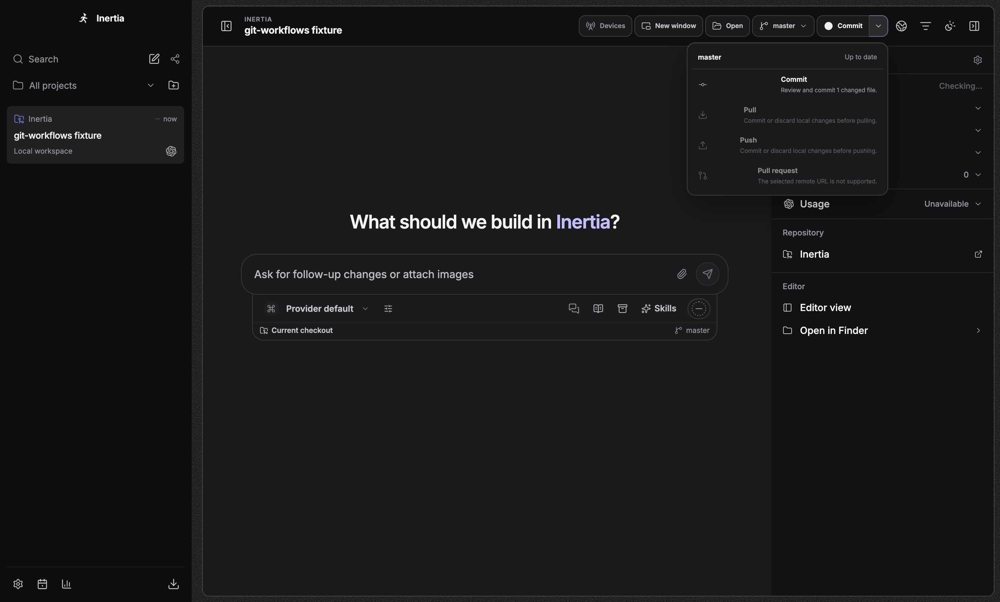
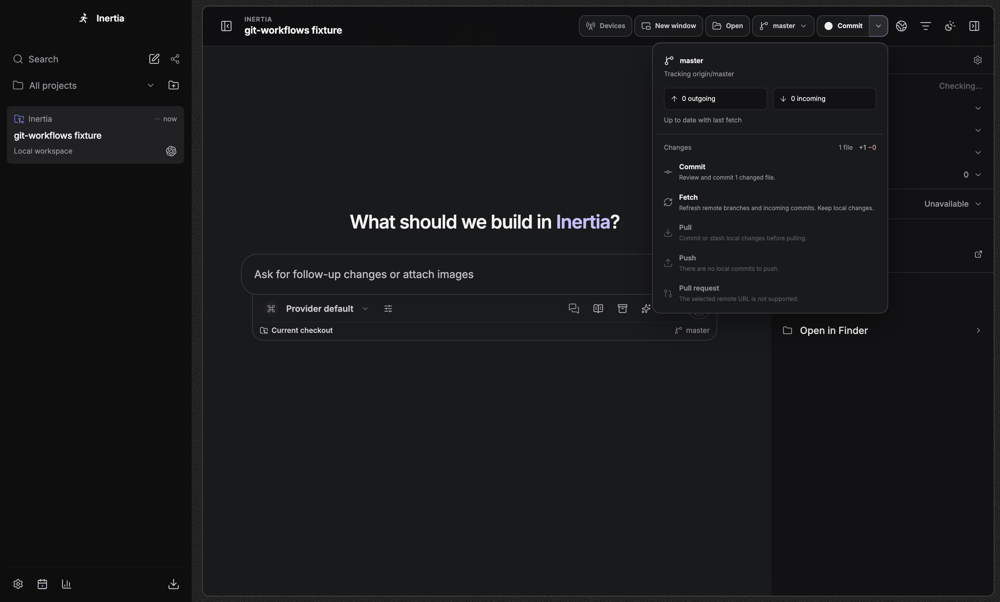
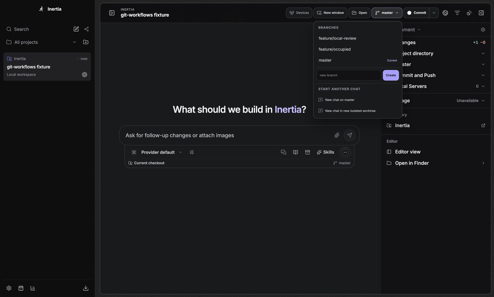
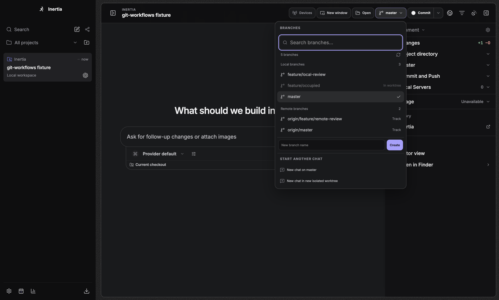

# Git workflows

Git controls operate on the active chat's checkout. The Changes panel can also
target one discovered nested repository; each action retains that repository's
runtime-issued authority. Opening the menus does not start a network scan.

## Everyday actions

- **Branch menu:** search local and remote branches, see which branches are
  already checked out in another worktree, create a branch, or start another
  chat in an isolated worktree. Choosing a remote branch creates a local branch
  of the same name with explicit tracking. A local name collision is reported
  rather than replaced. Switching requires a complete, clean status. Commit or
  stash local changes first; creating a new branch can carry existing work.
  Enter selects the first available search result; arrow keys keep the focused
  result visible. A failed change stays in the menu with the query and a retryable
  error. Selecting the current branch only closes the menu. Changing projects
  or chats dismisses the old menu and ignores its late completion.
- **Git menu:** see the current branch, upstream, incoming/outgoing counts, and
  changed-file totals. The primary button follows the next available step:
  review a commit, pull incoming commits, or push/publish existing commits.
  The full menu keeps unavailable actions and their explanations readable.
- **Fetch:** refresh remote branches without changing local files or staged
  content. Fetch uses the tracked remote, then `origin`, then a sole remote.
  Ambiguous selection requires configuring tracking or using the terminal.
  A missing configured upstream remote is reported instead of falling back to
  another remote.
  Fork workflows fetch the upstream independently of the push remote. Fetch is
  also available for a dirty checkout and from a nested repository's Changes
  controls. Stop an active fetch from **Environment**; the activity stays live
  until owned process cleanup settles.
- **Pull:** requires an upstream and a complete, clean checkout. Only a
  fast-forward is permitted; Inertia does not auto-stash, rebase, resolve
  conflicts, or recurse into submodules. Fetch first to update the incoming
  count. A branch with no upstream is labeled as such, not as up to date.
- **Commit / Push / Pull request:** retain Inertia's complete-diff review
  receipts, selected-path commit transaction and separate authenticated PR
  flow. Existing commits can be pushed while unrelated uncommitted work remains.
  A behind/diverged branch must be reconciled first. No force push is offered.

Counts reflect locally available remote-tracking refs, not a live network
guarantee. A truncated status is shown as incomplete and cannot authorize
commit/pull through these controls. Git failures use bounded, credential-free
guidance for authentication, connectivity, non-fast-forward rejection, index
locks, occupied branches, and missing author identity.

## Design reference and architecture

Reviewed current T3 Code upstream at
[`11601da846e7d82db63a6f4773e3a02421619b60`](https://github.com/pingdotgg/t3code/tree/11601da846e7d82db63a6f4773e3a02421619b60).
The implementation is adapted to Inertia's existing Electron/runtime split;
it does not import T3 Code dependencies or copy its service architecture.

| Upstream source studied | Decision in Inertia |
| --- | --- |
| [GitActionsControl](https://github.com/pingdotgg/t3code/blob/11601da846e7d82db63a6f4773e3a02421619b60/apps/web/src/components/GitActionsControl.tsx) and its logic module | Keep a compact split action, readable disabled reasons, explicit branch/upstream context and progressive workflow states. Retain Inertia's authenticated full-diff review before committing. |
| [BranchToolbarBranchSelector](https://github.com/pingdotgg/t3code/blob/11601da846e7d82db63a6f4773e3a02421619b60/apps/web/src/components/BranchToolbarBranchSelector.tsx) | Add searchable, grouped local/remote choices, loading/error/retry states and explicit remote tracking. Keep keyboard focus visible, preserve failed choices for retry, and retain chat/checkout mismatch evidence instead of silently rewriting chat identity. |
| [GitVcsDriverCore](https://github.com/pingdotgg/t3code/blob/11601da846e7d82db63a6f4773e3a02421619b60/apps/server/src/vcs/GitVcsDriverCore.ts) | Add a separate scoped fetch; guard detached/missing-upstream pull; preserve fast-forward semantics. Avoid automatic network polling and destructive reset paths. |
| [GitManager](https://github.com/pingdotgg/t3code/blob/11601da846e7d82db63a6f4773e3a02421619b60/apps/server/src/git/GitManager.ts) and [GitWorkflowService](https://github.com/pingdotgg/t3code/blob/11601da846e7d82db63a6f4773e3a02421619b60/apps/server/src/git/GitWorkflowService.ts) | Reuse Inertia's canonical checkout serialization, scan invalidation, authority binding and durable activity rather than introducing another Git manager or cache. |

`src/server/git` owns Git execution and parsing. The runner uses argument arrays,
sanitized environments, bounded output/deadlines and runtime-owned process
trees. Inspections disable optional index locking, fsmonitor, external diff and
text conversion. Branch listing uses one inspection for local/remote refs and
occupancy, bounded to 1,000 branches and 1 MiB; larger lists fail with explicit
terminal guidance. Branch discovery requires the runtime-issued authority for the active checkout
and verifies its filesystem identity and Git metadata before and after inspection.
Occupancy is projected as a boolean, not another worktree's filesystem path. Remote names containing slashes are matched by longest prefix.
Custom fetch mappings must identify exactly one source branch on the selected
remote before tracking checkout, including a uniquely renamed mapping such as
`refs/heads/server` to `refs/remotes/origin/client`. Excluded or ambiguous sources
are rejected; Git itself can create a branch before
reporting this ambiguity, so this check runs before mutation.

Fetch has a shared 180-second workflow deadline and a 120-second network limit;
the output limit is 64 KiB. Its explicit refspec updates only that remote's
tracking branches, with tags, pruning, `FETCH_HEAD`, submodule recursion and
automatic maintenance disabled. Configured head mappings within that remote's
tracking namespace, including renamed destinations and source exclusions, are
honored. Mappings to local branches, tags or another remote are ignored; when no
safe positive mapping exists, Fetch uses the normal remote-tracking namespace. Overlapping remote names such as `origin` and
`origin/team` are rejected before fetch can overwrite another remote's tracking
refs; this guard is covered by a reproducing regression test. It uses the same scoped mutation serialization
and invalidation as other Git actions. Cancellation and disconnect retain
ownership until cleanup finishes. Branch validation no longer disguises
timeout, missing-executable or process-cleanup failures as invalid names.

Workspace discovery and worktree ownership/cleanup rules remain governed by
their existing bounded implementations. This branch incorporates released
v0.0.54 fixes; the Git feature is a separate, unmerged follow-up. It introduces
no dependency, provider protocol or database migration changes.

## Evidence

Focused unit, integration and Happy DOM tests cover real bare remotes, dirty/index
preservation, fork routing, tracking collisions, occupied worktrees, missing
tracking, detached HEAD, overlapping remote namespaces, cancellation/deadlines,
safe errors, optional-boolean validation at the IPC boundary, command authority,
stale checkout ownership, search, keyboard focus,
and single-surface mutation errors.

Four independent Electron scenarios in `tests/e2e/git-workflows.spec.ts` exercise
actual IPC and Git operations against temporary repositories and local bare
remotes:

1. Recover from a failed fetch, expose the busy state during real ref contention,
   then fetch the new remote ref while preserving local file content.
2. Retain the search and inline failure after a blocked dirty checkout, preserve
   text-editing keys, scroll keyboard focus through a long list, and restore
   focus after dismissal/current-branch selection.
3. Commit through Inertia's existing selected-path review transaction, then push
   the existing commit while preserving unrelated uncommitted content.
4. Create the exact local tracking branch, fetch incoming commits, and pull a
   fast-forward in a compact light-theme window without viewport overflow.

The four scenarios pass on macOS arm64 using Node 22 and Electron 44, including
a run with Git’s initial branch forced to `master`; they also pass in the Linux
interaction lane. The latest macOS pass includes the Browser restart/cleanup
regression scenario. Screenshots below are actual desktop captures, not rendered
mockups. Before images use
released main commit `3121f209`; after images use this PR on the same release
baseline. Dark captures use a 1440×920 content-size request (the primary display
may constrain height), and compact light captures use 1100×760.

| v0.0.54 controls | Updated controls |
| --- | --- |
|  |  |
|  |  |

[Fetch busy](screenshots/pr-312-git-fetch-busy-dark.png) ·
[Fetch failure](screenshots/pr-312-git-fetch-error-dark.png) ·
[Retryable branch failure](screenshots/pr-312-git-branch-error-dark.png) ·
[Selected-path commit dialog](screenshots/pr-312-git-commit-review-dark.png) ·
[Outgoing commit with unrelated edits](screenshots/pr-312-git-outgoing-dark.png) ·
[Incoming commit in light theme](screenshots/pr-312-git-incoming-light.png) ·
[Up-to-date compact light overview](screenshots/pr-312-git-overview-light.png)

CI supplies applicable Linux and Windows coverage for the final PR commit.
Live SSH/HTTPS credentials and authenticated pull-request creation are not used
by these local-remote desktop scenarios; the existing credential and PR-flow
contract tests remain in the full gate.
