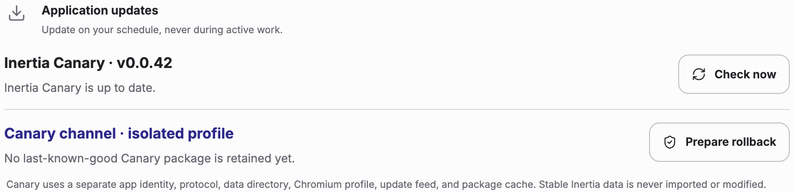

# Install Inertia

Download the [latest stable Inertia release](https://github.com/eduardtomas1/inertia/releases/latest):

| Platform | Architecture | Package | Update delivery after the first manual install |
| --- | --- | --- | --- |
| macOS | Apple silicon (arm64) | DMG or ZIP | Manual while Developer ID signing and notarization are unavailable |
| macOS | Intel (x64) | DMG or ZIP | Manual while Developer ID signing and notarization are unavailable |
| Windows | x64 | Installer | Manual while Authenticode signing is unavailable |
| Windows | ARM64 | Installer | Manual while Authenticode signing is unavailable |
| Linux | x64 | AppImage | Verified in-app updates |
| Linux | ARM64 | AppImage | Verified in-app updates |

The credential-free public release is exactly 12 assets: four macOS packages (DMG and ZIP for both architectures), two Windows installers, two Linux AppImages, the two architecture-qualified Linux update manifests, a CycloneDX dependency inventory, and `SHA256SUMS.txt`. Manual macOS and Windows builds do not publish updater metadata or blockmaps.

Linux browser downloads do not preserve the AppImage executable bit. After
verifying the exact selected filename against `SHA256SUMS.txt`, replace
`VERSION` below with that release's exact version, make only that file
executable, and launch it:

```sh
# Linux x64
chmod 0755 ./Inertia-VERSION.AppImage
./Inertia-VERSION.AppImage

# Linux ARM64
chmod 0755 ./Inertia-VERSION-arm64.AppImage
./Inertia-VERSION-arm64.AppImage
```

Do not apply executable permissions to a wildcard or to an unverified download.

Linux v0.0.52 requires one manual installation of this release because its
installed updater cannot repair itself. That repair first shipped in v0.0.53.
Quit the old app cleanly, verify and open the new AppImage as described above,
and keep your existing profile. Do not delete saved data or recreate projects.
The repaired installed-update handoff is covered by native packaging tests;
this does not establish that an unmodified v0.0.52 can update itself.

Every platform requires a manual first install. Every stable release and Canary prerelease includes `SHA256SUMS.txt`; download it from the same exact tagged release and compare the selected package's SHA-256 before opening it.

Update capability belongs to the installed package. An unsigned Windows build
cannot enable in-app installation merely because a later release is signed. The
first Authenticode-signed, update-capable Windows build, when available, must be
installed manually after its checksum is verified. Later compatible signed
releases can then offer **Download** and **Restart to update** inside Inertia.

Credential-free macOS packages are ad-hoc signed rather than notarized, so Gatekeeper may retain the download's quarantine warning. After verifying the checksum, open the package from Finder; if macOS blocks it, use **System Settings → Privacy & Security → Open Anyway**, confirm the exact file, then choose **Open**. Do not remove quarantine attributes or disable Gatekeeper.

Unsigned Windows installers may show **Windows protected your PC**. After verifying the checksum and exact GitHub release source, choose **More info**, confirm the filename and **Unknown publisher** status, then **Run anyway**. Do not disable SmartScreen.

Before a manual Windows update, quit Inertia and wait for its processes to
close safely before running the verified installer. If Setup reports that
installed processes are still running or could not be verified, do not force
them closed; close Inertia cleanly and retry.

See the [changelog](../CHANGELOG.md) for the complete release story and [release guide](RELEASING.md) for Stable, Canary, signing, and update-delivery details.


Building the current source for macOS requires macOS 13 or later.

## Canary release channel

Canary installs coexist with stable Inertia as a separate application and local
profile. **Settings → General → Application updates** identifies the active
channel, reports whether the current immutable Canary package is retained as
last-known-good, and opens or reveals a reverified rollback package after an
update. Canary never shares stable's protocol, database, Chromium profile,
updater cache, feed, or package names.


