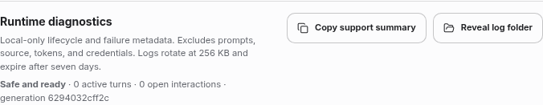

# Linux startup containment investigation (#322)

## Evidence and source comparison

The report describes Linux Mint 22, kernel 6.8, x86_64 Cinnamon/X11, public
Inertia 0.0.53 and authenticated Codex 0.153.4. Its runtime becomes ready for
three to four seconds, reports unconfirmed owned-process containment, and
restarts more than fifty times. Short-lived provider/Git guardians are present;
no active durable provider run or running turn was found. The explicit native
seccomp self-test succeeds. These are the reporter's sanitized observations.

The private profile, its original first failing claim, and a clean-profile Mint
reproduction are unavailable. The report's suggested admission/retirement race
was a hypothesis, not an established diagnosis. The synthetic reproductions
below establish a concrete defect in the same class; they do not establish the
exact ordering in that private profile.

Compared public `v0.0.53` (`f2534752`), frozen 0.0.54 application source
`3121f2098b0f93d8c8c16efd3df967f6cc9c4549`, and current main baseline
`a5760208fbcfbfe0fb328370c794f668175f4d56`. PR #299 is already in public 53:
it preserves successful native helper completion behind delayed JS callbacks
and recognizes post-exec terminal authority. PR #304 adds first-cause
diagnostics and provider/terminal settlement changes. It does not change the
Linux native guardian or helper transport and does not fix the post-exec stop
ordering reproduced here. Main after frozen 54 changes Windows test paths and
release CI only (#320). Unmerged PRs #310/#312/#313/#321 are not assumed present.

## Reproduced defects and final behavior

1. A real static-musl Linux guardian executes `/bin/true`, proves its clean
   terminal state, and can retire/release before delivery of the JS `exec`
   helper callback. A concurrent stop request is remembered by admission.
   Admission then sends `stop` against an already terminal or exited guardian,
   receives a rejection, and taints ownership. The original source fails the
   native regression with `{ stopped: false, tainted: true }` and first stage
   `linux-admission` in about 130 ms. The change accepts only the exact live
   hardened terminal authority or the same claim's previously observed terminal
   receipt. No PID absence or failed signal becomes proof. Claim retirement is
   still a separate requirement; taint is never cleared.
2. Normal provider-discovery and Git child-close callbacks can publish results
   while their exact guardian admission/retirement remains pending. They now
   join that claim's existing work. The process-tree terminator's already-closed
   tracked-child path does the same; untracked POSIX, Windows Job, and Darwin
   containment semantics remain distinct. Aggregate runtime cleanup is checked
   only after exact probe completion in the new fan-out regression.
3. The supervisor bounds unconfirmed recovery attempts, but formerly retried
   indefinitely when outer cleanup succeeded after every short-lived failure.
   The original regression creates eleven generations for ten failures.
   Automatic consecutive replacements now stop after three retries. Only real
   stable readiness resets the budget; restart requests revoke connection
   admission and cannot count their cleanup time as stability. Existing durable
   quarantine and recovery gates remain authoritative.

Linux admission diagnostics distinguish readiness, durable claim, native claim,
durable authorization, native authorization, and stop. Startup process owners
add only fixed probe classes (provider version/auth/capability, Codex control,
Git). The validated first cause survives the main-process journal and copied
support summary. No command, argument, path, provider output, credential, or
private profile identifier is recorded.

## Validation record

Development host: macOS ARM64 with Node 22. Linux tests run in a dedicated Linux
ARM64 container with the repository-built static-musl guardian, a reaping init,
synthetic executables and temporary profiles. This is not Mint/X11 or native
x86_64 evidence.

- Native terminal/stop ordering: both terminal-before-release and
  release-before-JS-completion cases pass.
- Exact publication barriers: provider and Git results stay pending while
  their native exec callback is held after child close, then return with empty
  ownership journals.
- Complete provider discovery fan-out with two configured synthetic providers
  (Codex and Claude), four absent providers, Codex control RPC, and three real
  Git `rev-parse` probes passes with a 1.7-second event-loop stall and exec
  callbacks delivered after native close. Nine or more claims retire, the
  journal is empty, and taint/restart notifications are zero.
- Existing Linux helper, admission, control/PTY integration, native guardian,
  and stop-barrier focused suites pass, including exact identity rejection,
  failed persistence, delayed helper results, excess output, aborts, native
  failure, retained claims, and no raw PID fallback.
- Focused supervisor, process lifecycle, and diagnostic tests pass. Persistent
  short-lived failures are bounded even with cleanup longer than stable uptime.
- `npm run check` passes on Node 22/macOS ARM64: quality, migrations,
  architecture, 7,673 passing tests (127 platform skips), and bundle budgets.
  `npm run test:portable` passes: 1,246 tests, nine platform skips.
- The reviewed diagnostic-projector fix has a demonstrated failing regression
  before the change and eleven passing focused tests afterward. Failure
  attachments retain the first bounded cause with or without a probe class.
- Linux ARM64 build, AppImage content validation, all nine Electron fuse
  settings, and both unpacked and AppImage extract-and-run package smokes pass.
  The actual packaged utility runtime reaches generation one, extracts a PDF,
  retains an image, and shuts down cleanly. Readiness/shutdown measured
  1,062/50 ms unpacked and 2,281/34 ms through the AppImage wrapper.
  Packaged and regression-tested static guardians have the same SHA-256:
  `bc27440323dab30c729d71db01a2c0bbb105b3a8cf2e755d12d26343ec7d97dc`.
- A real Linux Electron UI check passes in a fresh synthetic profile: runtime
  generation one, zero restarts, no last error, zero active turns/interactions,
  and no renderer errors. The runtime diagnostics card below was visually
  inspected. This change adds no renderer UI.

Local package/UI checks use Xvfb and the existing container no-sandbox option;
native guardian/seccomp checks remain enforced. AppImage extraction initially
hit the shared Docker disk limit. A workspace-backed temporary directory was
correctly rejected by private-storage ownership checks; a task-owned executable
tmpfs supplied sufficient private storage for the passing smoke. No check was
relaxed. Default FUSE mounting and native x86_64/macOS/Windows certification are
delegated to the existing required PR CI; consult the final PR head's checks.

No user profile was deleted, recreated, imported, or uploaded. No authenticated
provider traffic or real user turn was exercised. No release, version, tag,
publication, scheduled automation, or merge action is part of this change.
