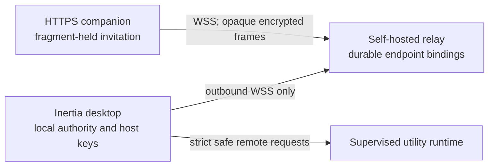

# Remote Companion onboarding and relay hardening design

Status: implemented design for the post-v0.0.21 hardening program, integrated
on the coordinator's authoritative remote-lifecycle base
`63e01b5e8888696e8ed627e54cd122e53168e23f`.

This document is intentionally more precise than the product copy. It defines
the compatibility, endpoint-ownership, deployment, diagnostic, migration, and
test contracts that the implementation must satisfy.

## Scope and invariants

The outcome is a self-hosted/private-network product, not a hosted Inertia
service. The supported topology remains:



The change must not:

- open an inbound listener on the desktop or reuse the privileged loopback
  runtime capability;
- give the relay application plaintext, HPKE private keys, pairing secrets, or
  session keys;
- make approvals, secrets, files, attachments, terminals, Git, Full Access,
  provider settings, provider maintenance, or diagnostics remotely available;
- let a remote peer enable Remote Companion, expand a grant, select Full
  Access, or create a project/conversation;
- place invitation material in an HTTP query, request target, referrer, server
  log, diagnostic record, analytics event, crash message, or relay state;
- silently downgrade endpoint authentication or application protocol security;
- weaken the existing origin, message-size, rate, replay, lock/suspend,
  persistence, or supervised-mode boundaries.

## Reference ergonomics, not reference authority

The current T3 Code `main` pairing/environment flow was inspected at commit
`5192f777fe54c2a2a359f6c25ecf5fbde46d49b0` for ergonomics only. Useful
patterns are its explicit local/headless/private-network choices, one-time
pairing link plus QR/manual fallback, fragment-held credential, saved device
environment, bounded endpoint probe, Tailscale HTTPS path, and actionable
mixed-version messages.

Inertia cannot copy T3 Code's authority model. T3 connects the browser to a
backend that owns files, Git, terminals, and provider sessions. Remote
Companion instead connects through a blind relay and exposes only the existing
safe projection plus prompts to explicitly granted Supervised conversations.
The setup language and controls must make that difference unambiguous.

## Version model

Three independent version axes are negotiated:

| Axis | Purpose | Compatibility rule |
| --- | --- | --- |
| Relay transport protocol | Relay hello, endpoint claim/registration, browser connection, routing metadata, and errors | Integer inclusive range; highest intersection wins. Version 2 requires endpoint authentication. |
| Remote application protocol | HPKE frame and plaintext schemas | Integer inclusive range; highest common version across desktop and browser wins. The relay compares ranges but never reads plaintext. |
| Component build version | Desktop, browser, and relay implementation version | Strict `MAJOR.MINOR.PATCH`; reported for diagnosis and release guidance, never used as an authority grant. |

Every range is an exact object with positive safe integers and `minimum <=
maximum`. Versions and component kinds are bounded closed-schema values.
Unknown fields fail.

### Relay hello and negotiation

The relay sends `relay.hello` immediately after the WebSocket opens:

```json
{
  "relayProtocolVersion": 2,
  "type": "relay.hello",
  "relayVersion": "0.2.0",
  "relayIdentity": "relay instance UUID",
  "relayProtocol": { "minimum": 2, "maximum": 2 },
  "remoteProtocol": { "minimum": 2, "maximum": 2 },
  "endpointAuthentication": "required"
}
```

The outer `relayProtocolVersion` makes the message self-identifying; it is not
the selected application protocol. A desktop then begins an authenticated
claim/registration. A browser sends `relay.connect` with its component version
and both supported ranges. The active desktop registration contains the same
ranges. A browser route is created only if all three components have a common
relay transport version and the browser/desktop have a common remote
application version.

The relay selects the highest common version and returns both selections in
`relay.connected` and `relay.peer-connected`. The desktop and browser each
verify the selection before accepting or sending an encrypted frame.

### Structured incompatibility

An incompatibility returns `relay.incompatible` and closes with a policy code:

```json
{
  "relayProtocolVersion": 2,
  "type": "relay.incompatible",
  "axis": "remote-protocol",
  "reason": "client-too-new",
  "component": "browser",
  "received": { "minimum": 3, "maximum": 3 },
  "supported": { "minimum": 2, "maximum": 2 },
  "guidance": [
    { "action": "upgrade", "component": "desktop", "requiredProtocol": { "minimum": 3, "maximum": 3 } },
    { "action": "downgrade", "component": "browser", "requiredProtocol": { "minimum": 2, "maximum": 2 } }
  ]
}
```

`axis`, `reason`, `component`, `action`, and guidance component are enums.
Guidance has at most three entries and contains only validated required protocol
ranges, not relay-provided prose or URLs. Local UI maps the structure to
reviewed copy and compatible pinned component artifacts.
The possible reasons are `client-too-old`, `client-too-new`,
`relay-too-old`, and `relay-too-new`.

The preferred action is always to update the older component. A downgrade is
shown only as a secondary recovery choice when a compatible pinned artifact is
available. There is no automatic downgrade.

### Legacy transport behavior

The production default is endpoint-authenticated relay transport v2 only.
Legacy `relay.register` is accepted only when the relay operator explicitly
sets the temporary migration flag. The health response then reports
`endpointAuthentication: "migration"` and a degraded status.

A legacy registration:

- may never register or replace an endpoint that already has a durable v2
  binding;
- may not create a durable binding or epoch;
- cannot coexist with an authenticated owner of the same endpoint;
- is disconnected when that relay process shuts down;
- is not an acceptable result for the desktop **Test setup** action.

The v2 desktop never silently falls back. A missing `relay.hello`, an old
relay, or migration-only registration produces structured local guidance.

## Relay endpoint authentication v2

### Separate endpoint signing key

The current design note proposes deriving an `endpointHostKey` from the HPKE
private key and then using its unspecified "public half" for signatures. That
is not directly implementable with platform WebCrypto and would invite
cross-protocol key reuse or a custom deterministic elliptic-curve construction.

Instead, the desktop generates a distinct non-extractable-in-memory ECDSA
P-256 signing key pair. Its serialized PKCS8 private key and SPKI public key are
stored only inside the existing encrypted Remote Companion vault. The key has
one purpose: relay endpoint claim and registration signatures. It is never sent
to the browser and is never used for HPKE.

Signatures use ECDSA P-256 with SHA-256 over a canonical, length-prefixed
transcript. Length prefixes are unsigned 32-bit big-endian byte lengths;
integers are unsigned 64-bit big-endian. The transcript is:

```text
"inertia-relay/2/endpoint-proof"
purpose = "claim" | "register"
relayIdentity
endpointId
endpointPublicKey
nonce
epoch
expiresAtUnixMs
```

The public key is included for both claim and registration so the same proof
cannot be reinterpreted under another binding. The stable relay identity stops
a proof captured at one deployment being forwarded to another deployment.

### First claim

An unbound endpoint uses this sequence:

1. Desktop sends `relay.claim.begin` with the endpoint ID, endpoint signing
   public key, desktop version, and supported ranges.
2. Relay checks bounds, availability, origin absence, per-IP/per-endpoint
   budgets, and that no binding exists. It creates one 32-byte random nonce,
   epoch 1, and a five-second expiry and stores the challenge only on that
   socket.
3. Relay returns `relay.register.challenge` with purpose `claim`, the nonce,
   epoch, expiry, relay identity, and supported ranges.
4. Desktop validates the exact challenge and signs the canonical transcript.
5. Desktop sends `relay.register.proof` echoing every signed field and the
   signature.
6. Relay synchronously consumes the challenge before signature verification.
   It then rechecks the budgets and absence of a binding, verifies the
   signature, durably creates the binding at epoch 1, and only then marks the
   socket authoritative.
7. Relay returns `relay.registered` with `ownership: "claimed"`, the epoch,
   selected versions, and prior connection time `null`.

The application must claim a newly generated endpoint before it exposes any
invitation containing that endpoint. If claim persistence fails, enablement
and invitation creation fail closed.

### Reconnect and takeover

An existing binding uses `relay.register.begin { endpointId, ...ranges }`.
The relay loads the bound public key and challenges at `storedEpoch + 1`.
After a valid proof it:

1. persists the incremented epoch and new `lastConnectedAt`;
2. installs the new socket as the only owner at that epoch;
3. disconnects all routes owned by the old epoch;
4. closes the superseded desktop socket;
5. returns `ownership: "verified"` or `"taken-over"`.

If persistence fails, the new socket is rejected and the existing owner is not
disturbed. This ordering prevents a failed takeover from creating two owners.

Every peer record contains `endpointId` and `endpointEpoch`. Desktop-directed
relay messages include the epoch. Before any route, frame, disconnect, or
cleanup mutation, the relay rechecks that the socket is still the active owner
of that exact endpoint/epoch. A stale socket therefore cannot route after
takeover even if its close event is delayed.

### Replay and challenge rules

- A socket has at most one outstanding challenge.
- Beginning again, sending the wrong proof kind, malformed echo fields,
  expiration, or any proof failure consumes the challenge and closes the
  socket.
- The nonce is exactly 32 random bytes and valid for at most five seconds.
- The proof is scoped to the socket-held challenge; client-provided nonce or
  epoch values never select server state.
- Successful epochs are durable and strictly increasing. A proof from an older
  relay process is therefore stale after restart even if its bytes are replayed.
- Before signature work, the relay compares the echoed fields in constant-time
  where applicable and checks rate limits. Invalid inputs cannot force
  unbounded asymmetric verification.

### Durable binding store

The relay owns a configured state directory. Production startup fails if the
directory is absent, unsafe, symlinked, not writable, or cannot provide a
stable relay identity. Loopback development may create a private temporary
state directory, but its health response explicitly reports
`persistence: "ephemeral"` and **Test setup** rejects it for self-hosted mode.

Metadata schema:

```json
{
  "version": 1,
  "relayIdentity": "UUID",
  "createdAt": "ISO timestamp"
}
```

Each endpoint is stored under the SHA-256 digest of its endpoint ID, never the
raw ID as a pathname:

```json
{
  "version": 1,
  "endpointId": "opaque routing ID",
  "endpointPublicKey": "base64url SPKI",
  "epoch": 17,
  "claimedAt": "ISO timestamp",
  "lastConnectedAt": "ISO timestamp"
}
```

Records are strict-schema and byte bounded. Directories are private, existing
files must be regular and non-symlinked, and writes use a same-directory unique
temporary file, restrictive mode, file sync, atomic replacement, and directory
sync where supported. Startup never treats a corrupt or missing record as an
unbound known endpoint. A corrupt record makes that endpoint unavailable and
degrades health; it does not permit a new first claim.

The relay never provides an online binding deletion or key-replacement API.
If the desktop vault is lost, the supported recovery is a new endpoint and
re-pair. An operator can archive the entire stopped relay state directory for
disaster recovery, but manual deletion is not presented as normal takeover.

### Migration from unauthenticated endpoints

Legacy endpoint IDs have already been exposed to invitations and paired
browsers. First-claiming them during upgrade would retain the known-ID
squatting race. The desktop migration therefore:

1. generates the endpoint signing key;
2. rotates to a fresh random endpoint ID inside the encrypted vault;
3. clears live invitation/session authority and disables automatic reconnect;
4. claims the fresh endpoint through v2;
5. marks existing remote devices as requiring re-pairing, without widening or
   silently translating their grants;
6. shows recovery guidance locally.

The old endpoint is never claimed and no redirect is installed. A user reviews
the exact replacement grant during re-pairing. The migration is append-only,
transactional/fail-closed, and covered from a representative v1 vault fixture.

### Rate and availability limits

The relay applies these independent bounds:

| Resource | Bound |
| --- | ---: |
| Outstanding challenges | 1 per socket, 1,024 globally |
| Challenge lifetime | 5 seconds |
| Failed proofs per source IP | 5/minute, then 60-second block |
| Failed proofs per endpoint | 10/minute |
| Challenge messages per socket | 3 total including begin/proof |
| Durable endpoints | Configured hard cap, default 10,000 |
| Binding record | 4 KiB |
| Relay metadata file | 1 KiB |

Rate maps are bounded and expire idle entries. The source IP is the direct TCP
peer unless a separately documented trusted-proxy configuration is enabled;
arbitrary forwarding headers are never trusted. An endpoint-limit or storage
failure is reported as availability/capacity, not authentication failure.

## Diagnostics and **Test setup**

Public `GET /health` contains only relay-wide safe data:

- status `ok` or `degraded`;
- relay component version and supported relay/remote ranges;
- endpoint authentication `required` or `migration`;
- persistence `durable`, `ephemeral`, or `unavailable`;
- exact-origin policy `configured` or `missing`;
- public transport expectation `wss` or `loopback-development`.

It never returns endpoint IDs, public keys, IPs, counts per endpoint,
invitation/session identifiers, URLs containing fragments, or raw errors.

Endpoint ownership, epoch, and prior connection time are returned only inside
the authenticated `relay.registered` response. The local desktop derives and
retains these safe diagnostic fields:

- configured companion HTTPS origin and relay WSS URL (fragment removed);
- TLS/WSS handshake result and a bounded certificate failure class;
- CSP response-header result including `frame-ancestors 'none'`;
- exact companion Origin acceptance/rejection result;
- desktop/browser/relay versions and selected protocol versions;
- endpoint ownership state, epoch, and last connected time;
- latest retry state and closed failure class.

Failure classes are closed enums such as `dns`, `tcp`, `tls-certificate`,
`tls-name`, `wss-upgrade`, `origin-rejected`, `csp-missing`,
`relay-incompatible`, `browser-incompatible`, `endpoint-owned`,
`rate-limited`, `capacity`, `relay-storage`, and `timeout`. Raw certificate
objects, socket errors, response bodies, headers, paths, IPs, invitation data,
and provider diagnostics are neither projected nor logged.

**Test setup** is a local pre-enablement action. It has strict per-step and
overall timeouts and performs no invitation creation:

1. validate configured HTTPS companion and WSS relay URLs;
2. fetch the companion entry point with redirects constrained to the same
   configured origin and verify production CSP/security headers;
3. open WSS and negotiate relay compatibility;
4. verify exact Origin policy with a browser-role probe that has no endpoint or
   invitation;
5. authenticate/claim the local endpoint only after the local user explicitly
   enables or confirms the self-hosted profile;
6. return the safe result and reviewed remediation.

Testing never sends a pairing secret, host HPKE private key, device identity,
project/conversation data, or provider/runtime request.

## Pairing link and invitation lifecycle

The desktop stores one configured companion base URL. Self-hosted mode requires
an `https://` URL with no username, password, query, or fragment. Loopback local
development alone permits `http://127.0.0.1`, `http://localhost`, or
`http://[::1]`.

The shareable URL is:

```text
https://companion.example/pair#pair=<base64url-canonical-invitation>
```

The complete invitation, including relay URL, endpoint ID, host public key,
invitation ID, pairing secret, expiry, and supported ranges, is inside the
fragment. There are no server-visible pairing query parameters. The companion
reads the fragment once, bounds and validates it, then immediately removes it
from the address bar/history with `history.replaceState` before opening WSS.
The raw fragment is never copied into an exception, storage key, telemetry, or
diagnostic field.

The local pairing surface provides:

- a QR code generated locally from the fragment URL;
- a copy-link action and a non-secret companion-origin display;
- a second-by-second five-minute countdown based on the authoritative expiry;
- Regenerate, which synchronously cancels the prior invitation before creating
  another;
- Cancel, which consumes the invitation and clears QR/link material;
- exact requested grant summary: view/prompt, named projects, named or future
  conversations, expiry, and the Supervised-only constraint;
- the comparison code and explicit local approval after the device connects;
- raw invitation JSON only in a collapsed **Advanced** section with an explicit
  secret warning.

Closing, disabling, locking, suspending, regenerating, cancelling, expiry, a
malformed holder request, or successful use invalidates the live invitation.
The QR disappears immediately when authority is invalidated.

## Guided setup and recovery

The local setup starts with two choices:

### Local development

- loopback browser and relay only;
- `http://`/`ws://` allowed only on loopback;
- ephemeral relay state allowed but clearly marked unsuitable for remote use;
- concise commands for the separately started reference components;
- no implication that the desktop starts or bundles a relay.

### Self-hosted/private network

- Tailscale/private-network recipe is the primary path;
- user supplies the HTTPS companion origin and WSS relay URL;
- durable relay state, endpoint authentication v2, exact Origin, TLS, and CSP
  are required;
- **Test setup** must pass before Enable is offered;
- custom reverse proxy is an Advanced alternative, not a public hosted service.

The supervised explanation is concrete: remote prompts can be sent only to
existing locally configured Supervised conversations; their provider may read
project material under that local policy, but the remote device cannot approve
Local/Full Access, use terminals/files/Git, change provider settings, or answer
secret/credential requests.

Recovery copy covers relay offline/restart, certificate/origin failure,
component mismatch, lost browser storage, cancelled/expired invitation, local
vault loss, endpoint migration, and device revocation. Re-pairing always
requires a fresh local invitation and exact grant review.

## Narrow mobile companion

The companion supports a 320 CSS-pixel viewport without horizontal scrolling.
Navigation becomes a single-column project/conversation list and detail view.
Touch targets are at least 44 CSS pixels, the prompt composer remains visible
above the virtual keyboard, safe-area insets are honored, and connection/grant
state remains readable without hover. Background/foreground and reload restore
only the non-extractable device identity and validated device profile; pending
prompt text and invitation fragments are not durably stored.

Selection generation, polling ownership, transcript clearing, prompt target
checks, and no-silent-retry behavior remain unchanged on viewport changes and
mobile lifecycle events.

## Distribution and deployment

Remote browser and relay artifacts remain independently versioned; this change
does not change the desktop package/application version. A release build
produces:

- `inertia-remote-browser-<browser-version>.tar.gz` containing only the built
  static site and artifact manifest;
- `inertia-remote-relay-<relay-version>.tar.gz` containing the relay runtime,
  locked production dependency graph, operator README, and artifact manifest;
- `REMOTE-SHA256SUMS.txt` containing both archive digests.

Each embedded manifest records the component version, Git commit, supported
relay/remote ranges, required Node range, file names, byte sizes, and SHA-256
digests. Build input is the reviewed root lockfile under Node 22. Artifact
creation is deterministic (sorted files, normalized timestamps/modes/owners)
and verification rejects missing, extra, empty, renamed, or changed files.
Release upload remains exact-tag, non-overwriting, checksummed, and provenance
attested alongside desktop assets.

The supported deployment recipe pins immutable container image digests and
runs two private-network services:

- the relay on an internal loopback/container network with a persistent state
  volume;
- a TLS reverse proxy/static server that serves the browser with the required
  CSP/security headers and proxies only `/remote` and `/health` to the relay.

The primary recipe uses Tailscale HTTPS/private DNS. A custom certificate and
reverse proxy path is documented separately. No public relay discovery,
account, tenancy, hosted endpoint, or analytics system is introduced.

## Verification matrix

### Compatibility

- every intersecting relay/remote range selects the highest intersection;
- browser too old/new, desktop too old/new, and relay too old/new return the
  exact structured guidance;
- unknown/malformed ranges, versions, or guidance fail closed;
- a v2 client refuses a v1 relay; migration mode is explicit and degraded;
- paired mixed browser/desktop versions cannot route incompatible frames.

### Endpoint ownership and relay lifecycle

- an endpoint-ID squatter without the signing key cannot claim/register;
- initial claim is durable before success and before invitation creation;
- same nonce, consumed challenge, expired challenge, altered field, old epoch,
  wrong relay identity, and cross-endpoint proof replays fail;
- legitimate reconnect increments the durable epoch;
- simultaneous valid owners resolve to one persisted winner; the stale socket
  and its routes close;
- storage failure during takeover leaves the current owner intact;
- restart preserves binding/epoch/relay identity and rejects an old proof;
- corrupt/missing known binding fails closed rather than enabling first claim;
- per-IP/per-endpoint rate limits run before signature verification and their
  maps remain bounded;
- relay upgrade reads the prior supported store schema transactionally.

### TLS, origin, diagnostics, and secrets

- trusted WSS succeeds; expired, untrusted, wrong-name, and plaintext remote
  endpoints return only their safe failure class;
- exact allowed Origin succeeds; missing/wrong Origin for a browser fails;
- production HTML has response-header CSP with `frame-ancestors 'none'`, strict
  connect policy, no inline/eval relaxation, and the other expected headers;
- health and local diagnostics contain no invitation fragment, pairing secret,
  private/public device key, raw header/error, project data, or frame body;
- query strings, HTTP access logs, relay logs, analytics stubs, and crash
  messages never receive invitation material.

### Pairing, mobile, and recovery

- fragment deep link and QR contain the same validated invitation; server
  request targets contain neither;
- countdown expires authoritatively; regenerate/cancel consume the prior link;
- exact grant summary matches the payload and cannot broaden it;
- raw JSON is absent until **Advanced** is opened;
- 320/375/768-pixel layouts preserve focus, touch targets, selection,
  transcript clearing, and prompt targeting;
- reload/background restore a valid paired device but never resurrect an
  invitation or silently retry a prompt;
- legacy vault migration rotates endpoint and requires re-pair; lost relay
  state and lost desktop vault show the correct recovery path.

### Deployment and release

- production smoke starts the built artifacts behind TLS, verifies HTTPS/WSS,
  CSP, exact Origin, endpoint auth, routing, restart persistence, and shutdown;
- archive manifests and checksums verify after download and reject tampering;
- container/reverse-proxy configuration is pinned and refuses missing durable
  state or insecure public bind;
- `npm run check`, `npm run test:portable`, remote unit/integration tests,
  Electron remote E2E, production dependency audit, package smoke, release
  asset checks, and exact-head macOS/Windows/Linux CI all pass.

## Integration ownership after the dependency lands

Before the coordinator supplies the authoritative merge SHA, implementation is
limited to this design, isolated relay authentication/persistence primitives,
protocol fixtures, distribution tooling, and their focused tests. It does not
edit `RemoteAccessSettings` or remote browser lifecycle/rendering files.

After the exact rebase, integration will adapt to PR 1 rather than resurrecting
pre-merge lifecycle code. The expected ownership seams are:

- shared protocol schemas and crypto helpers for version ranges, messages, and
  endpoint proof generation;
- main-process encrypted store migration, relay handshake, safe diagnostic
  probe, configured companion URL, and invitation lifecycle;
- preload/desktop contracts only for the minimum local controls and projected
  safe state;
- `RemoteAccessSettings` for the guided setup/test/pairing/recovery surfaces;
- remote browser bootstrap for fragment consumption, compatibility, and
  mobile lifecycle/layout;
- relay server for negotiation, durable ownership, routing epochs, health, and
  limits;
- scripts/workflows/remote documentation for reproducible artifacts and
  production smoke.

No integration file is assumed unchanged until the exact dependency rebase is
complete.
