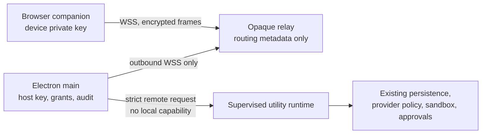

# Remote Companion protocol and architecture

Status: experimental protocol version 1, browser version 0.1.0, reference
relay version 0.1.0. Remote Companion is disabled by default. This repository
does not deploy or operate a public relay or browser origin.

## Current architecture seams

The implementation preserves Inertia's existing privilege boundaries:

- Electron main owns opt-in state, the host identity, pairing, device grants,
  replay state, delivery receipts, the audit trail, outbound WebSockets, screen
  lock behavior, and shutdown. Those records live in the separate encrypted
  `remote-access.vault`.
- Lock, suspend, and unlock listeners are installed synchronously when the
  Remote Access host is constructed, before the current idle state is sampled.
  A reported `locked` or `unknown` state fails closed. A lock observed during
  sampling or while secure storage is still initializing is retained and
  applied before a persisted enabled profile may reconnect. Platforms without
  a usable idle-state probe retain event-based enforcement.
- The existing `ElectronSafeStorageBackend` availability policy rejects Linux
  `basic_text` and `unknown` backends. Remote access remains unavailable rather
  than storing its host private key or grants through a plaintext fallback.
- Remote Access IPC is registered synchronously as an unavailable/initializing
  host. On a fresh profile, default-off startup checks only that no remote vault
  exists: it does not probe platform storage, generate a host identity, or
  write a vault. The first explicit Enable performs those operations.
  Availability of an existing vault is probed with a 1.5-second fail-closed
  deadline, so a stalled platform API cannot block application startup.
- `FileCredentialVaultPersistence` supplies the shared bounded, unique-stage,
  restrictive-file, restart-recovery, and Windows replacement behavior. The
  remote vault has its own filename and `.remote-access-vault-` transaction
  namespace; it is not part of the credential namespace.
- Vault writes are serialized. The first save failure poisons that queue and
  synchronously makes Remote Companion unavailable and disabled for the
  process, clears pairing/session authority and timers, terminates the relay
  socket, and preserves the write error for the caller. Disable and revocation
  tear down live access before their durable write.
- The preload exposes only local settings, pairing approval, scoped grant
  update, revocation, and projected state IPC. It never exposes a host/device
  private key, provider credential, runtime WebSocket capability, filesystem
  primitive, or provider process control.
- Electron main sends strict read requests to the supervised utility process.
  Prompts use separate strict prepare/commit commands. The runtime revalidates
  the authorization subject, project/conversation ownership, current
  conversation mode, and active-run state. It is still the sole authority for
  persistence, provider routing, sandboxing, and approval policy.
- Provider readiness may await during prompt preparation. Immediately after
  that await, the runtime reloads authoritative conversation detail and
  revalidates project ownership, Supervised mode, and inactive state. It then
  returns a one-time, expiring internal preparation ID without queueing. Main
  synchronously revalidates the exact live session/device grant and posts the
  commit with no intervening await. The runtime atomically consumes that ID,
  revalidates the boundary again, and synchronously queues the exact request.
- The existing privileged loopback WebSocket remains unchanged and is never
  sent to a remote browser or relay.
- The reference relay routes bounded opaque frames between an outbound desktop
  connection and a browser connection. It has no durable message queue.
- The independent browser stores one strictly validated device profile in
  IndexedDB and renders all provider-derived strings through `textContent`.

No component opens an inbound network listener on the desktop, requests UPnP,
or reuses the local runtime capability.

## Topology decision

| Option | Boundary consequence | Recommendation |
| --- | --- | --- |
| LAN-only direct pairing | Requires an inbound desktop listener, firewall discovery, address handling, and a larger local-network attack surface. | No-go for this product boundary. |
| User-managed private network | A user may run the reference relay and browser origin on a Tailscale-style/private network. The desktop still connects outbound. Operational TLS, origin allowlists, availability, and updates remain the user's responsibility. | Supported self-hosting pattern, not an automatic integration. |
| Inertia-hosted outbound relay | Works across networks without desktop inbound access, but creates material availability, abuse, metadata, incident-response, key-transparency, browser-delivery, and privacy operations. | Recommended only as a later operated service after explicit product and operational decisions. Not deployed here. |
| No remote access | Leaves the local-only trust model unchanged. | Always available: the feature defaults off and can be disabled or omitted. |

## Versioned frames and data flow

All JSON objects are strict-schema parsed; unknown fields fail. Relay envelopes
carry protocol version, routing endpoint/connection identifiers, frame kind,
session/invitation identifiers, sequence where applicable, and ciphertext.
Before any relay JSON parse, desktop and browser enforce the 132 KiB envelope
limit; browser tunnel setup, pairing/session handshakes, and active sessions
close on oversized or non-text messages. Application plaintext is capped at
96 KiB, serialized encrypted frames at 130 KiB, and wrapped relay envelopes at
132 KiB. The frame budget includes the AES-GCM tag, base64url expansion, and
JSON fields rather than treating ciphertext bytes as wire bytes. Projection
builders truncate by UTF-8 byte size, keeping the newest useful conversations
and transcript content.

Pairing:

1. The local user enables Remote Companion and creates a five-minute
   invitation containing relay URL, opaque endpoint, host identity/public key,
   invitation ID, random pairing secret, and expiry.
2. The browser independently rejects any relay URL except `wss://` or loopback
   `ws://`, creates a device P-256 key pair, and encrypts a strict pairing
   request with HPKE PSK mode. After matching the invitation ID, expiry, and
   attempt budget, the desktop consumes the one-time invitation synchronously
   before HPKE work. Concurrent copies cannot create multiple approvals; a
   malformed request from an invitation holder consumes it and requires the
   local user to create a new invitation. Disabling Remote Companion also
   invalidates any live invitation before the relay connection closes.
3. Both devices derive and display the same six-digit comparison code from the
   host public key, device public key, and invitation ID. The local user must
   compare it and explicitly choose at least one project. Prompt scope is a
   separate opt-in.
4. The desktop normalizes the untrusted browser label, removing controls and
   bidi formatting marks. It imports and validates the submitted P-256 public
   key before mutating or persisting the grant, then returns an authenticated
   encrypted pairing result. If the device ID replaces an existing grant, its
   old sessions close immediately after the replacement is durably stored and
   before the pairing response is sealed.

Sessions:

1. The browser creates a fresh UUID session ID and HPKE authenticated session
   opening. Clear `session.open` metadata does not contain a device ID.
2. Before P-256 work, the desktop applies global and per-connection
   authentication-attempt budgets and synchronously reserves the session ID,
   route epoch, and one of four global admission slots. Concurrent routes
   cannot reuse an opening ID or over-admit while crypto or persistence awaits.
   Once a device key authenticates, its grant owns the reservation so a local
   update or revocation invalidates the in-progress opening before acceptance.
   The desktop tries at most the bounded set of current device public keys
   without revealing which key matched.
3. The desktop rejects used session IDs across process restarts and requires a
   fresh timestamp. The device key authenticates identity; the desktop's
   current grant is authoritative. An old browser grant version cannot widen
   permissions.
4. The encrypted accept returns current scopes, projects, expiry, and grant
   version. The browser atomically validates and persists them before sending
   a request.
5. Each direction uses a separate authenticated HPKE context and exact
   monotonically increasing sequence. A duplicate, skipped, or reordered
   sequence closes the session.

Relay peer routes have desktop-local epochs established only by
`relay.peer-connected`. Each connection has one bounded inbound frame queue, so
HPKE recipient sequence advances cannot race. Successfully opened application
requests are detached from that queue and may remain concurrently active up to
the in-flight limit. Responses have a separate per-session send queue so their
HPKE sender sequence advances in completion order. Peer disconnect invalidates
its epoch immediately, queues cleanup behind earlier frames, and every
post-crypto commit rechecks current ownership. A dead or reused route therefore
cannot leave a pending approval or active session.

The suite is RFC 9180 HPKE using DHKEM(P-256, HKDF-SHA256),
HKDF-SHA256, and AES-256-GCM through `@hpke/core` and platform WebCrypto.
Protocol-specific `info` and AAD bind the protocol version, purpose, host,
device where encrypted, session/invitation/request ID, and sequence. This is
use of a reviewed standard primitive, not a new cipher construction.

## Requests, authority, and exactly-once behavior

The only version 1 application requests are:

- `state.get`: safe projects, conversations, and agent-run summaries.
- `conversation.get`: persisted user/assistant transcript for one authorized,
  unarchived conversation, generic redacted workstream activity, bounded
  subagent status, and whether a local action is required. A bounded monotonic
  scanner removes backtick/tilde fenced code, interrupted fences, top-level
  indented code, and paired, nested, self-closing, or interrupted HTML before
  path/credential redaction.
- `prompt.send`: bounded text to one existing authorized, unarchived
  conversation.

For prompts, Electron main persists a bounded delivery receipt as `dispatched`
before runtime preparation. Preparation cannot queue a turn. Immediately
before commit, main synchronously checks that Remote Companion remains enabled
and unlocked, the exact session/route remains live, and the same device grant,
scope, projects, version, and expiry remain authoritative. If that check fails,
or the runtime becomes unavailable before the commit command is posted, the
receipt is removed and the known non-delivery returns `forbidden` or
`unavailable`; it is not marked uncertain. The supervisor reports the delivery
linearization only immediately after `postMessage` succeeds. A deterministic
commit response remains a known outcome. Only a posted commit whose
acknowledgement is lost becomes `uncertain`, and it is never retried
automatically.

The runtime preparation is identified by an unguessable one-time UUID, expires
after 15 seconds, and is consumed by the first exact commit attempt. A retry of
the same session/request invalidates an older preparation, and at most 32
preparation operations (including readiness checks in progress) exist. A
readiness check that never settles retains its slot until runtime restart
rather than allowing unbounded replacement work. An accepted turn records its
turn ID. A duplicate delivery ID with the same
device/conversation/content returns the prior result; different content is
rejected. The receipt ledger retains the newest 512 entries, so exactly-once
deduplication is intentionally bounded to that retained window. The runtime
also keeps a bounded 512-entry in-process dedupe ledger.

There is no durable relay queue. If the desktop is absent, the relay reports it
offline. A request timeout or transport loss reports offline/uncertain; the
browser does not silently retry a prompt. The browser owns exactly one
generation-tagged polling loop. Conversation selection and manual refresh
replace its timer; completion of an older in-flight poll cannot publish state
or schedule another loop. Selection also clears the prior detail/prompt form
synchronously, and the client rejects any prompt whose target is no longer the
selected conversation. If the local user archives that conversation, detail
and prompt preparation/commit return `not-found`; the still-current browser
selection clears its transcript and prompt form on the next response.

## Authorization matrix

| Capability | View grant | Prompt grant | Remote MVP |
| --- | ---: | ---: | --- |
| Safe project/conversation shell | Yes | Yes | Available |
| Safe persisted conversation detail | Yes | Yes | Available |
| Text prompt to existing supervised conversation | No | Yes | Available |
| Stop remotely initiated run | No | No | Deferred; exact run ownership is not exposed |
| Local/Full Access approval | No | No | Prohibited |
| Secret question or credential operation | No | No | Prohibited |
| Terminal or provider maintenance/settings | No | No | Prohibited |
| File browse/upload/download or attachment | No | No | Prohibited |
| Source path/content or diagnostics | No | No | Prohibited |
| Git reversal/mutation | No | No | Prohibited |
| New project/conversation or enabling permission | No | No | Prohibited |
| Destructive action | No | No | Prohibited |

Every grant is device-specific, requires one or more explicit project IDs,
expires in at most 90 days, and has a current desktop-controlled version.
Scope/project/expiry changes close active sessions. The same authenticated
device may reconnect and receives only the reduced current grant. Revocation
makes its key ineligible immediately and closes its sessions.

## Browser delivery and relay operations

The browser is an independently versioned static build with no server-side
session and a strict CSP. The reference Vite development and preview servers
send that CSP as an HTTP response header, including `frame-ancestors 'none'`;
the HTML meta policy deliberately does not claim frame protection because
browsers ignore that directive in a meta policy. Any other host must provide
and verify an equivalent response header before pairing. The reference relay
requires an exact browser Origin allowlist; clients without an Origin are
reserved for the desktop/reference clients. Serve the browser over HTTPS and
relay over WSS outside loopback.

CSP cannot protect a user if the browser hosting origin itself serves modified
first-party JavaScript. A malicious update from that origin could read the
IndexedDB device key and visible plaintext. Self-hosters should pin source and
artifacts, publish checksums, minimize administrators, use immutable HTTPS
delivery, and review updates. A future operated service needs a signed-build
and incident-response policy; this repository makes no supply-chain
transparency claim.

The relay sees endpoint and connection identifiers, IP/network timing,
connection/session/invitation IDs, frame kinds, sequences, sizes, and traffic
timing. It cannot decrypt or forge authenticated application payloads, but it
can correlate, delay, drop, replay, reorder, rate-limit, or deny traffic. It
must not log frame bodies. The reference implementation keeps routing only in
memory, caps connections/messages/payloads, disables compression, checks peer
ownership for disconnect, and terminates a destination before its queued
outbound bytes plus the next message exceed the configured buffer budget. It
heartbeats clients and has bounded shutdown. If registration finds a duplicate
desktop endpoint, the rejected desktop closes its socket and retries with
bounded backoff rather than remaining indefinitely connected but offline.

## Lifecycle bounds

- Device records: 16 total; active peer routes: 8; active sessions: 4; pending
  pairings: 1. Pairing a new device deterministically evicts only the oldest
  revoked/expired record needed to stay within 16; a full set of current
  devices rejects the pairing without mutation.
  In-progress admissions share the four-session bound and reserve unique IDs
  across routes until success, failure, or disconnect. Each route queues at
  most 16 encrypted frames. A local user must resolve the current
  security-sensitive approval before creating another.
- Pairing: five minutes and ten attempts/minute.
- Session authentication: four attempts/connection and 24/minute globally.
- Active requests: eight/session; all requests: 120/minute; prompts: six/minute.
  The reference relay permits 240 browser messages/minute per socket and 544
  aggregate desktop messages/minute, enough for four independently bounded
  sessions plus pairing/session lifecycle traffic without weakening each
  browser's cap.
- Prompt preparation operations: 32 total including unresolved readiness
  checks. Issued IDs expire after 15 seconds and are one-time; same-request
  retry invalidates an older ID. An unresolved check retains its bounded slot.
- Session idle expiry: 15 minutes; handshake freshness: 60 seconds.
- Reconnect backoff: capped at 30 seconds; no prompt replay.
- Relay envelope: 132 KiB before JSON parsing; serialized encrypted frame:
  130 KiB; plaintext: 96 KiB. Deterministic maximum-size tests seal, wrap,
  relay, open, and schema-validate the byte-bounded projection.
- Relay destination send buffer: 264 KiB by default; exceeding the configured
  bound terminates that destination and cleans up its routes.
- Audit events: newest 1,000 persisted; delivery receipts/session IDs: newest
  512 persisted.
- Main-to-runtime request: ten-second timeout.
- Desktop shutdown: graceful WebSocket close for at most 1.5 seconds, then
  terminate; reconnect, sweep, and request timers are cleared. Any in-flight
  bounded vault initialization is also awaited before the host finishes
  shutdown.

Screen lock or suspend disconnects remote sessions and pauses reconnection.
Listeners exist before the initial idle-state sample and asynchronous
vault/service initialization. The monitor starts conservatively locked, keeps
a lock event that races the sample, and applies retained state before connection
startup. Unlock reconnects only if the feature remains locally enabled.
Shutdown removes all three power listeners. The desktop UI shows
enabled/connection state and active remote session count.
