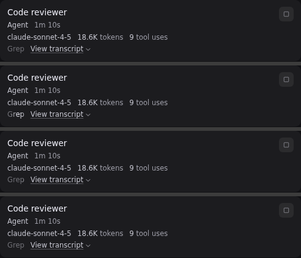
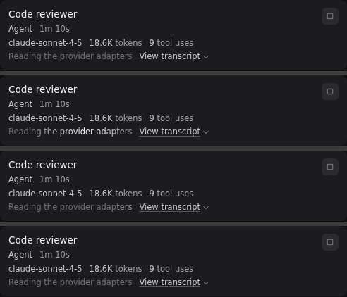

# Background tasks: full text on the running line

Captured from `tests/e2e/background-tasks.spec.ts` on Linux (Xvfb) with the
same seeded fixture.

Claude sends a running task's state in two ways. A `task_progress` event carries
the last tool name and sometimes a one-line `summary`; a `tool_progress` event
carries the tool name and the seconds elapsed. Claude sends the summary for a
backgrounded MCP task, and for a subagent only when its progress-summary option
is on, which Inertia does not turn on. Before,
Inertia always made the tool name the task's current activity, so a summary
such as "Reading the provider adapters" was stored only as progress and the
running line showed "Grep", with the sweep moving across a single word.

Now Inertia makes the summary itself the current activity when Claude sends
one, so the running line shows the whole sentence and the same
`turn-thinking-sweep` moves across all of it. A `tool_progress` event still
shows the tool name, and a `task_progress` event without a summary still shows
the last tool name. Codex is unchanged: its activity is a short label for the
current step, such as "Thinking" or a command, and its progress is the child's
last finished message, so the running line keeps showing the current step.
The renderer still shows the current activity first and falls back to the
progress text.

When a running card's transcript is open, a line that shows the current
activity keeps moving and the same sentence is not repeated inside the
transcript. The reduced-motion,
forced-colours and hidden-window guards are unchanged.

The seeded "Code reviewer" task carries the sentence the way the server now
stores it (activity and progress both "Reading the provider adapters"); the
card renders the same line as in the frames below.

Each image stacks four frames of the same card, taken about 0.7 s apart with
animations running.

| Before | After |
| --- | --- |
|  |  |

The full panel after the change, with animations disabled:
[after-background-tasks-claude-wide-dark](after-background-tasks-claude-wide-dark.png).
