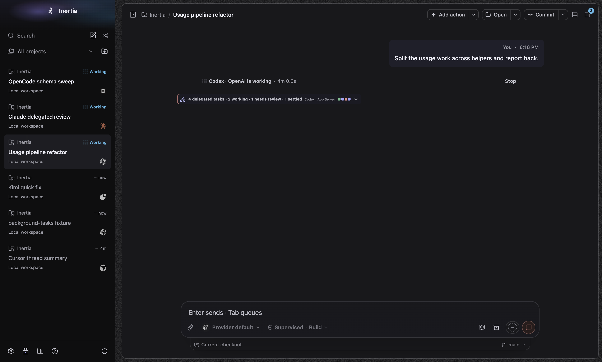
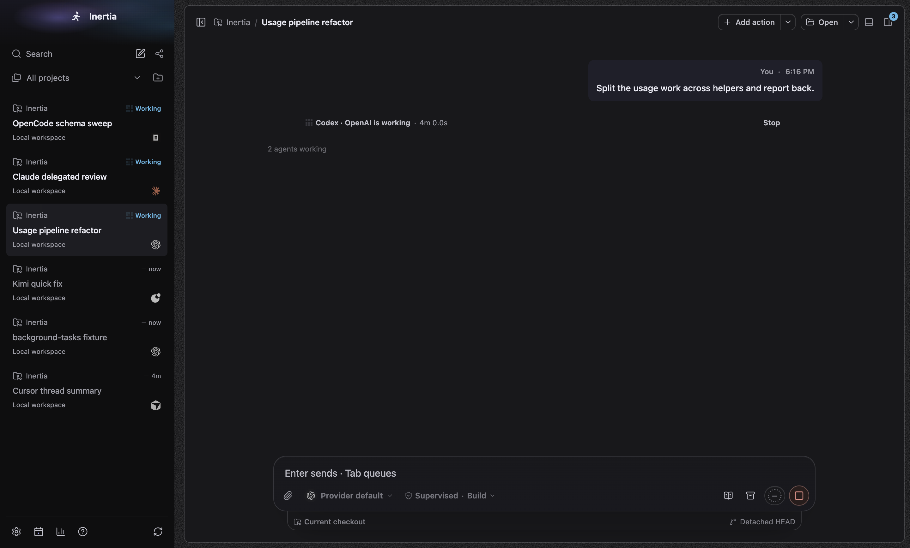
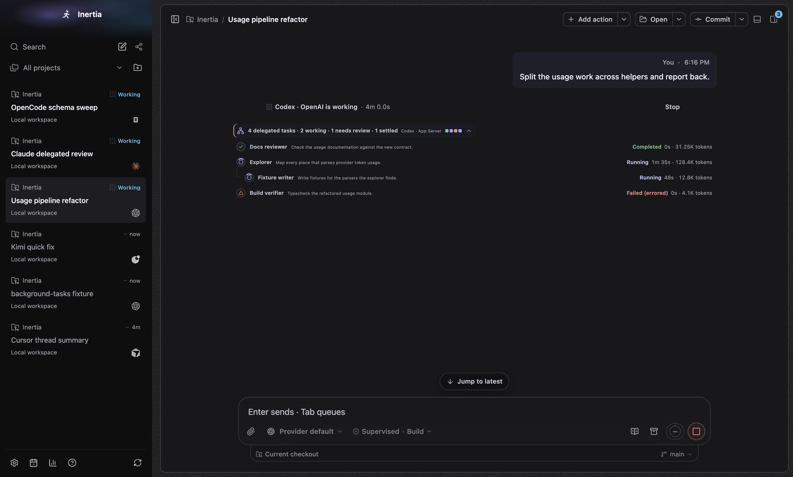
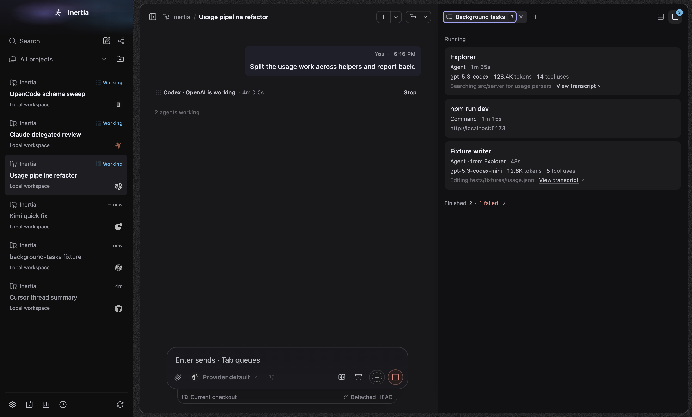
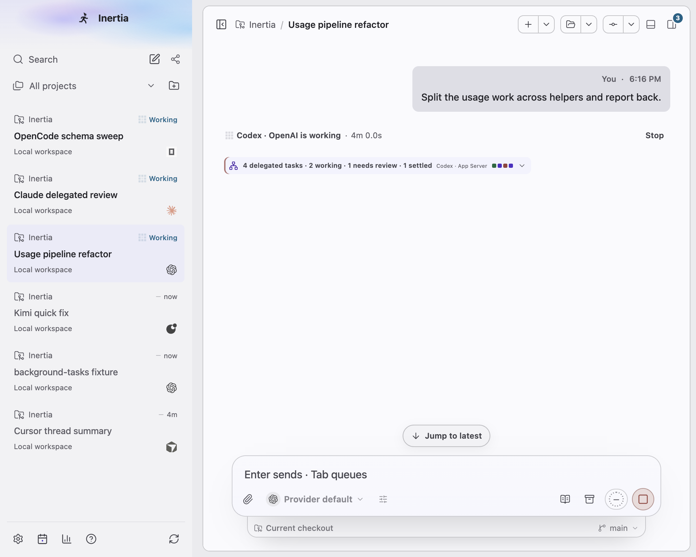
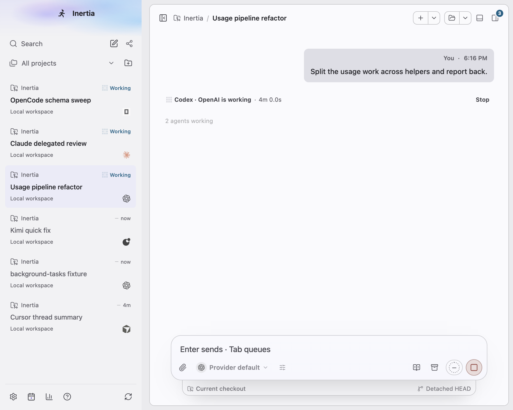
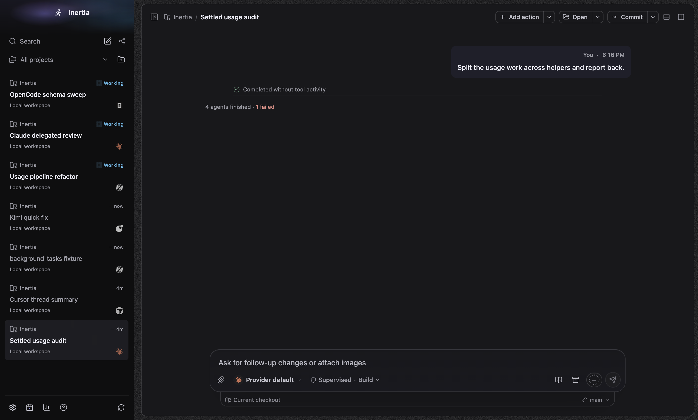

# Background tasks

Real screenshots of the built Electron app on macOS 27.0.1 (arm64), captured by
`tests/e2e/background-tasks.spec.ts` with `animations: "disabled"`. The spec seeds
an isolated synthetic database through `RuntimeStore.upsertSubagentTrace` and
`RuntimeStore.createWorkspaceRun`. No live profile, credentials, provider CLI,
private prompt or user repository content is used.

The panel is a plain list: a muted "Running" label, one quiet card per task
(title; kind and elapsed time; model, tokens and tool uses when reported; what
it is doing or its result, then a quiet "View transcript" toggle), then one
collapsed "Finished" row that counts failures in words and offers a dismiss icon
for finished commands. "View transcript" opens a compact block in the same card:
the task text (4 lines, then "Show more"), the latest progress or outcome (6
lines, then "Show more"), one meta line with the latest step and context left,
and the "View turn" and "Guide parent" links. The only colour is the danger text
for failed work. The line of a running task uses the timeline's own thinking
sweep (`turn-thinking-sweep` in `src/renderer/src/styles.css`), with the same
reduced-motion, forced-colours and hidden-window guards.

In the chat, a turn that delegated work shows one quiet line instead of the old
expandable "N delegated tasks" block: "2 agents working" while any of its agents
is live (with the same sweep), otherwise "4 agents finished", followed by
" · 1 failed" in danger colour when an agent failed, was interrupted or was
lost. The line is a real button named, for example, "Open Background tasks,
2 agents working". Click, Enter or Space opens the right panel on Background
tasks (including the sheet presentation) and moves focus to its tab. In a
detached chat window the same line returns the chat to the main window
("Return chat to main window, 2 agents working"), where the panel lives.

## Chat timeline: before and after

Both columns use the same fixture, the same frozen clock and the same window.
"Before" is the branch at `1a6dfd1d`; "after" is this change. The before
screenshots were taken with a one-off capture appended to this spec at that
commit and are kept here for review only.

| Before | After |
| --- | --- |
|  |  |
| 1440 × 1100 dark. "4 delegated tasks · 2 working · 1 needs review · 1 settled", route and status squares | 1440 × 1100 dark. "2 agents working" |
|  |  |
| 1440 × 1100 dark. The disclosure expanded inline into one row per task | 1440 × 1100 dark. Enter on the line opened Background tasks; focus is on its tab |
|  |  |
| 1000 × 800 light | 1000 × 800 light |

A settled turn (seeded only for this capture: three completed agents and one
failed one) has no before counterpart:

## Reproducibility

Every seeded timestamp is relative to a fixed instant (2026-09-30 16:20 UTC) and
the renderer's clock is frozen there with Playwright's `page.clock.setFixedTime`
before any capture. Run start and finish times are written to the fixture
database directly because `createWorkspaceRun` stamps the wall clock. Across the
three `--repeat-each` runs the Background tasks panel matched pixel for pixel;
the remaining differences above a small threshold were in the chat column (the
animated working indicator and composer stop control are canvas drawings that
`animations: "disabled"` does not freeze) and one pixel of the corner badge.

## Fixture

| Chat | Harness | What it shows |
| --- | --- | --- |
| Usage pipeline refactor | `codex-app-server` | Running: Explorer (model, tokens, tool uses, current tool), a dev server the user started, and a child agent "from Explorer". Finished: a failed agent, a completed agent and a failed test command (2 failed). Two commands the provider ran inside its turn are correctly left out. |
| Claude delegated review | `claude-agent-sdk` | Running task with its last tool, a total-only token count and a Stop control; a finished task with its transcript open (outcome first) |
| OpenCode schema sweep | `opencode-sdk` | Running task with its transcript open, showing every latest-step field; a finished child "from Schema sweep" |
| Cursor thread summary | `cursor-acp` | Finished task with model and runtime and no token text on the card; its transcript says "Tokens not reported by Cursor" |
| Kimi quick fix | `kimi-acp` | Empty state: "No background tasks." |

## Wide (1440 × 1100)

| Dark | Light |
| --- | --- |
|  |  |

## Narrow (1000 × 800), one transcript open

| Light | Dark |
| --- | --- |
|  |  |

## Small window (760 × 600)

## Each harness

## What the spec asserts

- The chat line: "2 agents working" with the shared sweep and no danger text
  while agents run; "4 agents finished · 1 failed" with only "1 failed" in the
  danger colour once they settle; one line per turn. Enter or Space on the line
  opens Background tasks and focuses its tab, and the panel lists the turn's
  agents.
- Card content per harness, the "from <parent>" line for a child agent, and no
  headings, pills or summary block in the panel.
- The same active count on the tab and the corner toggle ("3 background tasks
  active"); provider command activities inside a turn are not listed or counted.
- The Finished row ("Finished 3 · 2 failed"), its danger word, and the dismiss
  icon, which removes the finished command through the existing
  `activity.dismiss` command and disappears when nothing is dismissible.
- The transcript: collapsed by default, compact (no label grid or meter), task
  text, progress, one meta line ("… · 75% context left"), and View turn; opening
  it adds less than 110 px to a card.
- The running task's line carries the shared thinking sweep; its title does not.
- Keyboard: "View transcript" is reached with Tab from the tab and toggled with
  Enter; every button has an accessible name and no control sits inside another.
- No viewport or panel overflow, no truncated titles at 760 × 600, and the
  composer still ends at its dock.
- After an application restart the surface is still selected, tokens persist,
  recovery marks live tasks Lost with no invented runtime, and the interrupted
  dev server shows as a failed command.

## Runs on this machine

- `tests/e2e/background-tasks.spec.ts --repeat-each=3`: 12 passed normally
  and 12 passed under 12 CPU-burning processes.
- `tests/e2e/activity.spec.ts --repeat-each=3`: 9 passed normally and 9 passed
  under 12 CPU-burning processes.
- `tests/e2e/renderer-background.spec.ts`: the mature profile, which now opens
  Background tasks from the agents line and measures its six live timers,
  passed 3 of 4 runs under 12 CPU-burning processes and every unloaded run.
  Across all runs of the spec the only failures were the sidebar aurora
  assertion (the window lost OS focus mid-sample), which also failed in the
  128-turn profile that has no sub-agents and so no agents line.
- `layout`, `composer-entry`, `terminal`, `draft-worktree`, `transcript`,
  `chat-scroll-memory` and `activity-lifecycle` specs: each passed once.
- `npm run benchmark:desktop:built` with the agents line: long-conversation
  scroll 8.3 ms median frame and 10.2 ms p95 with no long tasks; streaming first
  paint 22 ms and final paint 265 ms. With the old disclosure the branch
  measured 8.3 ms, 10.3 ms, 23 ms and 268 ms, and `origin/main` (`fd02e238`)
  8.3 ms, 9.8 ms, 22 ms and 277 ms.

## Not exercised

- Linux and Windows rendering; forced colours and reduced motion in a real
  window (covered by stylesheet assertions in the DOM tests only).
- Pressing Stop against a real provider or process; the Stop wiring and focus
  behaviour when a control disappears are covered by DOM tests.
- Live telemetry from real providers; all data is seeded.
- The detached chat window's line ("Return chat to main window, …") is covered
  by DOM tests only.
- A turn settling while scrolled up was not driven live; the spec instead
  asserts that the line keeps the same height when working and when finished,
  so settling cannot move the rows below it.

See [renderer-bundle.json](renderer-bundle.json) for every closure measured
against `origin/main` (`fd02e238`) and against the branch before the agents
line. Replacing the disclosure removed 278 bytes from the workbench first load,
5,008 bytes from the detached chat first load, 4,776 bytes from shared core,
7,112 bytes from the entry stylesheet and 6,994 bytes from the transcript
chunk. Against main, the workbench first load now grows by 758 bytes, while the
detached chat first load (-4,745), shared core (-3,774), entry stylesheet
(-6,984) and transcript chunk (-6,815) are smaller than on main. No cap was
changed. The Background tasks surface itself (12,617 bytes) loads on demand.
