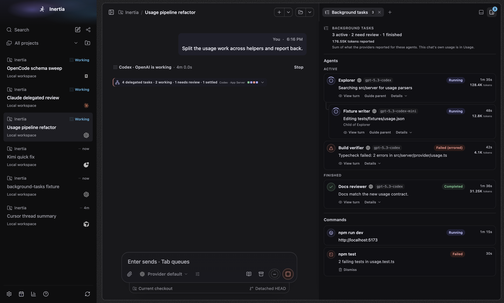
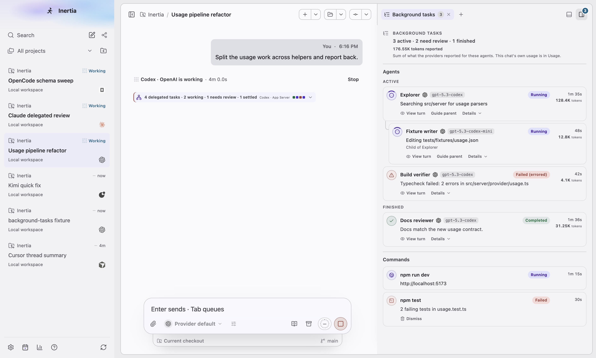
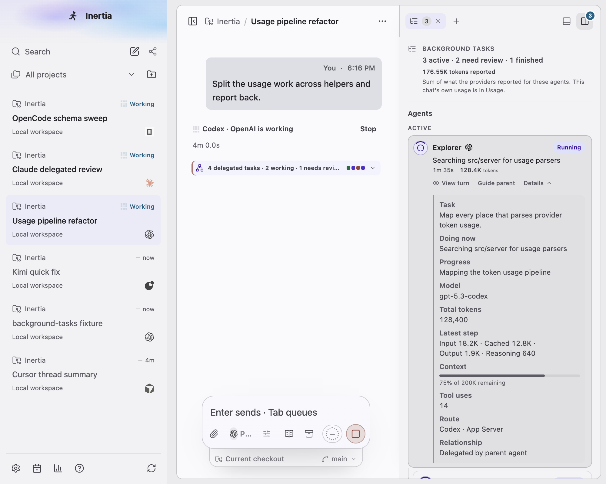
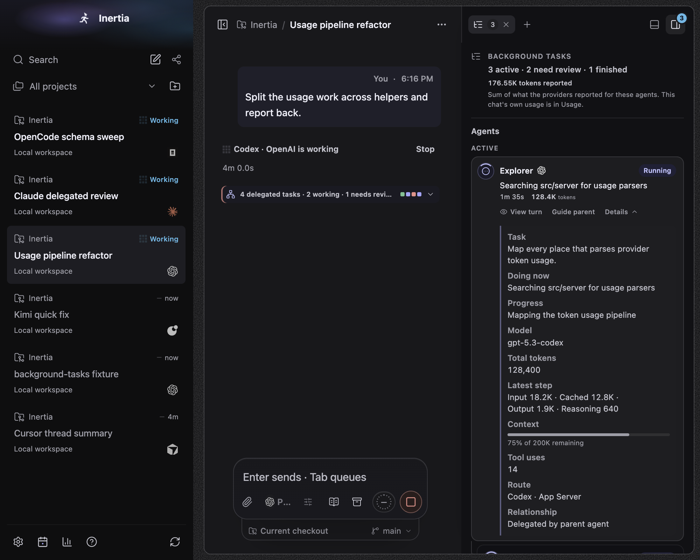
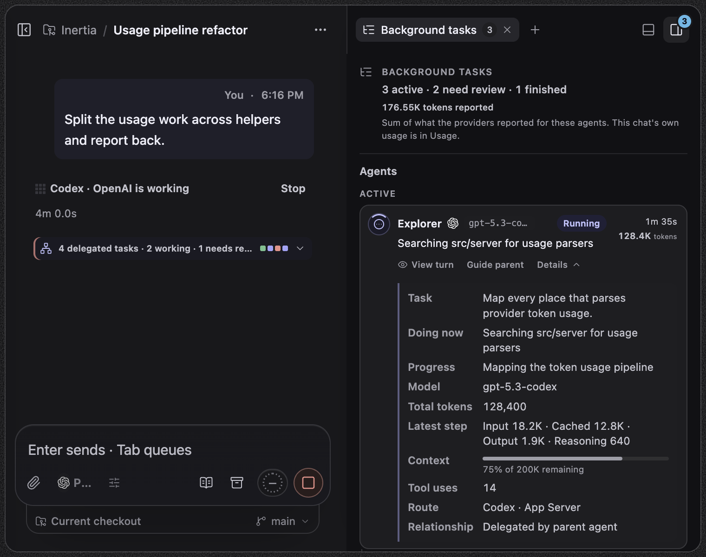
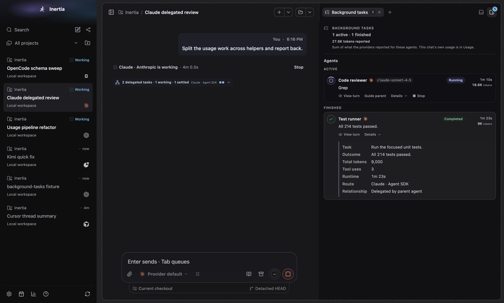
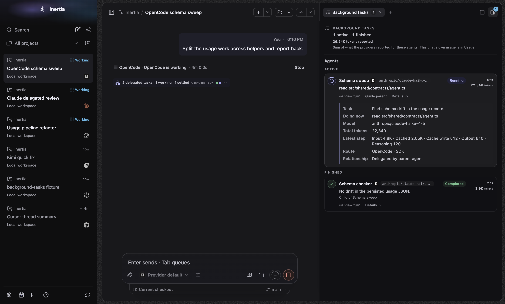
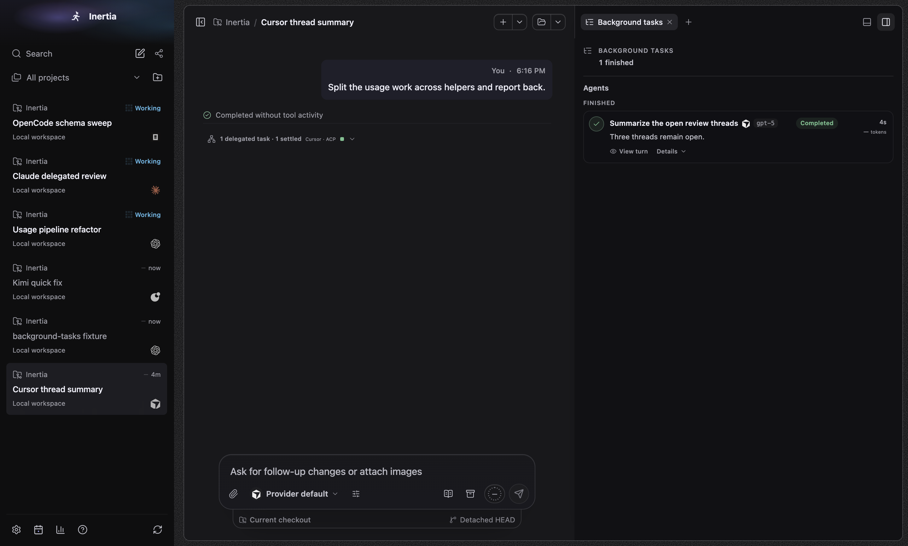

# Background tasks

Real screenshots of the built Electron app on macOS 27.0.1 (arm64), captured by
`tests/e2e/background-tasks.spec.ts` with `animations: "disabled"`. The spec seeds
an isolated synthetic database through `RuntimeStore.upsertSubagentTrace` and
`RuntimeStore.createWorkspaceRun`. No live profile, credentials, provider CLI,
private prompt or user repository content is used.

## Reproducibility

Every seeded timestamp is relative to a fixed instant (2026-09-30 16:20 UTC) and
the renderer's clock is frozen there with Playwright's `page.clock.setFixedTime`
before any capture, so elapsed times, the transcript timer and message times are
the same on every run. Run start and finish times are written to the fixture
database directly because `createWorkspaceRun` stamps the wall clock. Across the
three `--repeat-each` runs every pixel of the Background tasks panel matched;
the only differences above a small threshold were in the chat column (the
animated working indicator and composer stop control, which are canvas drawings
that `animations: "disabled"` does not freeze).

## Fixture

| Chat | Harness | What it shows |
| --- | --- | --- |
| Usage pipeline refactor | `codex-app-server` | Live root with model, current tool, cumulative tokens, the latest step and context remaining; live nested child; failed task with provider state; completed task; a running dev server and a failed test the user started; two commands the provider ran inside its turn, which the panel correctly leaves out |
| Claude delegated review | `claude-agent-sdk` | Live task with its last tool, a cumulative total only, and a Stop control (the Claude harness supports stopping one task); completed task with provider-reported runtime |
| OpenCode schema sweep | `opencode-sdk` | Live task with every latest-step field, including cache writes; finished nested child |
| Cursor thread summary | `cursor-acp` | Completed task with model and runtime; tokens explained as not reported by Cursor |
| Kimi quick fix | `kimi-acp` | Empty state that explains Kimi Code does not report delegated agents |

## Wide (1440 × 1100)

| Dark | Light |
| --- | --- |
|  |  |

## Narrow (1000 × 800), Details open

| Light | Dark |
| --- | --- |
|  |  |

## Small window (760 × 600)

## Each harness

## What the spec asserts

- Header counts ("3 active · 2 need review · 1 finished"), the reported-token
  total with its visible explanation, and the same active count on the tab and
  the corner toggle ("3 background tasks active").
- Provider command activities inside a turn are not listed or counted.
- Row content: status text pill, model chip, provider icon, current tool,
  elapsed time and tokens; tree indentation of a nested child.
- Details: Doing now, Progress, Model, cumulative total, latest step, context
  remaining (same meaning as the Usage surface), tool uses, runtime and route.
- Keyboard: the Details control is reached with Tab from the tab and toggled
  with Enter; every button in the region has an accessible name.
- No viewport overflow, no horizontal overflow in the panel, task titles never
  truncate at 760 × 600, and the composer still ends at its dock.
- The existing Dismiss command removes a failed command and updates the counts.
- After an application restart the surface is still selected, reported tokens
  persist, recovery marks live tasks Lost with no invented runtime, and the
  interrupted dev server shows as Failed.

## Runs on this machine

- `tests/e2e/background-tasks.spec.ts --repeat-each=3`: 9 passed normally and
  9 passed under 12 CPU-burning processes.
- `activity`, `layout`, `composer-entry`, `terminal` and `draft-worktree` specs:
  each passed once.

## Not exercised

- Linux and Windows rendering; forced colours and reduced motion in a real
  window (covered by stylesheet assertions in the DOM tests only).
- Pressing Stop against a real provider or process; the Stop wiring and the
  focus behaviour when a control disappears are covered by DOM tests.
- Live telemetry from real providers; all data is seeded.

See [renderer-bundle.json](renderer-bundle.json) for every closure measured
against `origin/main` (`2364d768`) and the feature base (`70d3d0f8`).
