# Generated palette evidence

Real Electron screenshots from the isolated `color-palette` fixture on Linux
x64, at 1440 × 1000. No live user profile, prompts, credentials, or project data
are used. These are screenshots of the built app, not mockups.

The workbench uses the existing synthetic code-block history fixture; its
"Recovered legacy history" label is fixture provenance, not a failed live turn.

Verification on 2026-09-11:
- `npm run check`: 8,270 tests passed, 83 existing skips; all quality/build gates passed.
- Electron: 12/12 passed (ten palettes, detached-window lifecycle and native
  appearance/settings navigation).
- The previously failing Windows unit shard passed unchanged on retry:
  2,272 tests passed, including the compiled installer guard in 5.4 seconds.
  No installer behavior or deadline was changed to mask that earlier timeout.

`tests/e2e/color-palette.spec.ts` selects each family through Settings and checks
the actual canvas, sidebar, surface, text, accent, and terminal CSS tokens
against the shared palette definition before capturing the workbench. The
detached-window scenario also checks Ocean against that definition, replacing
the obsolete pre-generator literals without removing its lifecycle checks.

## Theme library

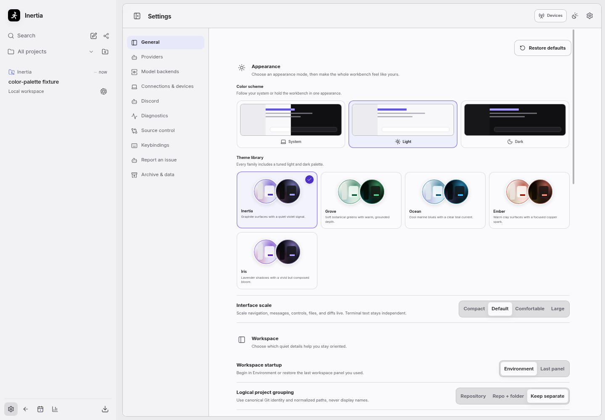
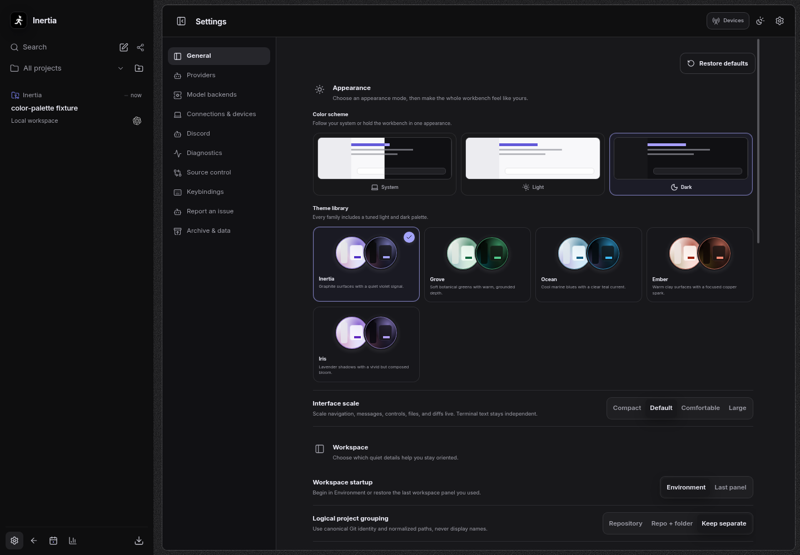

## Workbench families

| Family | Light | Dark |
| --- | --- | --- |
| Inertia | 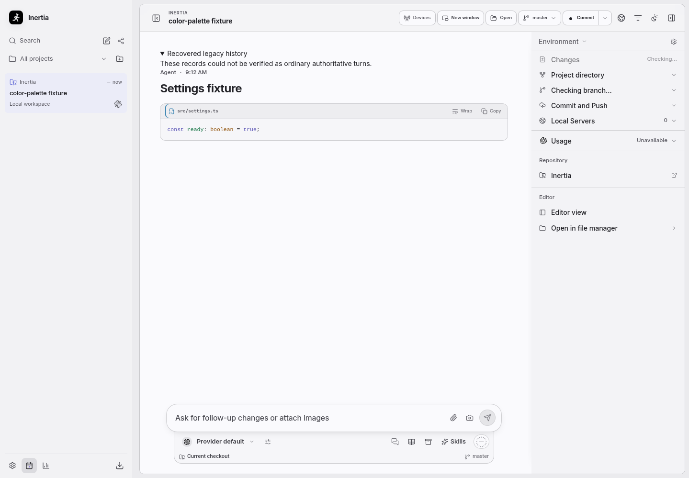 | 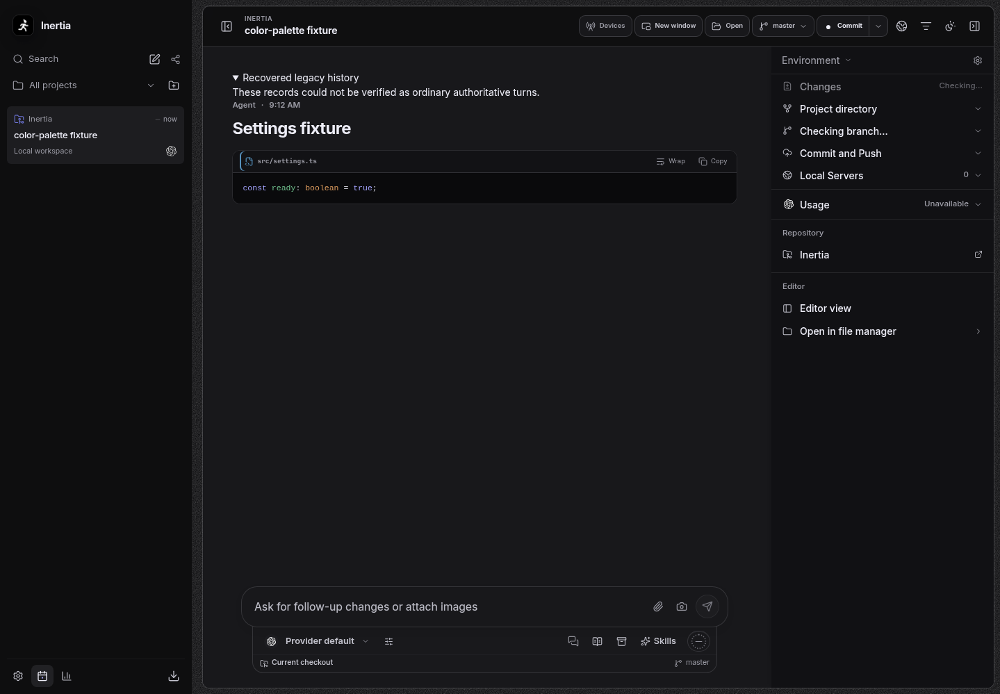 |
| Grove | 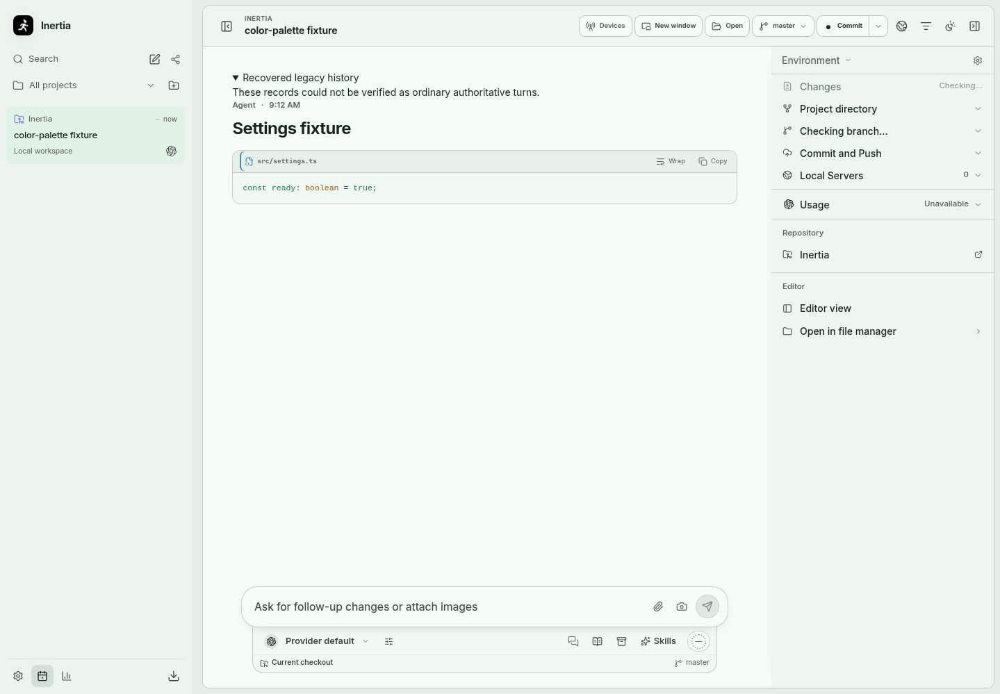 | 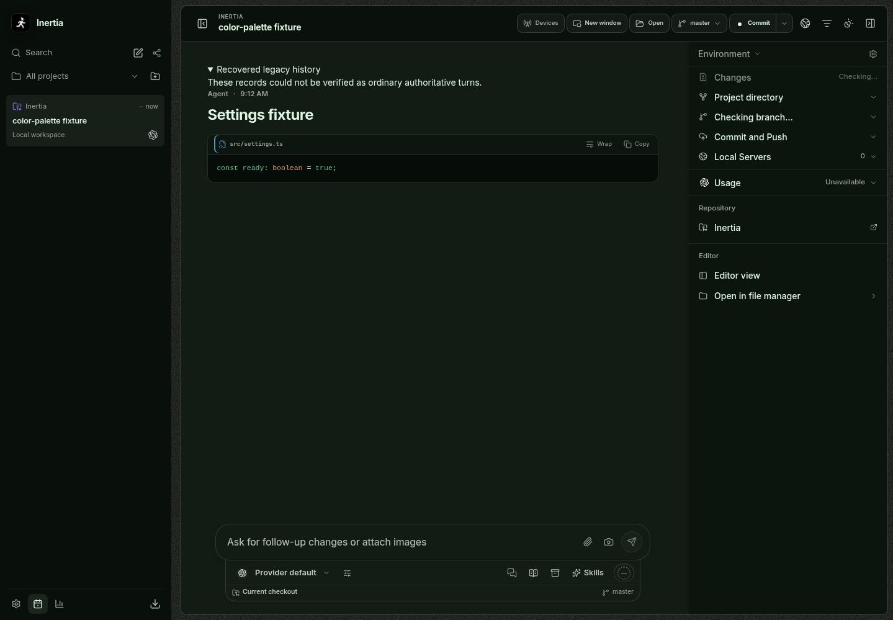 |
| Ocean | 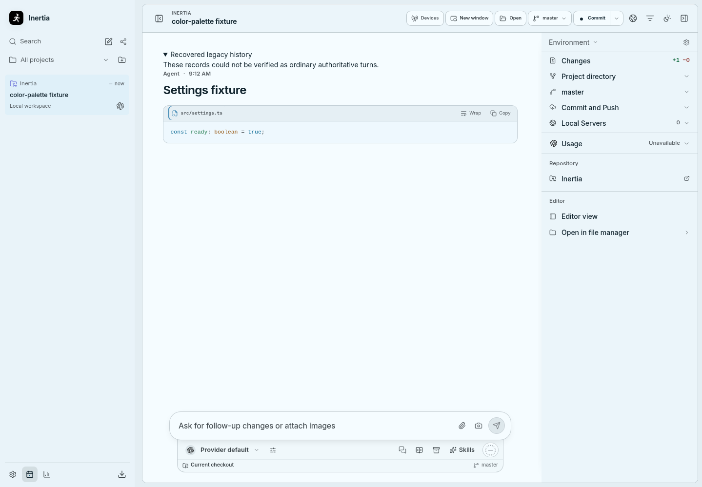 | 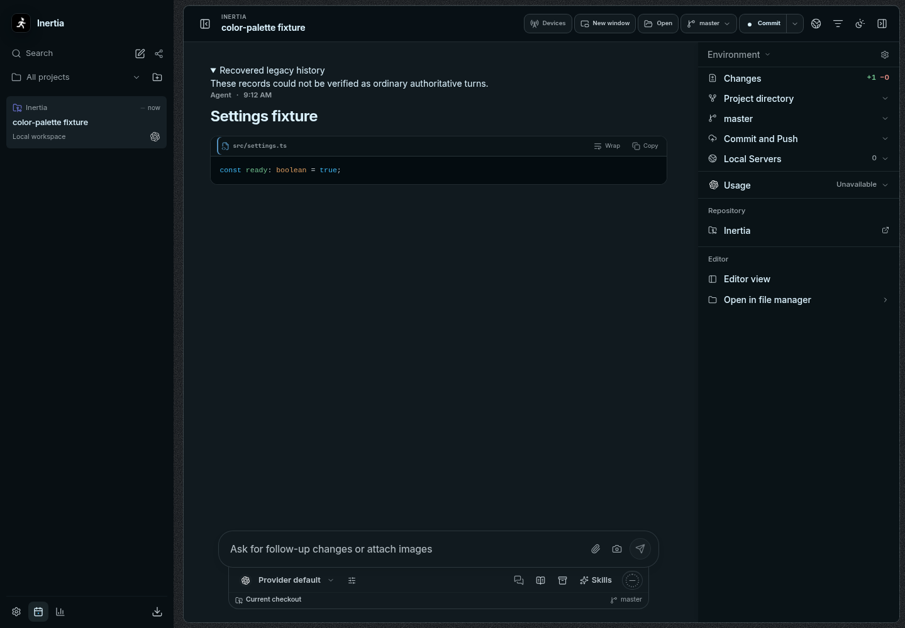 |
| Ember | 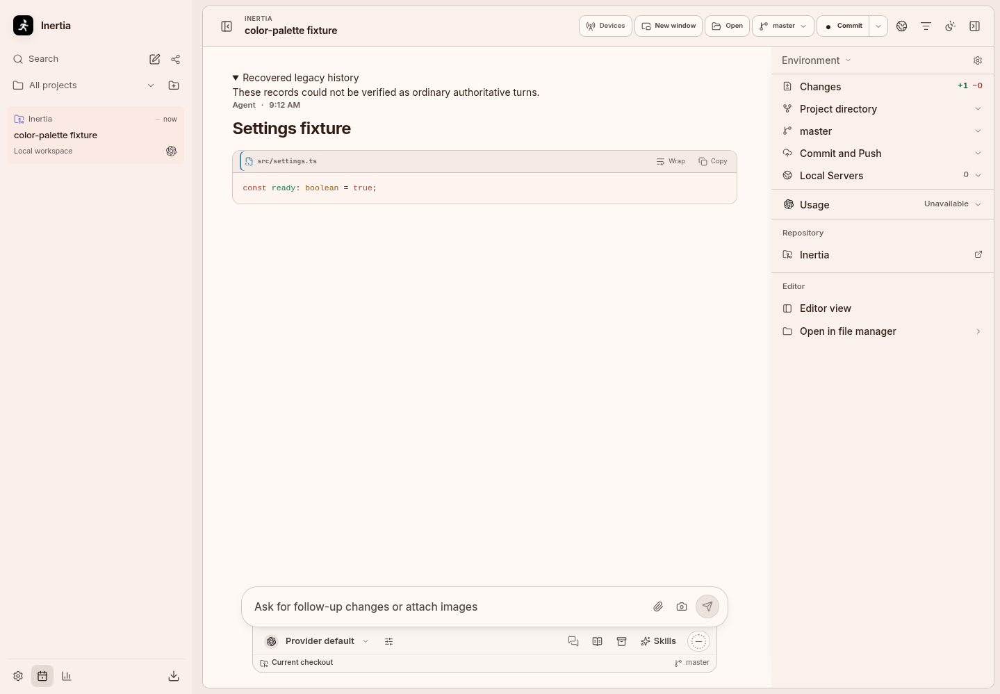 | 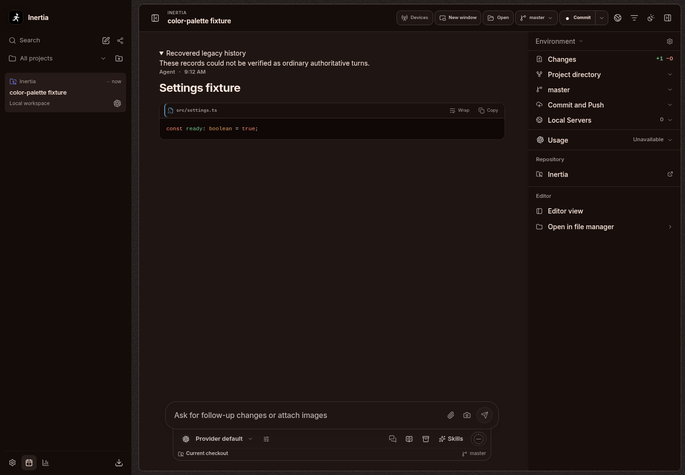 |
| Iris | 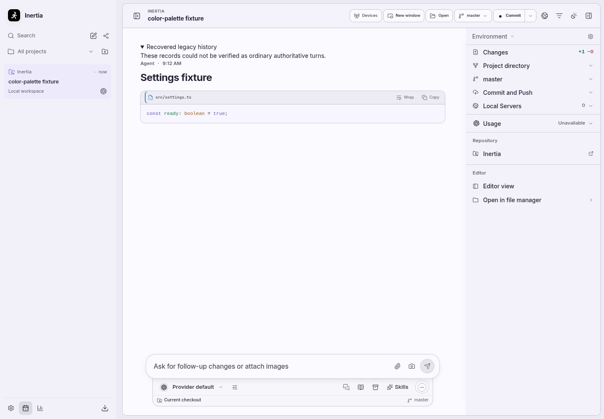 | 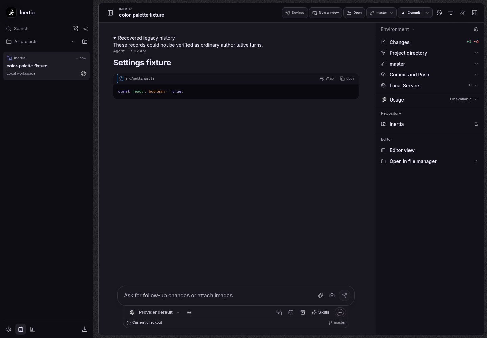 |

Native Windows/macOS rendering and the Windows installer require their CI
jobs; these Linux screenshots do not establish those platform results.
