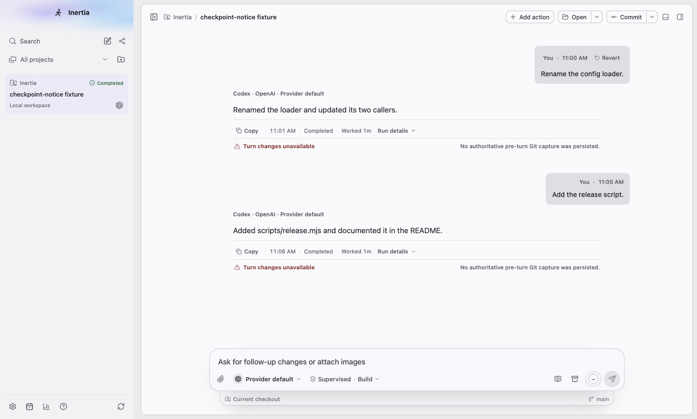
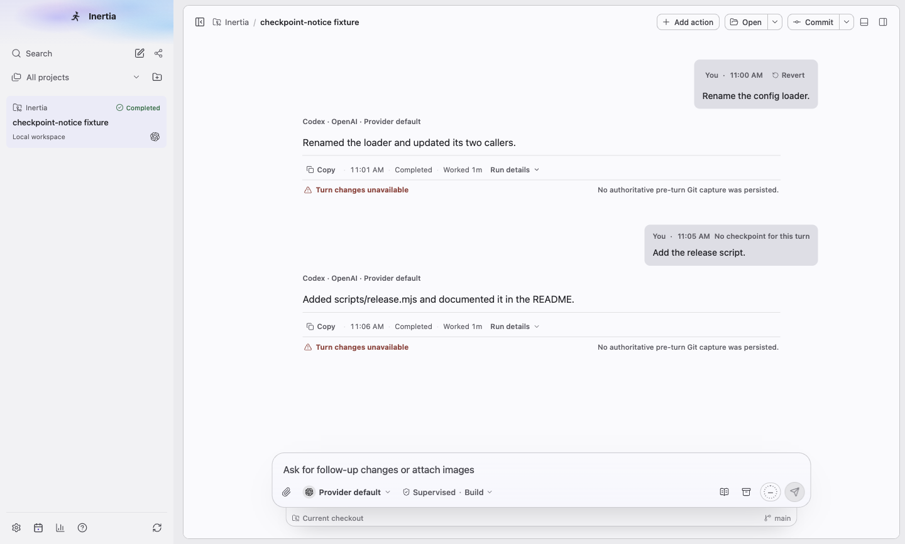
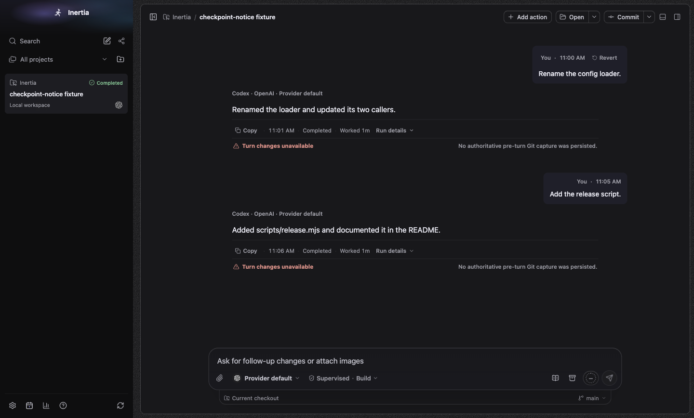
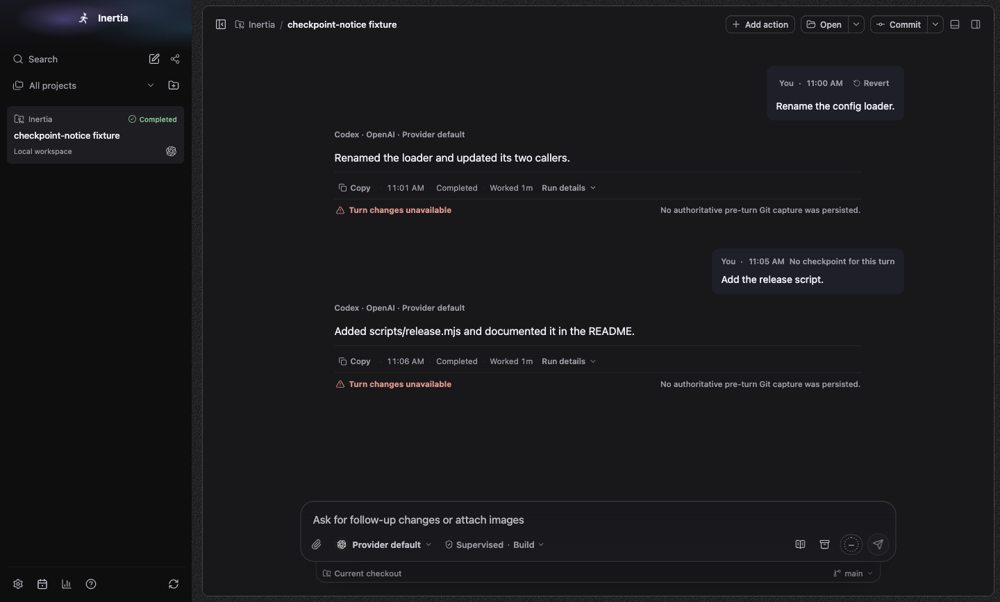
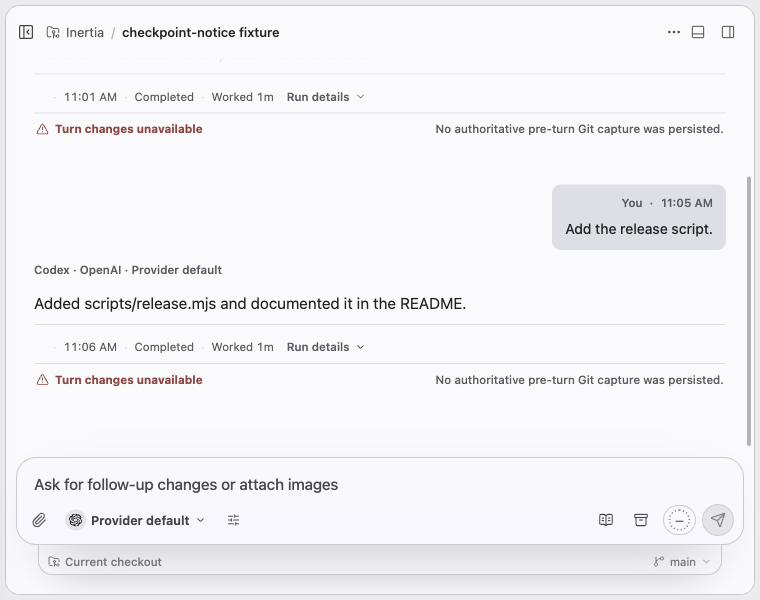
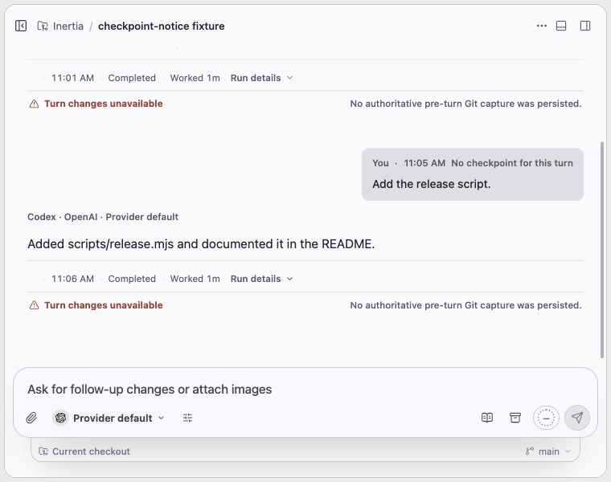
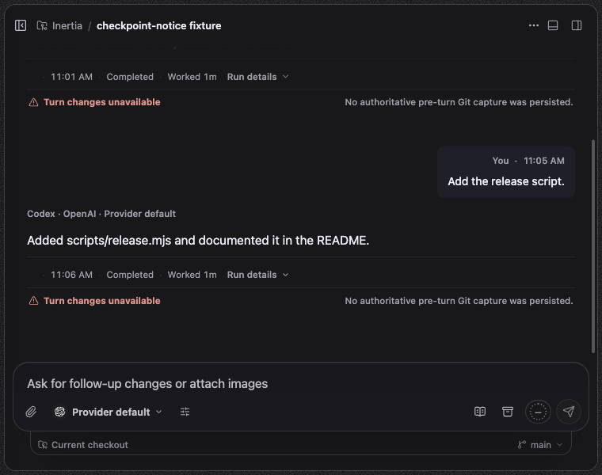
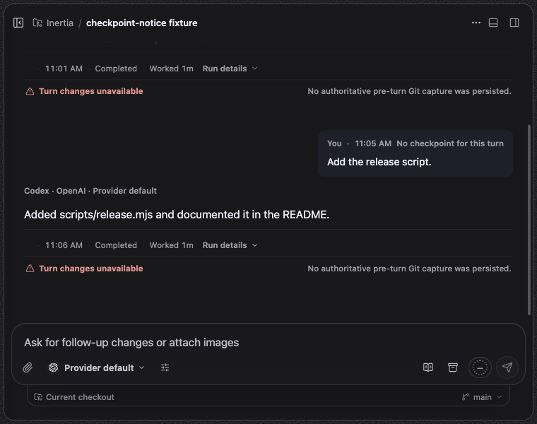

# Checkpoints

Platform: macOS 27.0.1, Electron at device scale 2. Spec: `tests/e2e/checkpoint-notice.spec.ts`, test "says No checkpoint for this turn beside a request whose checkpoint failed", with providers disabled and two completed turns seeded through `RuntimeStore`. The first turn has a checkpoint, the second has the "No checkpoint for this turn" record its turn start writes when the checkpoint failed ("Checkpoint operation timed out."). Before images come from a build of main at `b6865e11` with the same turns and no record, because main never writes one. Sizes: wide 1440x920 and 760x600.

## What changed

- The second request row: before, only the time, with no Revert and nothing saying why; after, "No checkpoint for this turn" in the muted metadata style where Revert would be. Hovering it shows the reason.
- The first request row keeps its Revert button.

"Turn changes unavailable" under both answers comes from the seed, which stores no Git capture for these turns; it is the same before and after and not part of this change.

| Size | Before | After |
| --- | --- | --- |
| light-1440x920 |  |  |
| dark-1440x920 |  |  |
| light-760x600 |  |  |
| dark-760x600 |  |  |
