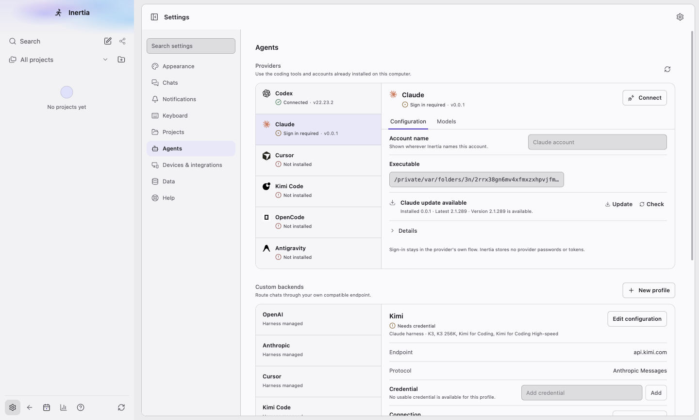
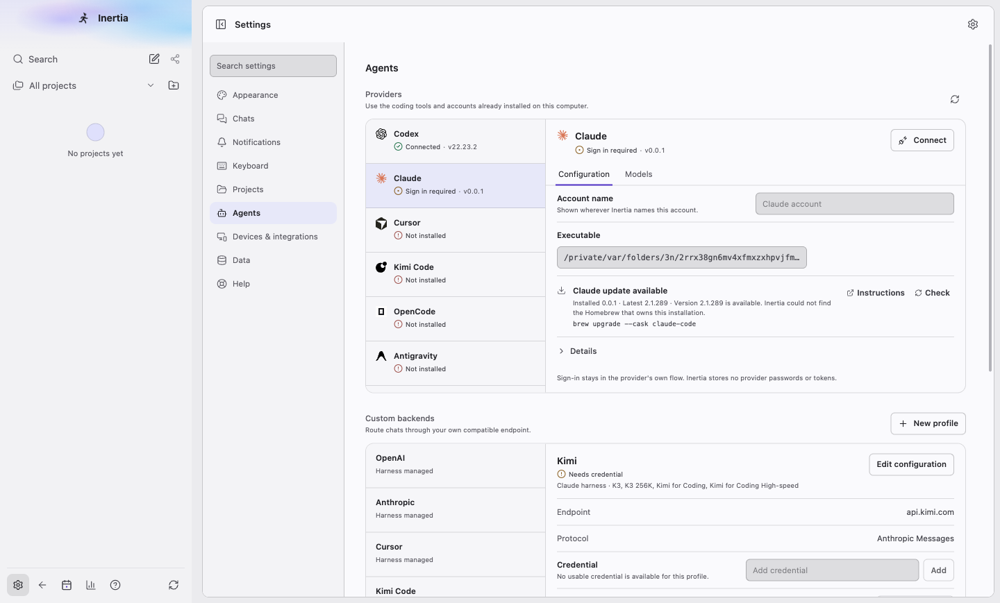
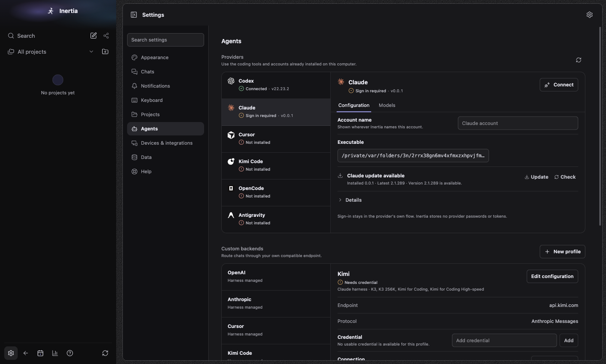
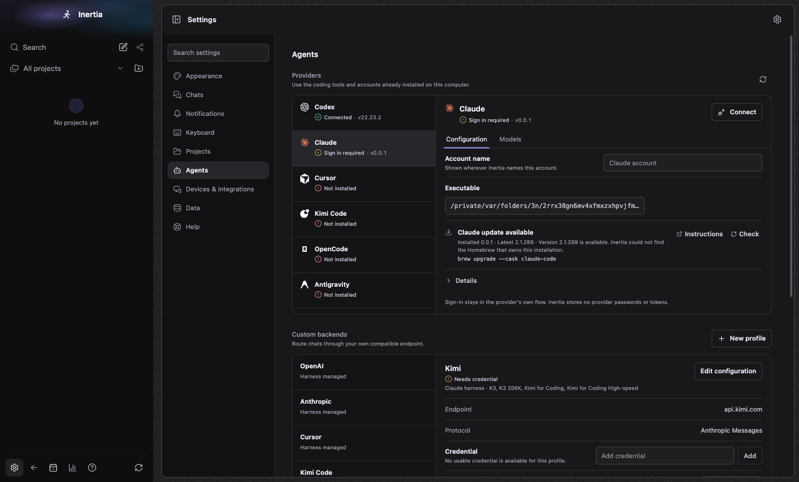
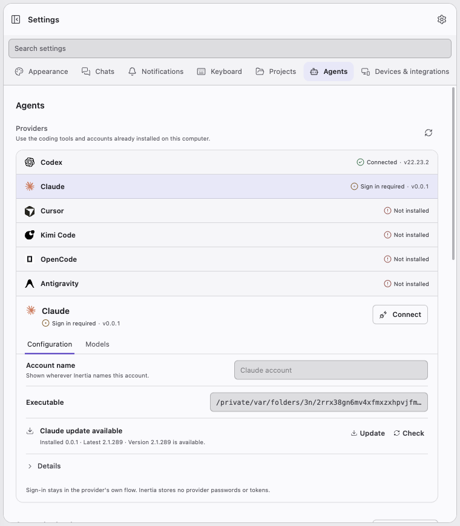
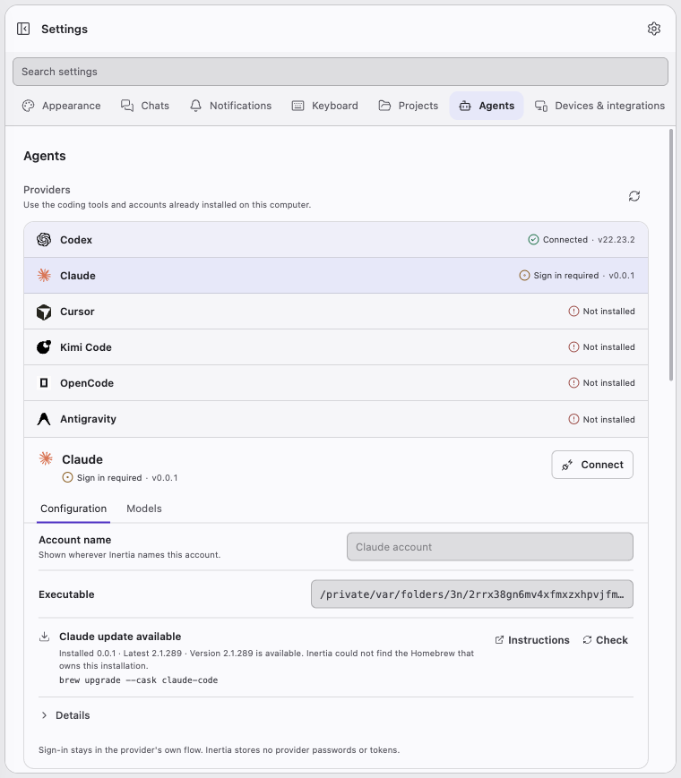
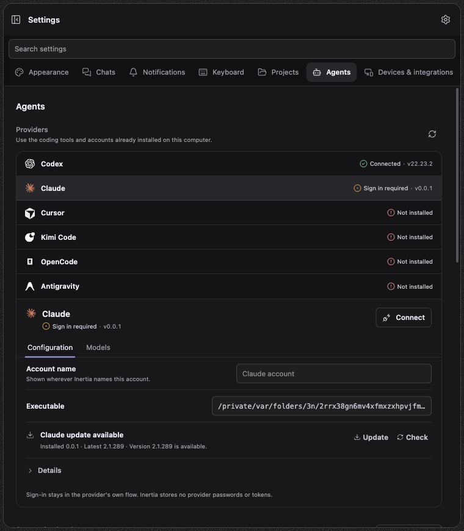
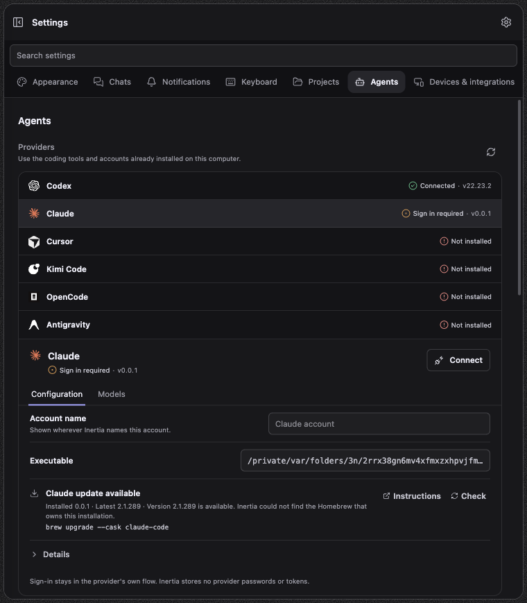

# Provider updates

Platform: macOS 27.0.1, Electron at device scale 2. Spec: `tests/e2e/provider-update-command.spec.ts`. A fake Claude CLI (version 0.0.1, signed out) lives in a Homebrew cask layout, `<test>/brew/Caskroom/claude-code/0.0.1/claude`, linked from the test provider directory. Before images come from a build of main at `b6865e11` running the same layout with captures only. "Latest 2.1.289" in the first state is the npm registry's answer on the day of the capture; the second state reads its latest version from the fake brew.

## What changed

- Claude in a Homebrew keg whose prefix has no `bin/brew`: before, **Update**, which runs `claude update` and is refused by Claude for a Homebrew install; after, no Update, the sentence "Inertia could not find the Homebrew that owns this installation." and the command `brew upgrade --cask claude-code`.
- The same keg once `<prefix>/bin/brew` exists: **Update** runs `<prefix>/bin/brew upgrade --cask claude-code`, and the latest version (0.0.2) is the one that brew reports, not the npm registry's.

The **Update** and **Check & update** buttons themselves look as before; what changed is which installations get them. That and the command for every other owner are covered by `tests/server/provider-maintenance-install-source.test.ts`, `tests/server/provider-maintenance-real-layout.test.ts` and `tests/renderer/provider-maintenance-notice.dom.test.tsx`.

| State | Before | After |
| --- | --- | --- |
| keg without its brew, light 1440x920 |  |  |
| keg without its brew, dark 1440x920 |  |  |
| keg without its brew, light 760x900 |  |  |
| keg without its brew, dark 760x900 |  |  |
| keg with its brew, light 1440x920 | |  |
| keg with its brew, dark 1440x920 | |  |
