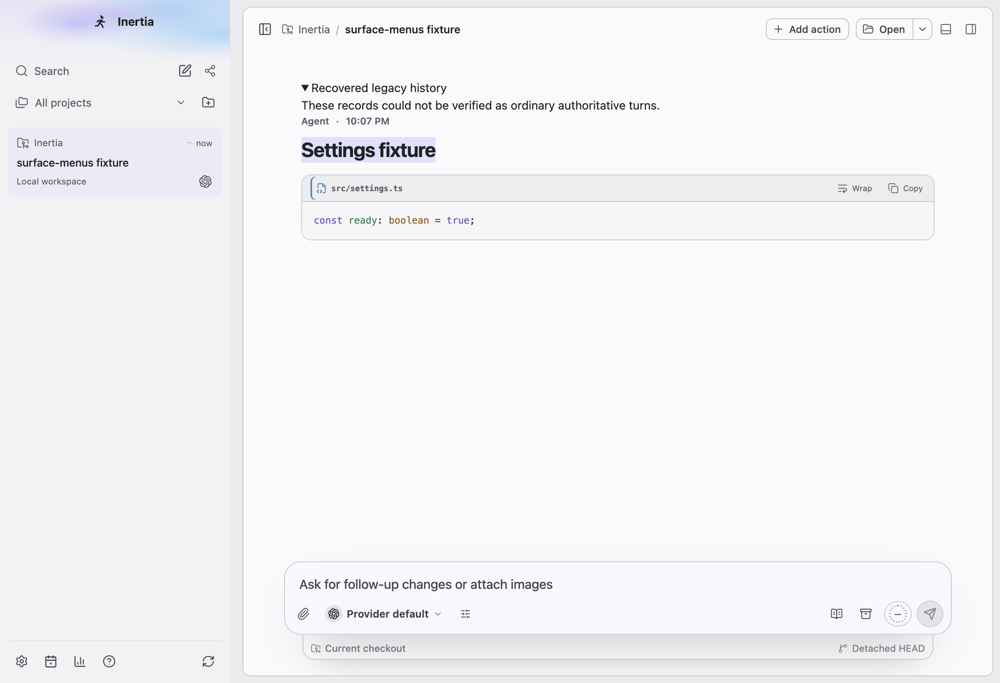
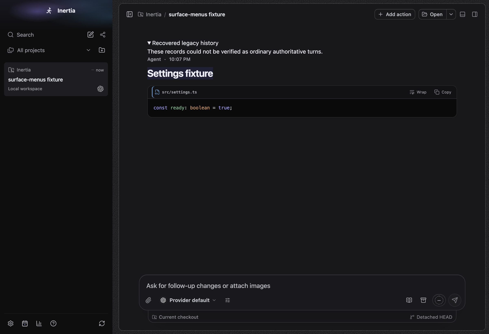
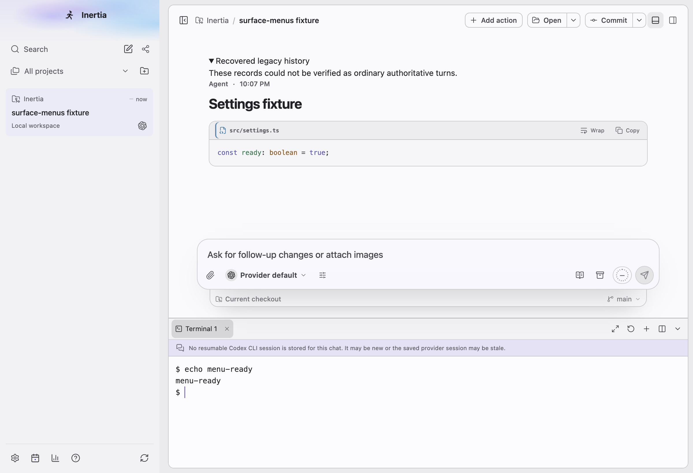
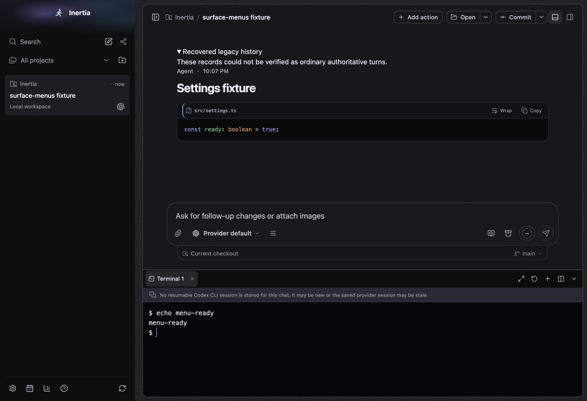

# Right-click in the main frame

Platform: macOS 27.0.1, Electron at device scale 2, window 1200x820. Captured with the E2E harness from a build of this branch, using the `seedAssistantCodeBlock` conversation fixture; the terminal prompt was set to `$ ` before capture so no machine name appears.

The menus themselves are native. The E2E specs replace `Menu.prototype.popup` to record them, so a native menu cannot be captured here. The images show the surfaces with a selection or focus, and the lists below are the exact items the specs assert (`tests/e2e/edit-context-menu.spec.ts`, `tests/main/context-menu-ipc.test.ts`, `tests/main/edit-context-menu.test.ts`, `tests/main/preview-context-menu.test.ts`). Before this change, these surfaces had only the editing menu: Copy when text was selected, the text-field menu in editable fields, and nothing otherwise. In the terminal that was the generic text-field menu acting on xterm's hidden textarea, whose Undo, Redo and Select all did nothing useful.

Every label is in sentence case, including the native editing roles, which carry explicit labels. Unpackaged development builds add **Inspect element** at the end of every surface menu; packaged builds never do.

## Menus by surface

| Surface | Items |
| --- | --- |
| Agent answer | Copy (only with a selection), Copy message, Copy as Markdown |
| Your message | Copy (only with a selection), Copy message |
| Code block | Copy (only with a selection), Copy code |
| File link in an answer, changed file | Open, Reveal in Finder, Copy path, Copy relative path |
| File in Files | Open, Reveal in Finder, Copy path, Copy relative path |
| Folder in Files | Reveal in Finder, Copy path, Copy relative path |
| Workspace terminal | Copy (disabled without a selection), Paste, Select all, Clear |
| Sign-in terminal | Copy (disabled without a selection), Paste, Select all |
| Web link (native) | Copy link address, Open link, then Copy for a selection |
| Image (native) | Copy image |
| Misspelled word in a text field | Up to five suggestions or "No suggestions", then the editing actions |
| Browser pane page | Editing actions or Copy for a selection, Copy link address on a safe link, Back, Forward, Reload (disabled while an agent Browser command runs) |

Reveal reads "Reveal in File Explorer" on Windows and "Reveal in file manager" on Linux. On macOS, Chromium selects the word under a right-click, so Copy also appears there for links and text.

| Surface | Light | Dark |
| --- | --- | --- |
| Answer with a selection |  |  |
| Workspace terminal |  |  |
