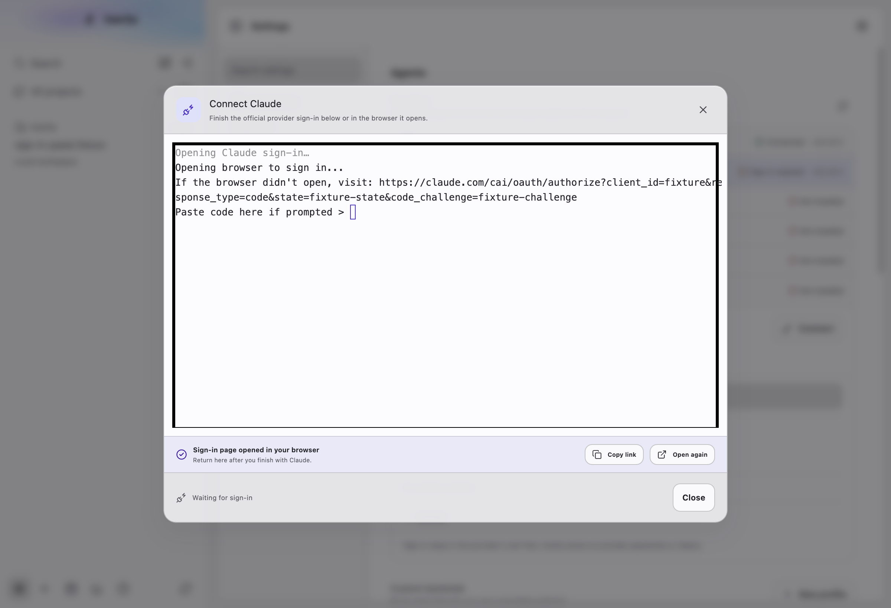
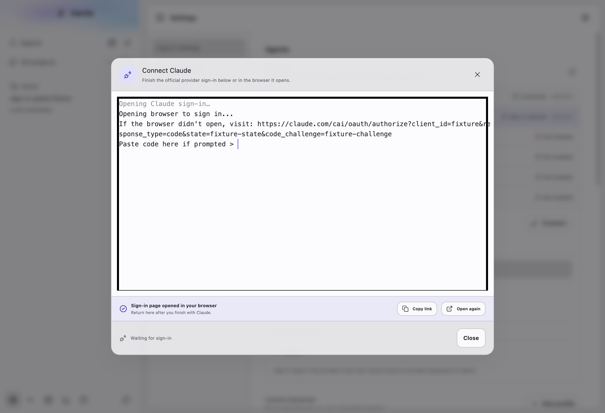
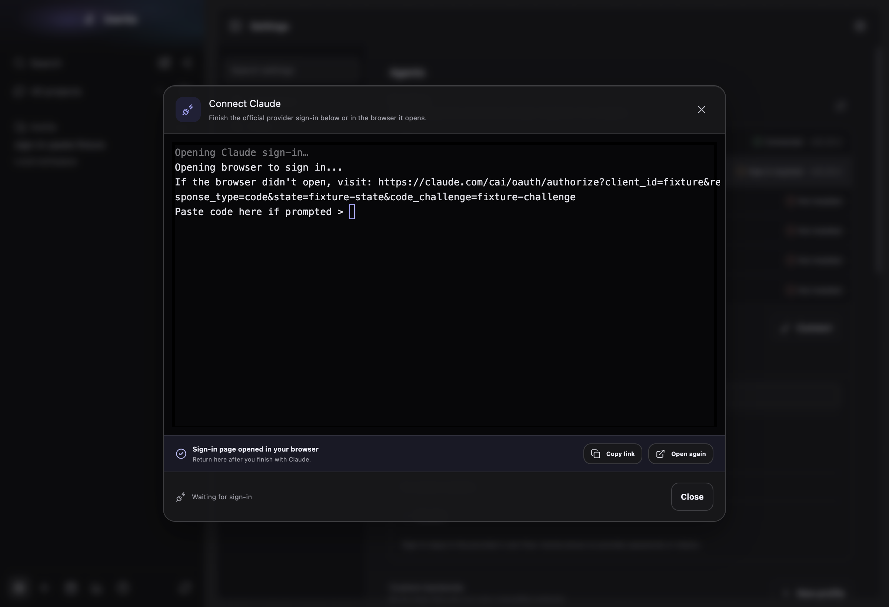

# Sign-in with paste

Platform: macOS 27.0.1, Electron at device scale 2, window 1200x820. Captured with the E2E harness and a fake Claude login that prints the authorize URL and "Paste code here if prompted >" (the same fixture shape as `tests/e2e/provider-auth.spec.ts`; no real provider CLI ran). Before images come from a build of `feat/core-wins` at `51c525e7`, without these changes, running the same capture.

Each image is taken right after **Copy link** and then **Open again** in the browser helper bar.

- Before: focus stays on the **Open again** button (hollow terminal cursor). Coming back from the browser and pressing ⌘V or Ctrl+V pastes into a button, so the code is lost, and Enter opens the browser again.
- After: the terminal has focus (solid bar cursor), so the paste lands at the provider's prompt. A window refocus never restores a helper-bar button.

The native right-click menu in the dialog (Copy, Paste, Select all; no Clear) is recorded by `tests/e2e/provider-auth-input.spec.ts` and listed in [../right-click/README.md](../right-click/README.md).

| Theme | Before | After |
| --- | --- | --- |
| Light |  |  |
| Dark |  |  |
