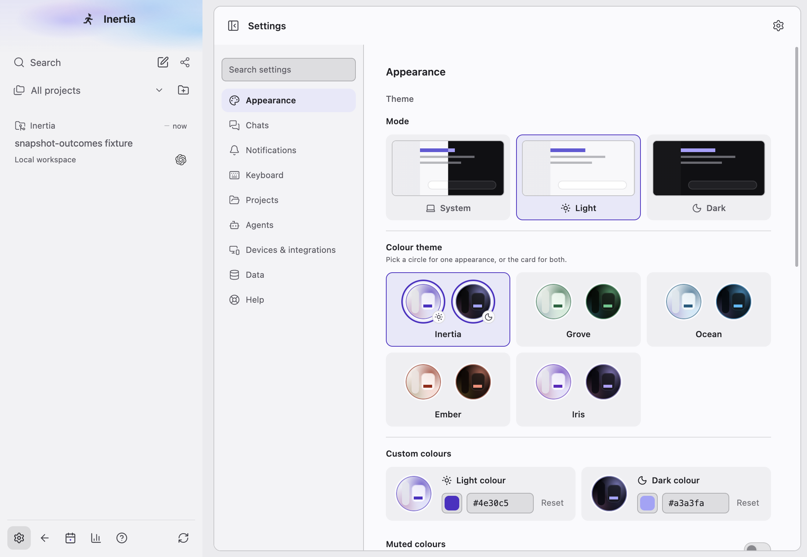
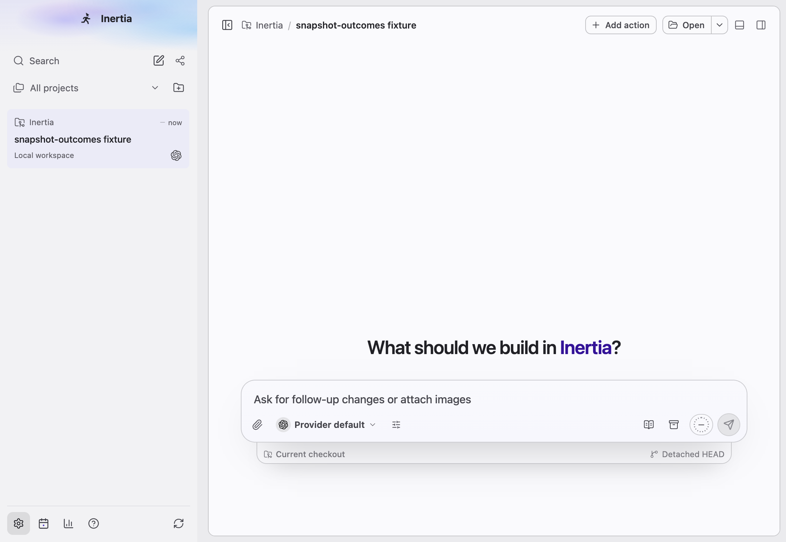
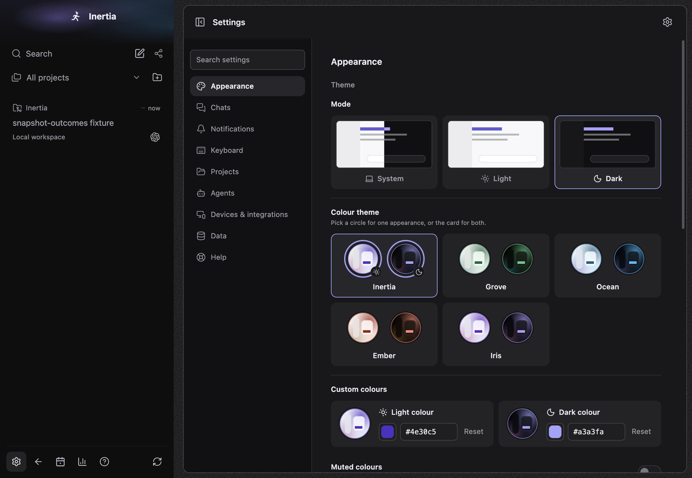
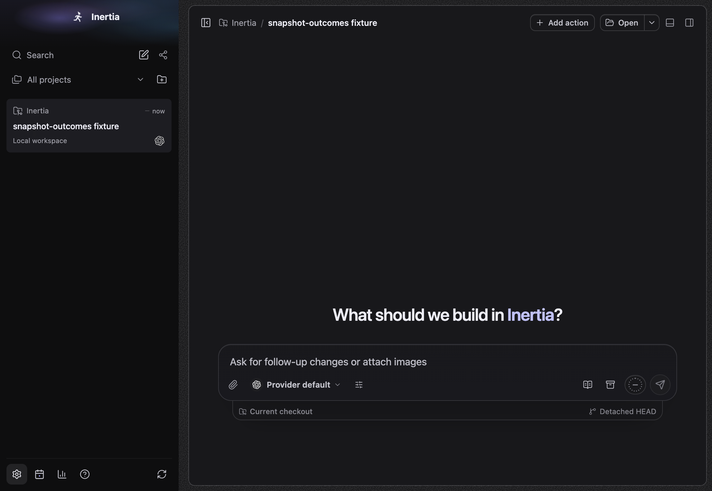
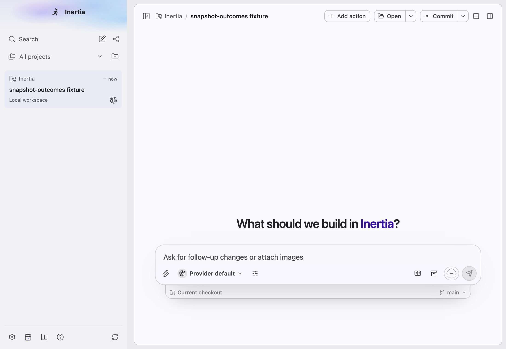
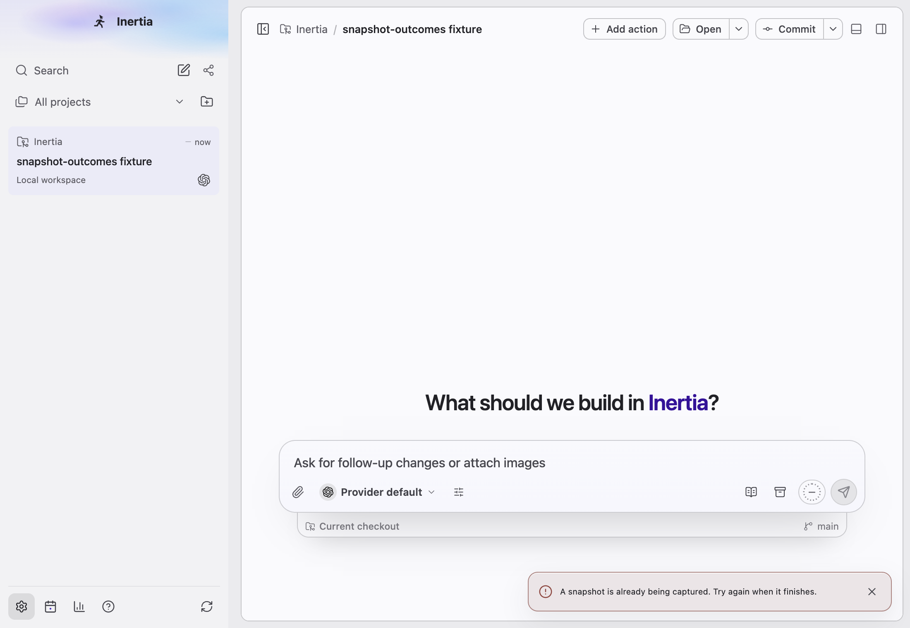
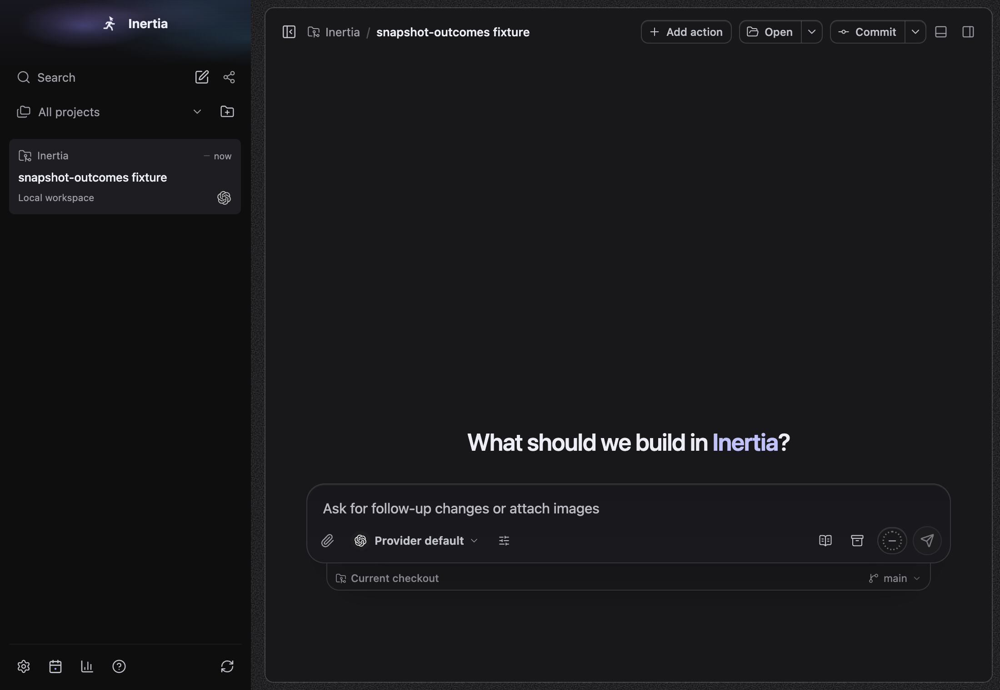
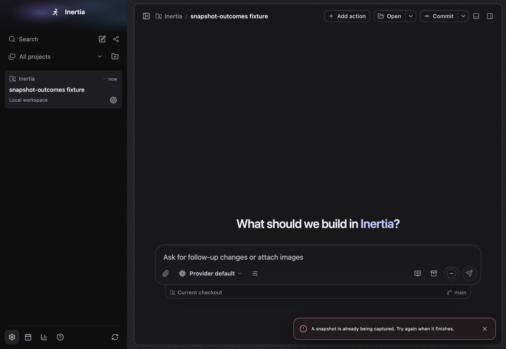

# Snapshots

Platform: macOS 27.0.1, Electron at device scale 2, window 1100x760. Spec: `tests/e2e/snapshots-compaction.spec.ts`, test "opens the chat for a pending snapshot and explains a busy shortcut", with a seeded conversation. The deliveries are sent through the real `inertia:snapshot-ready` IPC channel from the main process, because this host has not granted Accessibility or Screen Recording to the test build, so the real shortcut cannot capture here. Before images come from a build of `feat/core-wins` at `38290940` (the branch without this area) with the same steps; that build ignores both deliveries.

## What changed

- Pending snapshot: Settings is open, so no chat message box can receive a capture. Before, the shortcut was dropped and Inertia stayed on Settings. After, the capture is kept as a pending snapshot and Inertia returns to the selected chat, whose message box receives it.
- Busy shortcut: a second press while a capture runs. Before, nothing. After, the main window's existing notice says "A snapshot is already being captured. Try again when it finishes.", without moving focus.

| Case | Before | After |
| --- | --- | --- |
| pending, light |  |  |
| pending, dark |  |  |
| busy notice, light |  |  |
| busy notice, dark |  |  |

Window-only pixels on macOS have no screenshot here: they need a granted, signed build (see "Owner verification on a signed macOS build" in `docs/SNAPSHOTS_AND_COMPACTION.md`).
