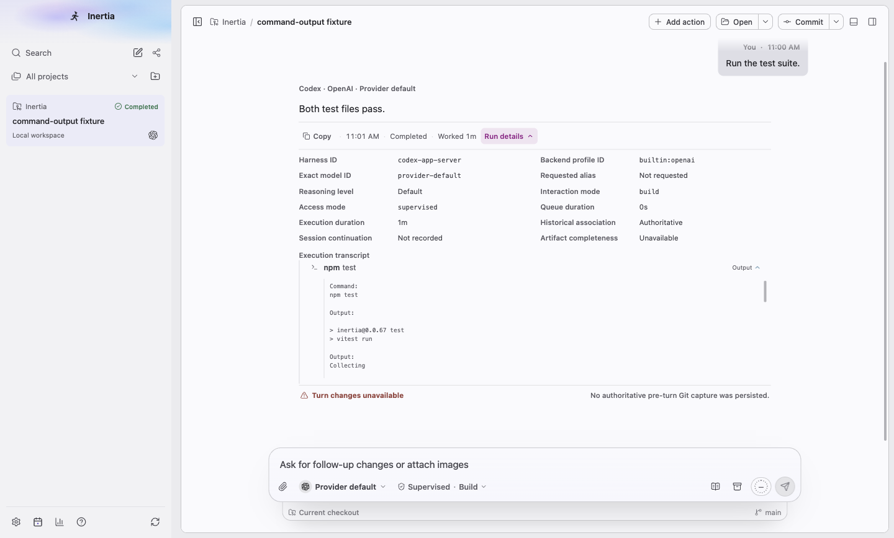
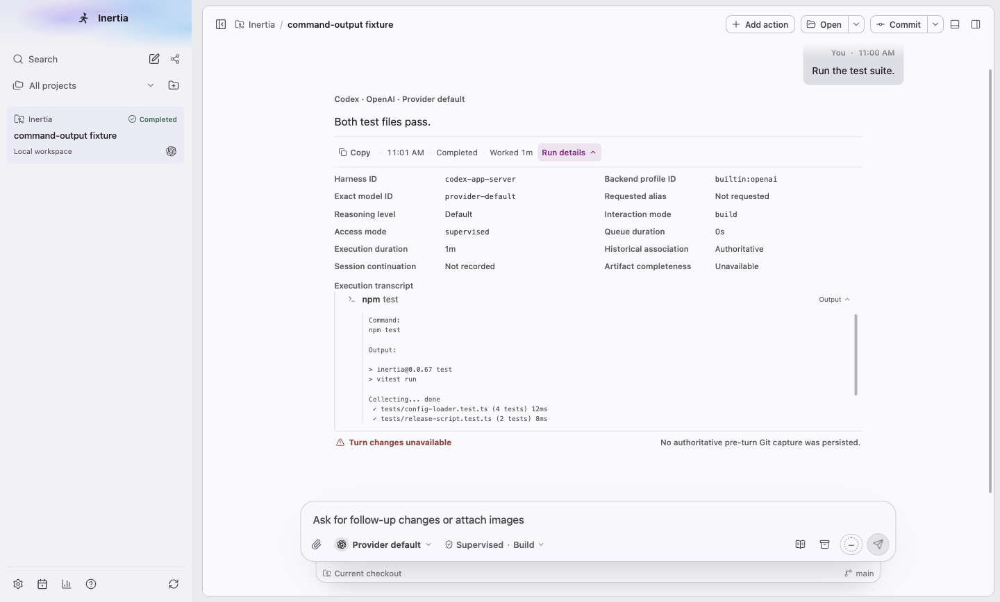
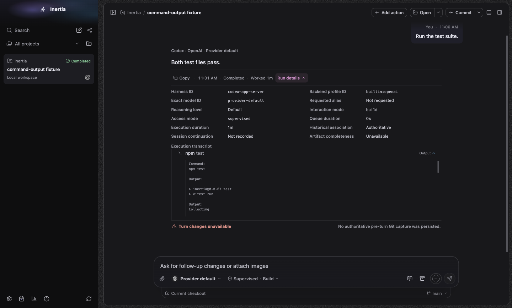
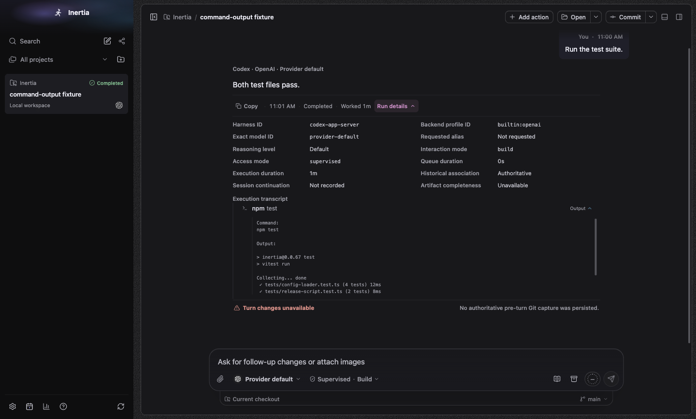
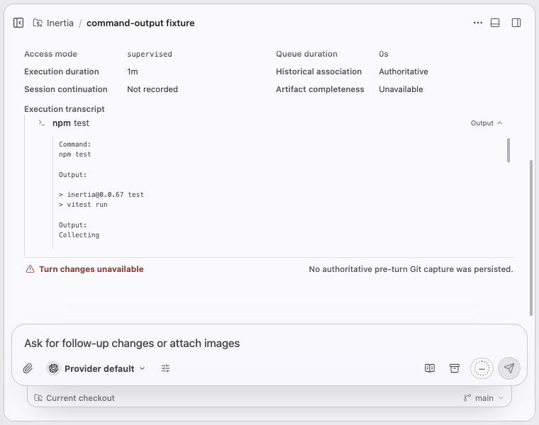
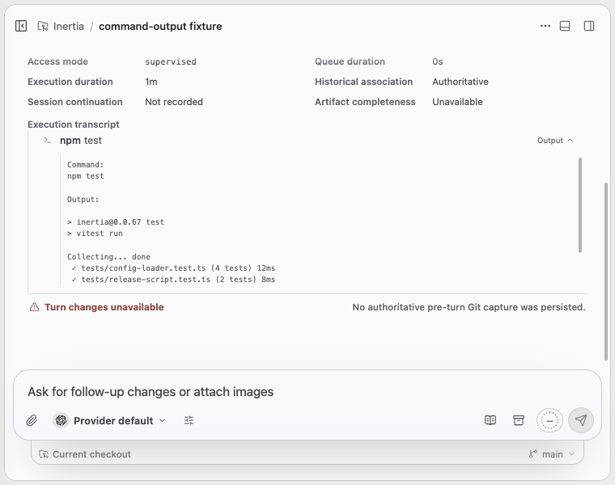
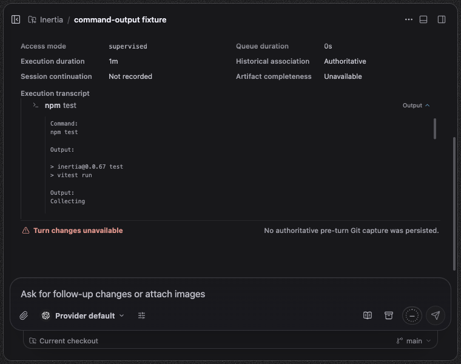
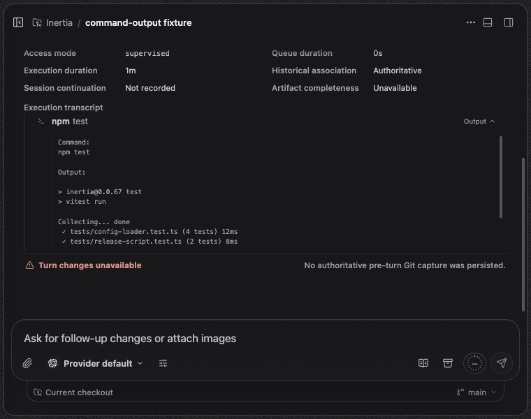

# Tool activity

Platform: macOS 27.0.1, Electron at device scale 2. Spec: `tests/e2e/command-output.spec.ts`, test "shows streamed command output once, in order, under one Output heading", with providers disabled. The seed feeds one Codex command (`item/started`, ten `item/commandExecution/outputDelta` chunks, `item/completed` with the aggregated output) through the real Codex event handler, harness scrubber and activity projection into SQLite, then the spec opens Run details and the command's Output. Before images come from a build of main at `b6865e11` running the same seed with captures only (main has no pending-update flush, so that one call is left out). Sizes: wide 1440x920 and 760x600. The Output box scrolls inside itself; the full text is below.

## What changed

The command's expanded Output. Before, every chunk had its own trimmed `Output:` heading, two of the three progress dots were dropped as repeats, and the completion appended the command and the whole output again. After, the command appears once and the output once, exactly as it streamed.

Before, the full text:

```
Command:
npm test

Output:

> inertia@0.0.67 test
> vitest run

Output:
Collecting

Output:
.

Output:
 done

Output:
 ✓ tests/config-loader.test.ts (4 tests) 12ms

Output:
 ✓ tests/release-script.test.ts (2 tests) 8ms

Output:

 Test Files  2 passed (2)

Output:
      Tests  6 passed (6)

Command:
npm test

Output:

> inertia@0.0.67 test
> vitest run

Collecting... done
 ✓ tests/config-loader.test.ts (4 tests) 12ms
 ✓ tests/release-script.test.ts (2 tests) 8ms

 Test Files  2 passed (2)
      Tests  6 passed (6)
```

After, the full text (asserted by the spec):

```
Command:
npm test

Output:

> inertia@0.0.67 test
> vitest run

Collecting... done
 ✓ tests/config-loader.test.ts (4 tests) 12ms
 ✓ tests/release-script.test.ts (2 tests) 8ms

 Test Files  2 passed (2)
      Tests  6 passed (6)
```

"Turn changes unavailable" comes from the seed, which stores no Git capture for this turn; it is the same before and after and not part of this change. The batching, shell and renderer snapshot changes have no visible difference beyond fewer updates.

| Size | Before | After |
| --- | --- | --- |
| light-1440x920 |  |  |
| dark-1440x920 |  |  |
| light-760x600 |  |  |
| dark-760x600 |  |  |
