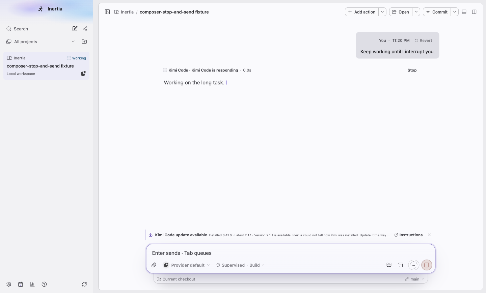
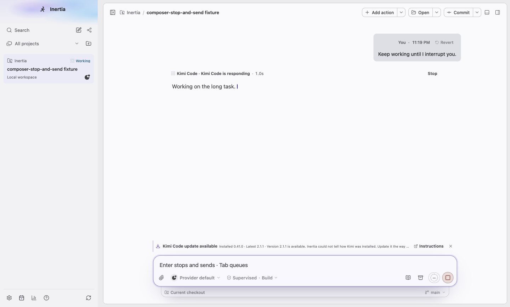
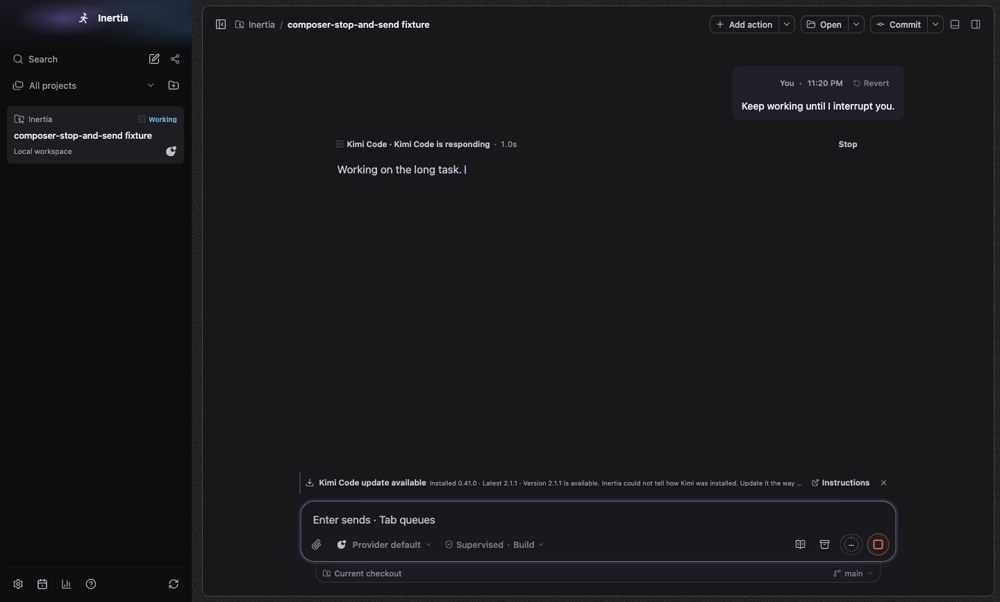
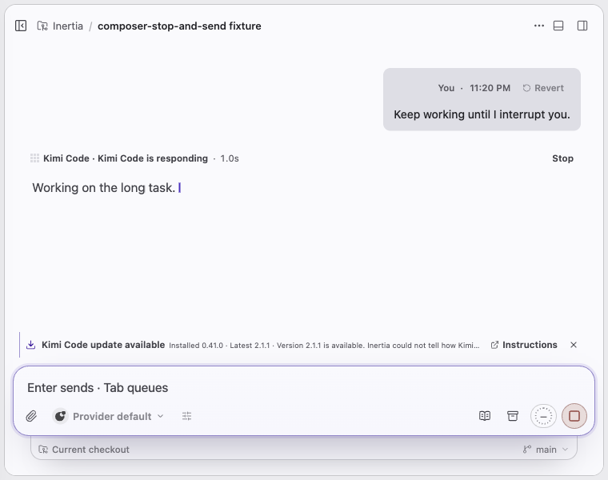
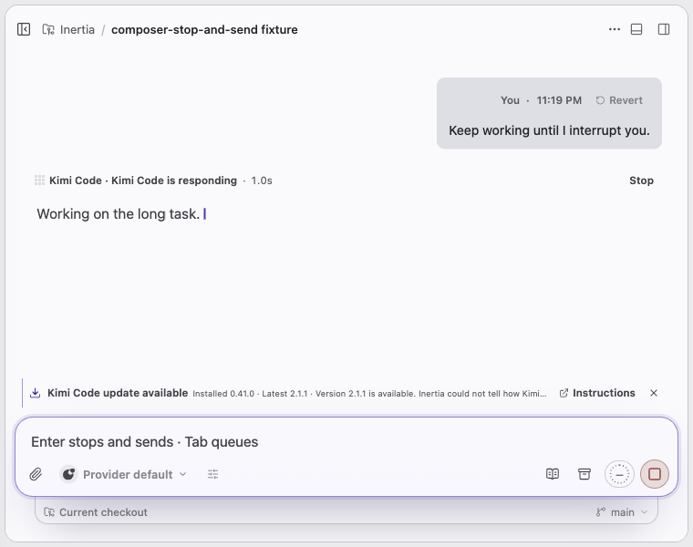
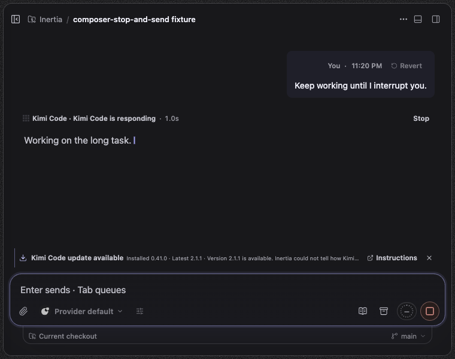
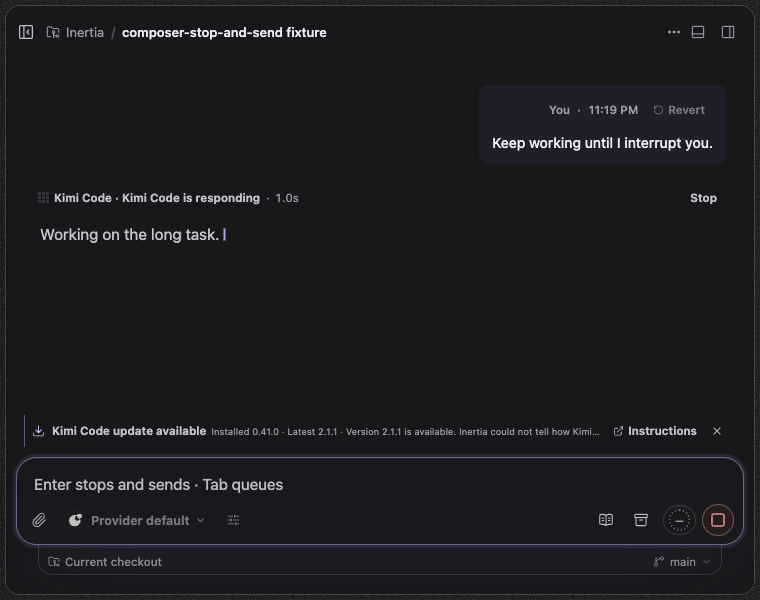
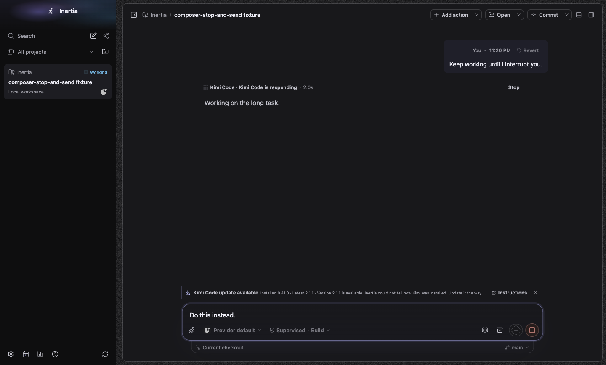
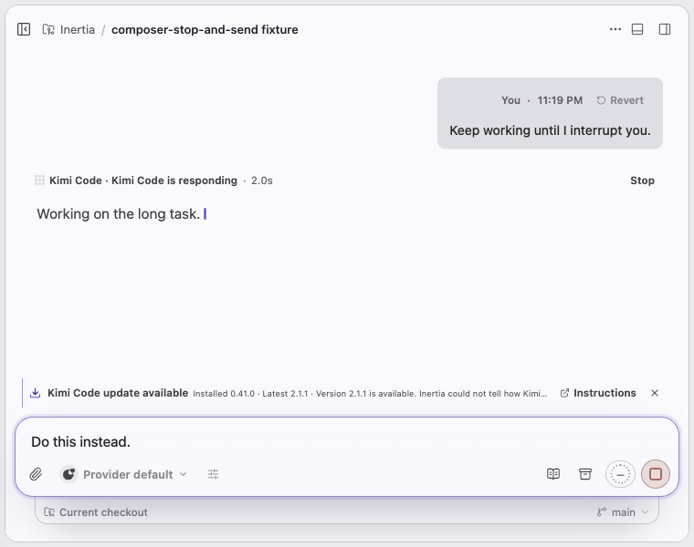
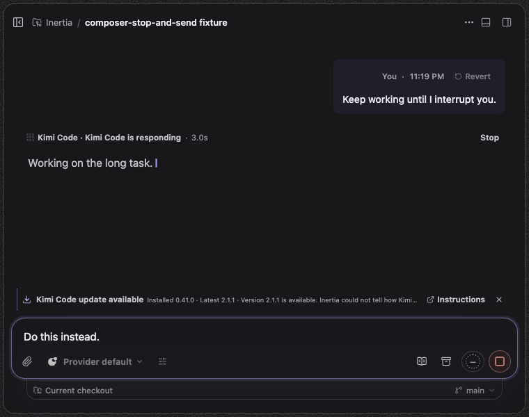

# Turns: Stop and send

Platform: macOS 27.0.1, Electron at device scale 2. Spec: `tests/e2e/composer-stop-and-send.spec.ts`, with a synthetic Kimi ACP executable on an isolated PATH and HOME. The first request makes the fake agent hold its prompt until `session/cancel`. Before images come from the same branch with this area's renderer changes reverted (identical to main for the composer), using a copy of the spec that stops after the captures. Sizes: wide 1440x920 and 760x600.

## What changed

- Empty composer while Kimi works: before, the placeholder said "Enter sends · Tab queues", but Enter did nothing on this route; after, it says "Enter stops and sends · Tab queues".
- Draft while Kimi works: the primary button looks the same (the stop square), but its name and tooltip are now "Stop and send" instead of "Stop agent". Enter or a click stops the run and sends the draft as the next turn in the same Kimi session. The before run pressed Enter and checked that the draft stayed and no second prompt reached the agent.
- Routes that take live follow-ups (Codex, Claude, OpenCode) keep "Stop agent" and send follow-ups into the running turn.

The "Kimi Code update available" row compares the fixture's version 0.41.0 with the latest release Inertia looked up, and it shows in both runs. It is not part of this change.

| State | Before | After |
| --- | --- | --- |
| empty, light-1440x920 |  |  |
| empty, dark-1440x920 |  |  |
| empty, light-760x600 |  |  |
| empty, dark-760x600 |  |  |
| draft, light-1440x920 |  |  |
| draft, dark-1440x920 |  |  |
| draft, light-760x600 |  |  |
| draft, dark-760x600 |  |  |
