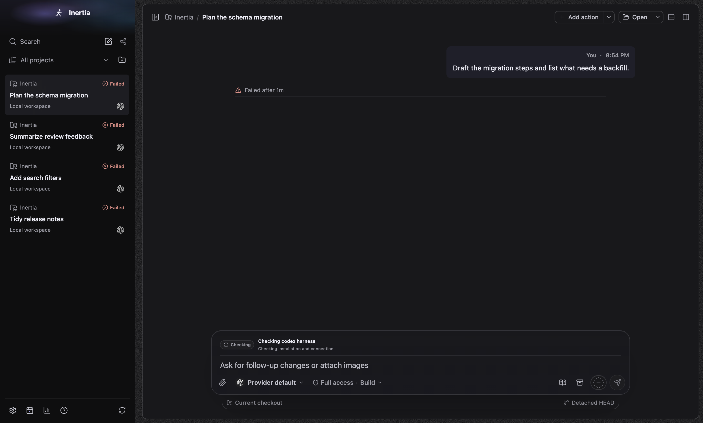
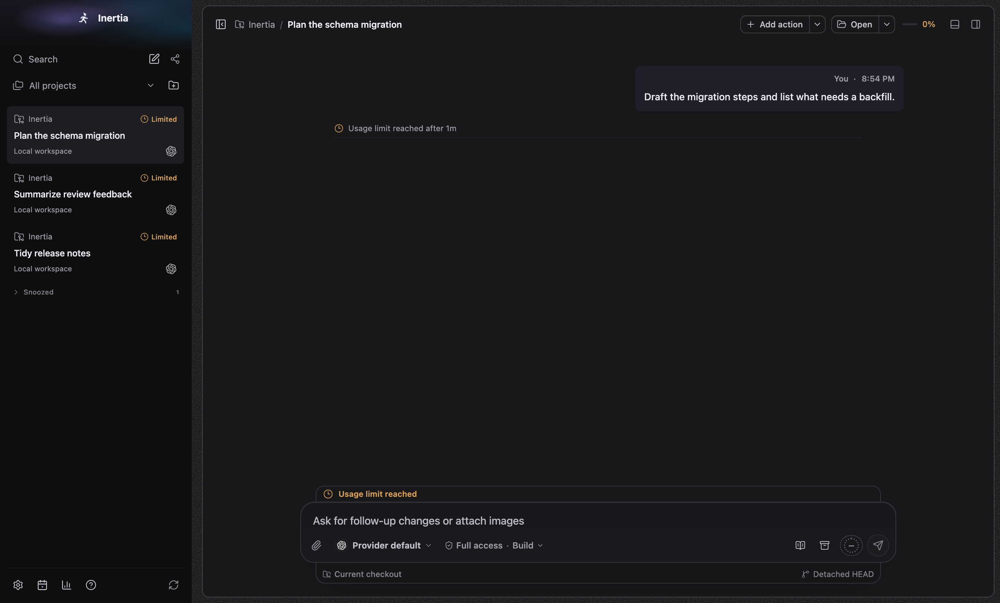
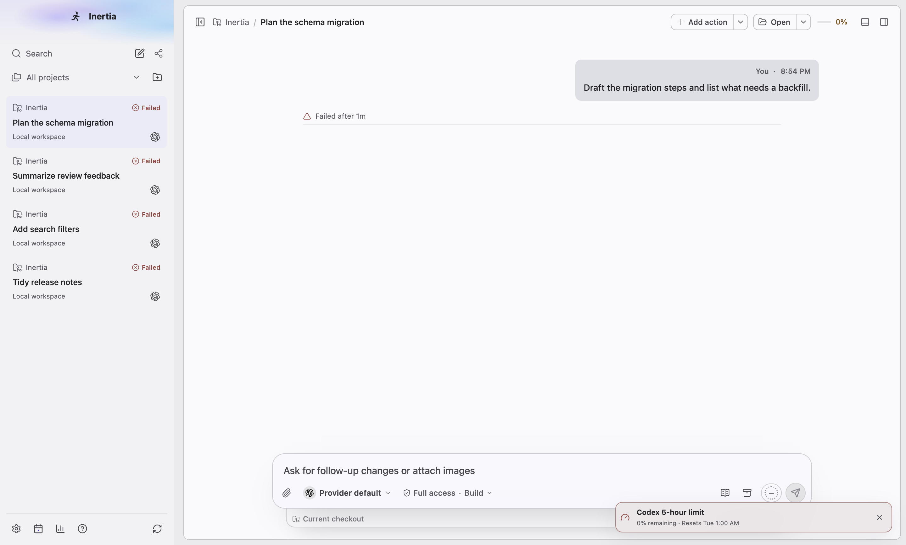
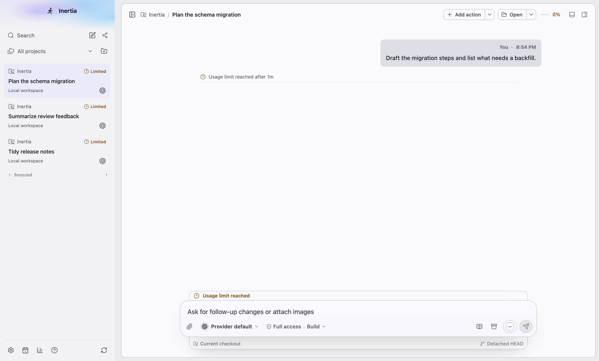
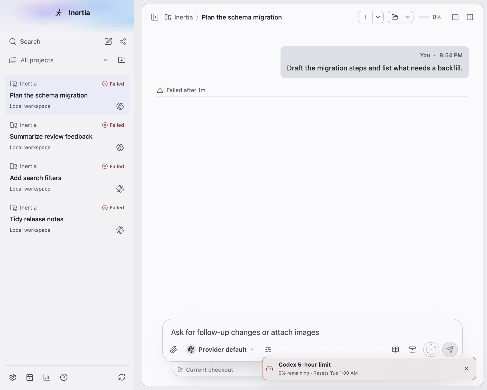
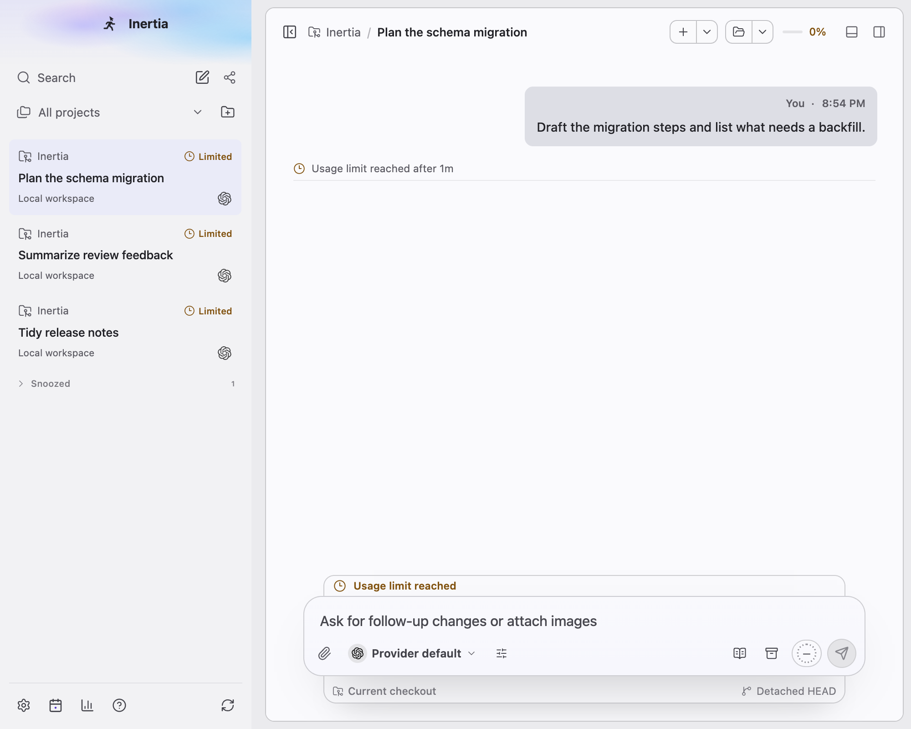
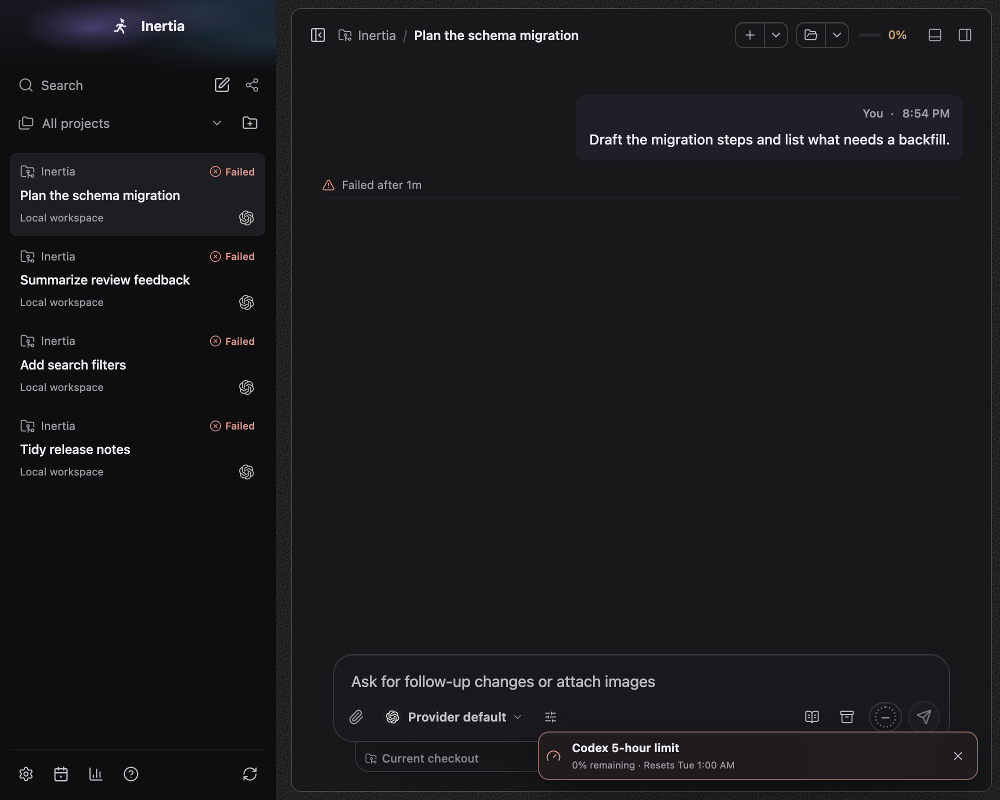
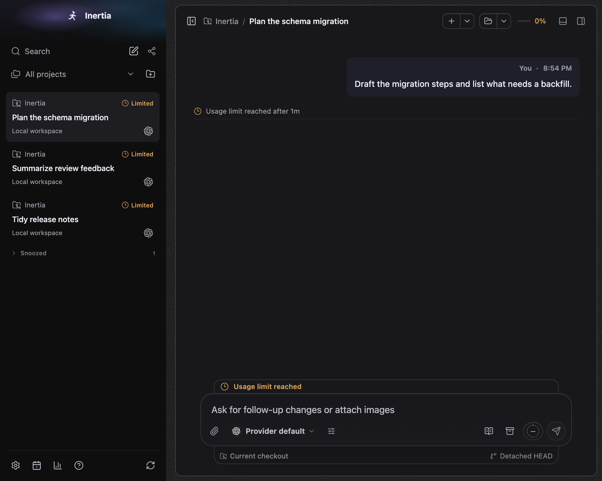
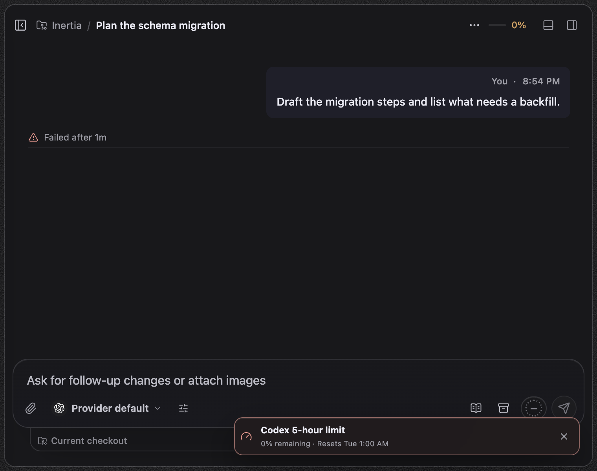
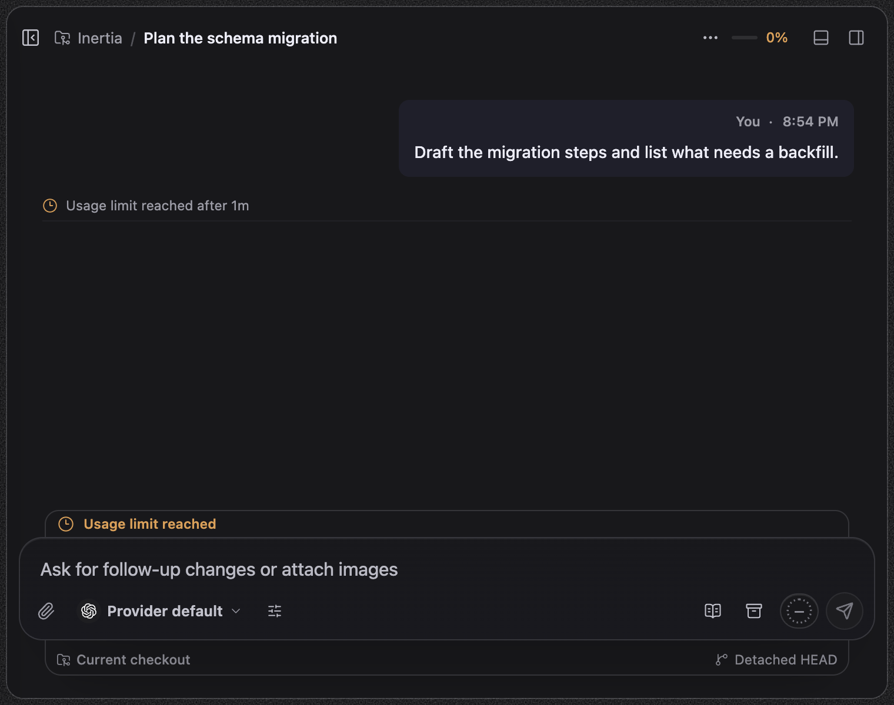

# Usage limits

Platform: macOS 27.0.1, Electron at device scale 2. Spec: `tests/e2e/limit-reset-appearance.spec.ts`, test "says Usage limit reached without a time or actions while no reset applies", with the fake Codex fixture and synthetic chats seeded through `RuntimeStore`; the clock is fixed. Before images come from a build of main at `b6865e11` running the same seed with captures only. Sizes: wide 1440x920, narrow 1000x800, 760x600.

The chat "Plan the schema migration" stopped at a usage limit, then its access mode changed, so no reset offer applies to it.

## What changed

- Above the composer: before, nothing; after, a plain "Usage limit reached" row with no time and no actions. It keeps the row's shape but has no fill; only the clock and the words use the warning colour.
- Transcript: before, "Failed after 1m" with the red triangle; after, "Usage limit reached after 1m" with the clock in the warning colour. The flag comes from each turn in loaded history, so older usage-limited turns keep it too.
- Sidebar: before, every usage-limited chat said "Failed" with the red icon; after, "Limited" with a clock icon in the warning tone.

The before run shows the Codex quota notice in the corner and lists "Add search filters" in Work; in the after run the earlier tests of the spec dismissed that notice and snoozed that chat. Neither is part of this change.

Area 5 later added **Continue with another model** to this row. The after images here predate it; the row as it is now is in [../continuation](../continuation/README.md#the-usage-limit-row-with-this-change).

"Reset due" replacing "Reset due · refresh to check" is a text-only change, covered by `tests/renderer/header-usage-meter.test.ts` and `tests/renderer/usage-limits.dom.test.tsx`.

| Size | Before | After |
| --- | --- | --- |
| dark-wide |  |  |
| light-wide |  |  |
| light-narrow |  |  |
| dark-narrow |  |  |
| dark-760x600 |  |  |
