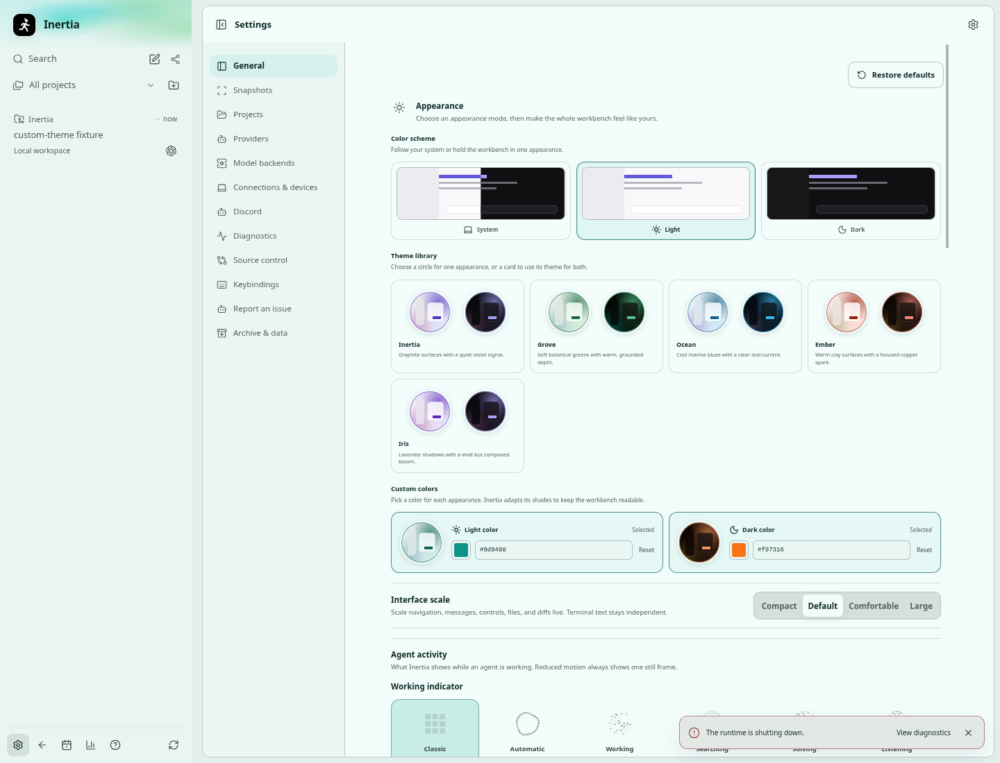
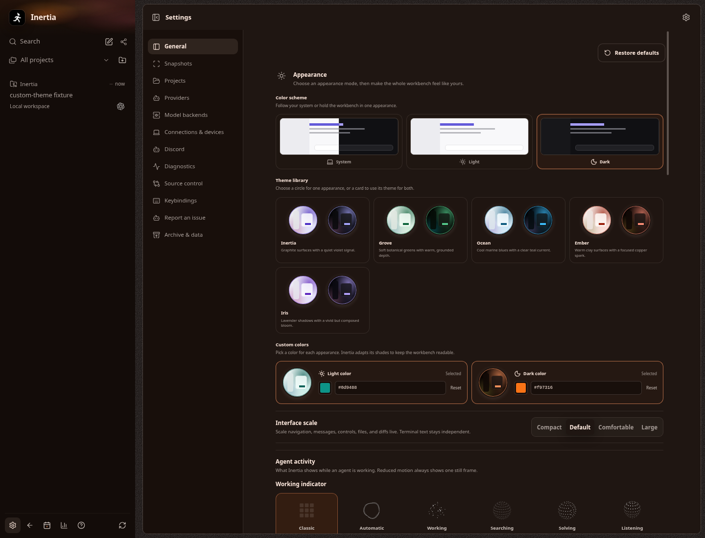
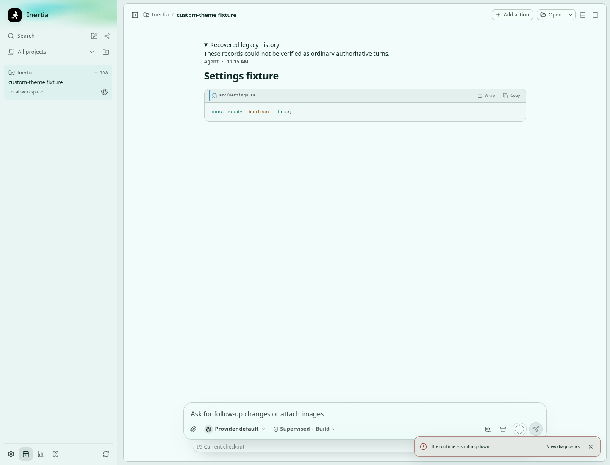
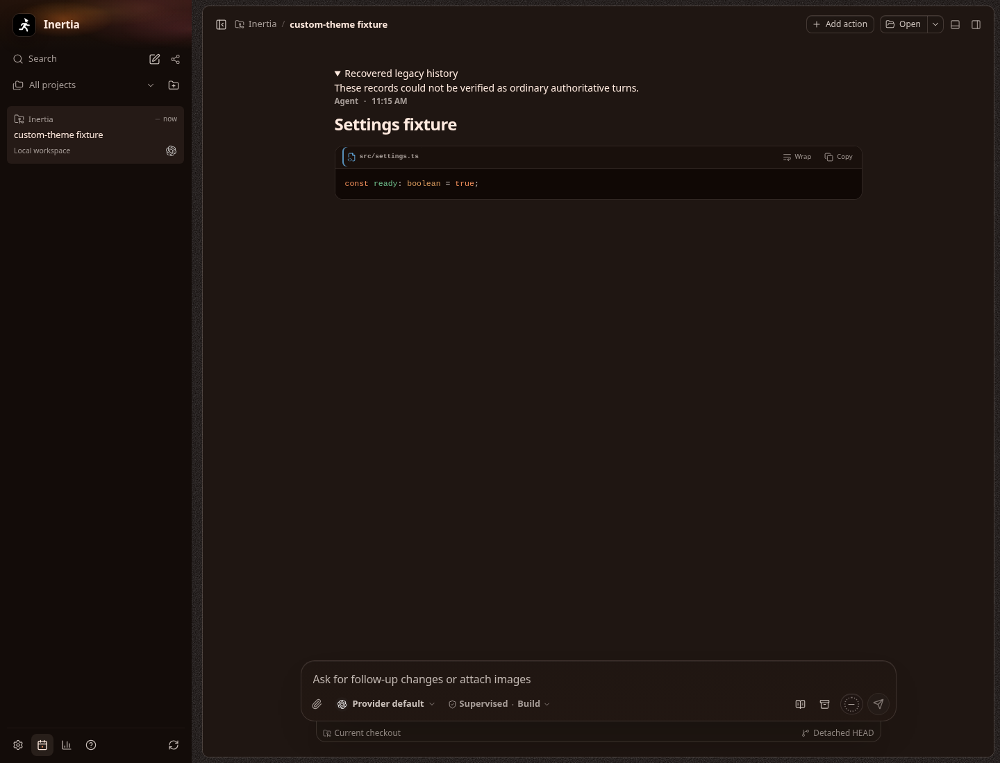
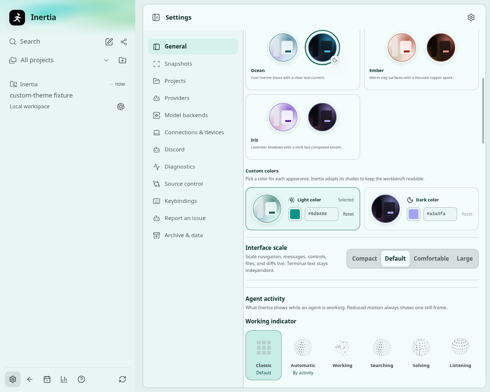

# Custom light and dark colors

Real screenshots of the built Electron app on Linux x64, captured by
`tests/e2e/custom-theme.spec.ts` with an isolated synthetic conversation.
No live profile, credentials, private prompts, or user repository content is used.
The workbench's recovered-history label is part of the synthetic code-block fixture.

The selector uses the existing Appearance card, paired swatches, semantic tokens,
and settings command. Each appearance accepts a native color picker or editable
hex value. The seed supplies hue/tint; Inertia keeps its existing surface ladder,
readability targets, semantic status colors, and syntax/terminal roles. Grayscale
seeds stay neutral. Reset restores that appearance's preset; a preset card clears
both custom overrides. System mode chooses the matching saved color.

The shared palette implementation also generates the shipped preset CSS. Its
output is unchanged for all five preset families. Custom generation loads on
demand, while a validated cache paints the last custom palette before React.
See [renderer bundle measurements](renderer-bundle.json) for a comparison with
`cb93b1f5` using the same dependency graph.

## Settings

## Workbench

| Light | Dark |
| --- | --- |
|  |  |

## Smaller window

The standard captures are 1440 × 1100. These screenshots establish Linux Electron
rendering; native Windows/macOS color dialogs and rendering were not exercised.

## Verification

- 435 focused tests pass across 12 unit/DOM test files, including palette contrast,
  picker validation and commit behavior, cache/bootstrap, settings persistence,
  schema upgrades and lineage, detached settings projection, and preset output.
- Both Electron appearance scenarios pass: custom colors and existing preset
  themes. Coverage includes System switching, restart persistence, detached-window
  synchronization, returning to presets, and viewport overflow checks.
- `npm run check:quality` and the production build/bundle-budget check pass.
  The build used the cloud workspace's local native compiler wrapper for the
  process guardian; application build settings and runtime guards were unchanged.
- The full verification gate was exercised as separate quality, test, and build
  stages because of that compiler setup. The full test run reported 11,410 passed,
  83 failed, 106 skipped, and one unhandled Git error. Three migration-related
  failures from that run were corrected and pass in focused reruns. The full
  suite was not rerun after those corrections.
- Other failures include native guardian/process lifecycle timeouts, filesystem
  identity/permission behavior, and experimental proxy warnings in exact-output
  tests. A representative selection on unchanged base `cb93b1f5` reproduced 15
  failures across seven files (358 passed, 15 skipped). This does not establish
  that every full-suite failure is pre-existing; the complete gate remains red.

Windows/macOS native dialogs and rendering were not exercised.
