# Custom colours: preset parity and Muted colours

Platform: macOS arm64, device scale 2, built Electron app (`npm run build:bundle`).
Spec: `tests/e2e/custom-colours-reach.spec.ts` with the synthetic `conversation`
fixture (one code block, one unstaged diff, one local shell terminal). No
provider ran.

`before-*` images come from `origin/main` 75dc9ceb, so their Settings page is
the pre-rework General page. The other images come from this branch.

Each image name is `<colour>-<view>-<theme>.png`:

- colour: `ember` (built-in preset, for reference), `teal` (#0d9488),
  `teal-muted`, `orange` (#f97316), `orange-muted`
- view: `workspace` (chat with code, Changes diff, terminal dock), `settings`
  (Appearance, custom colours and the Muted colours row), `detached` (the chat
  in its own window)
- theme: `light`, `dark`

| Colour | Before | After, vivid | After, muted |
| --- | --- | --- | --- |
| Teal, light | 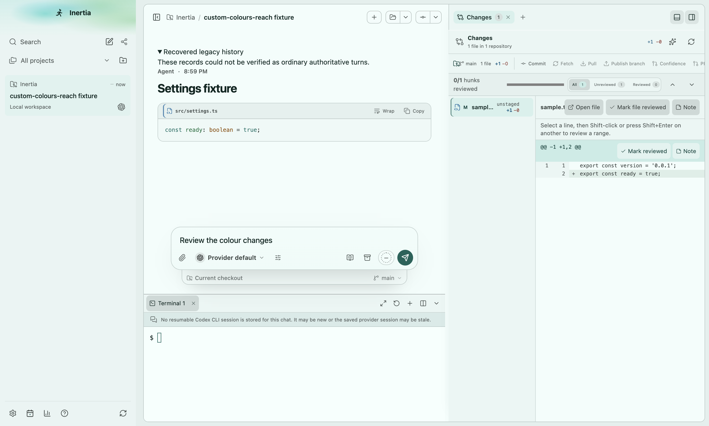 | 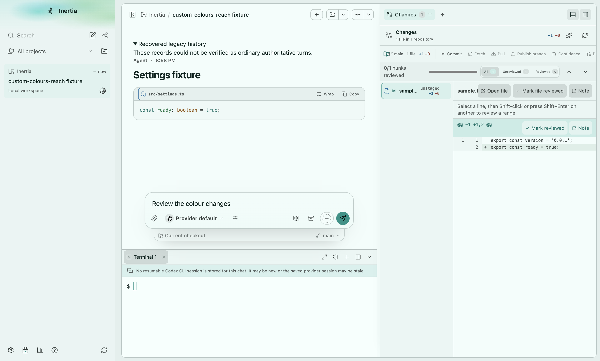 | 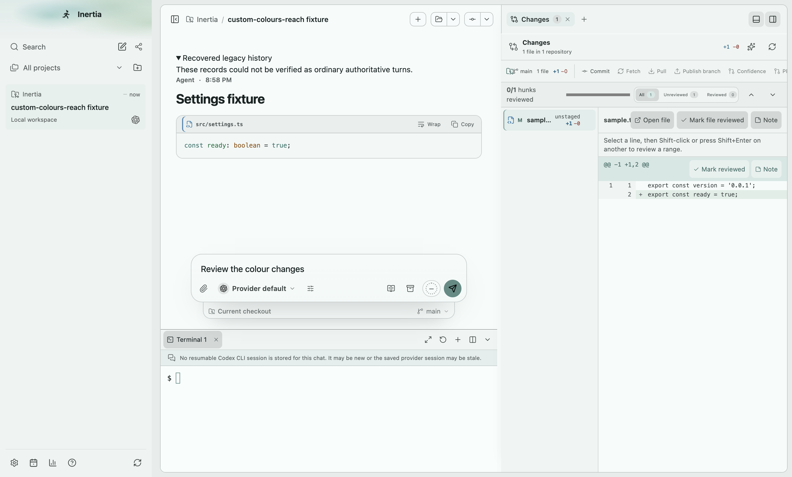 |
| Teal, dark | 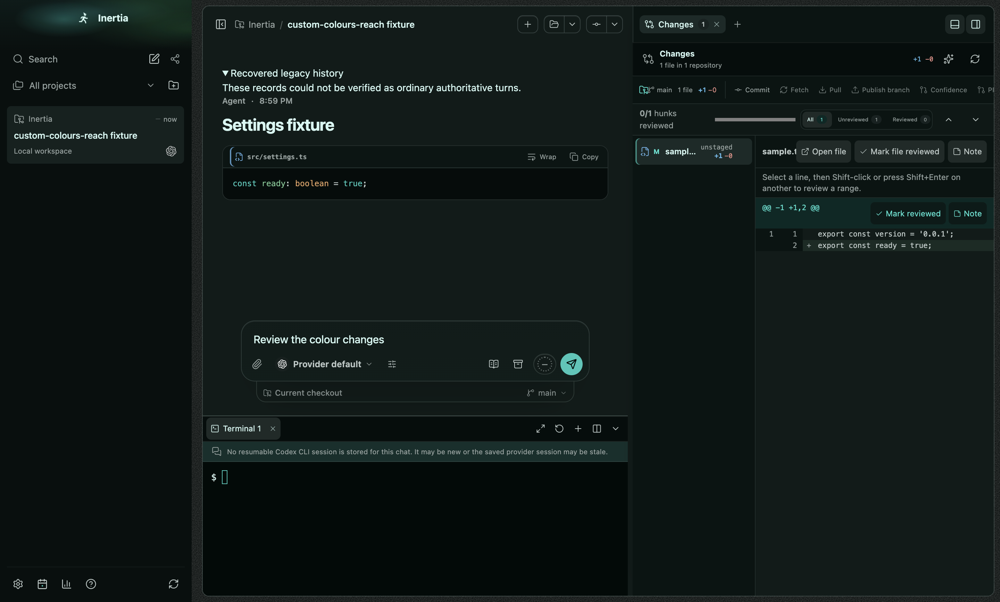 |  | 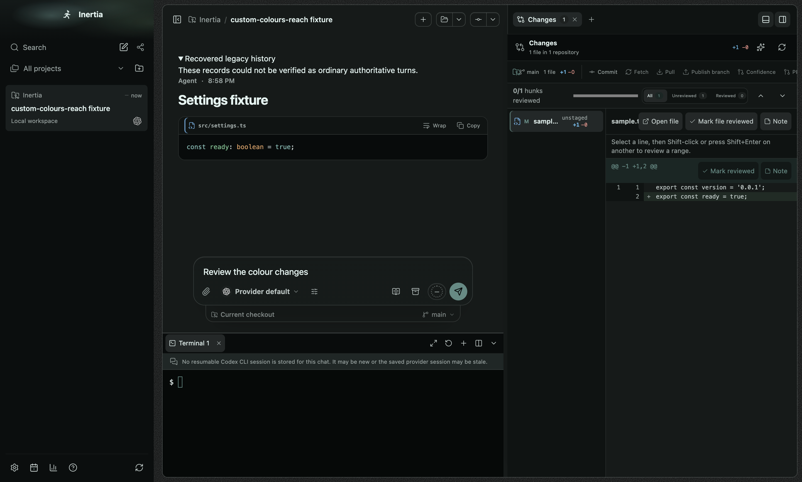 |
| Orange, light |  | 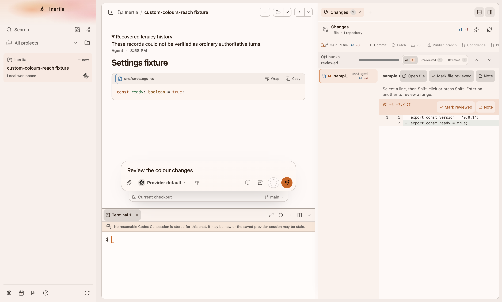 | 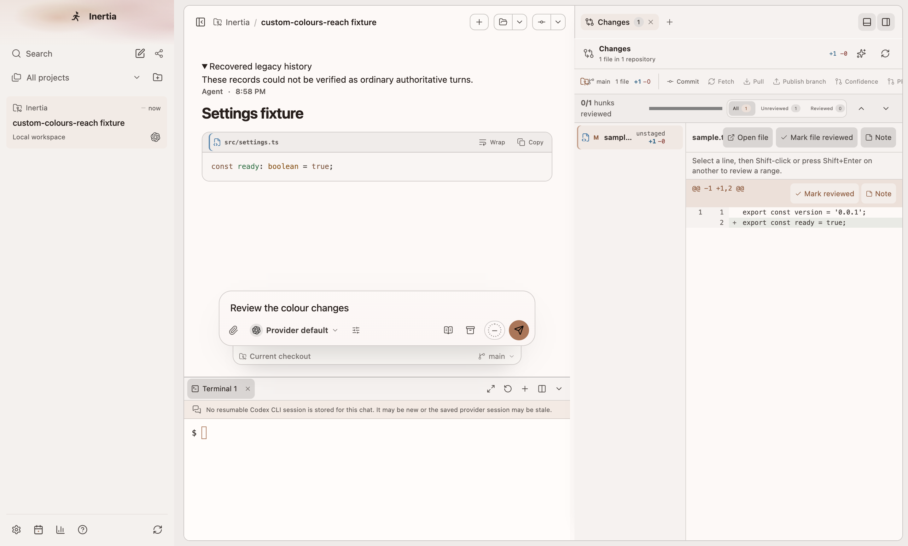 |
| Orange, dark | 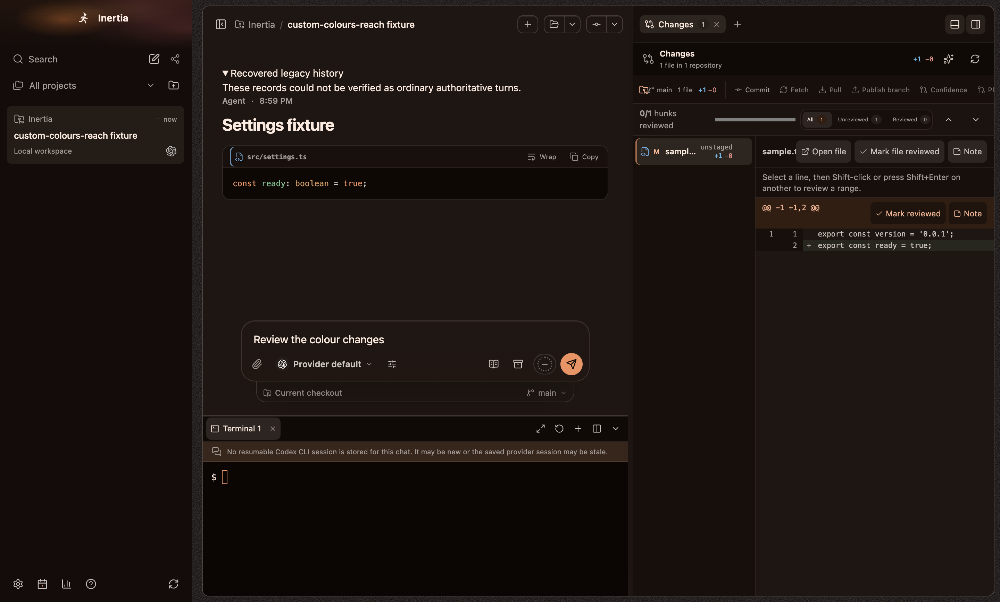 | 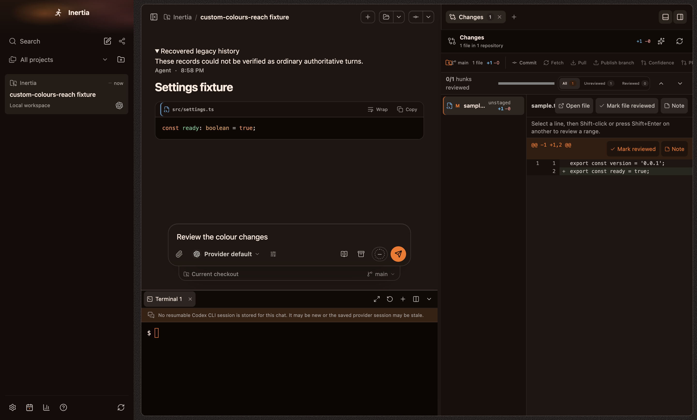 | 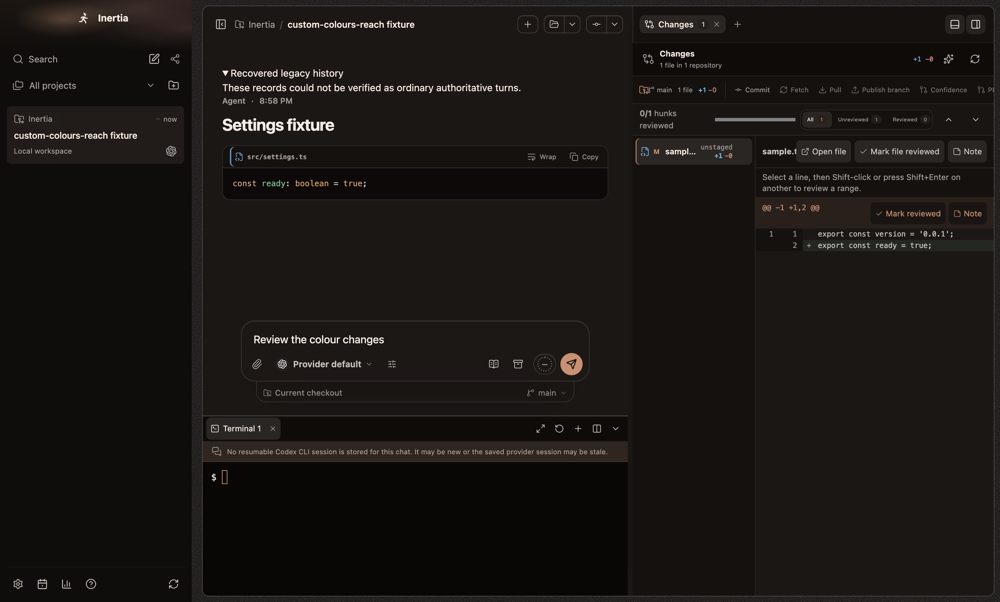 |
| Settings, dark | 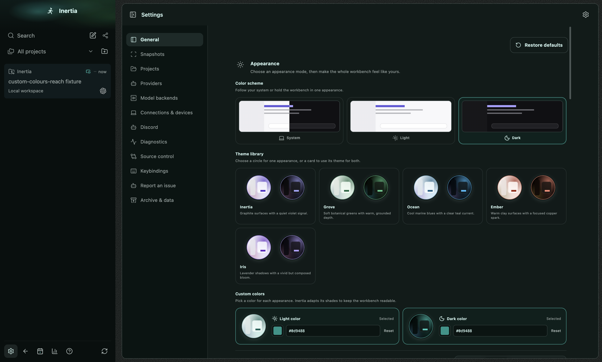 | 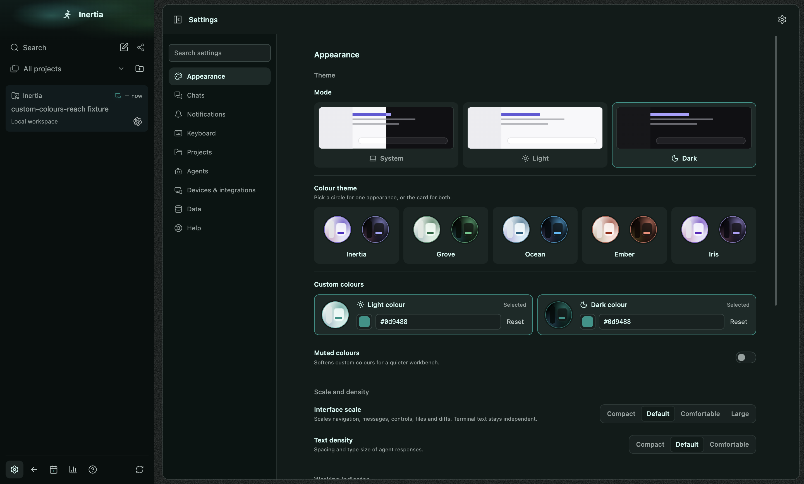 | 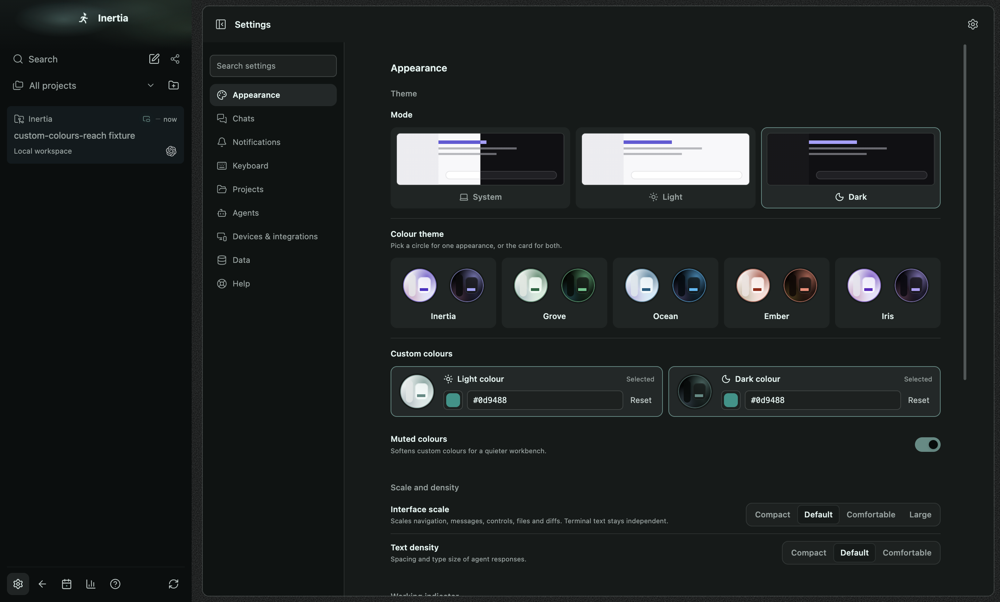 |
| Detached, dark |  | 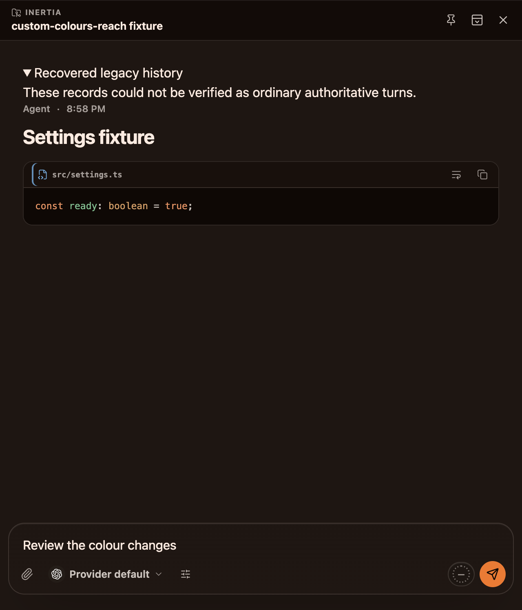 | 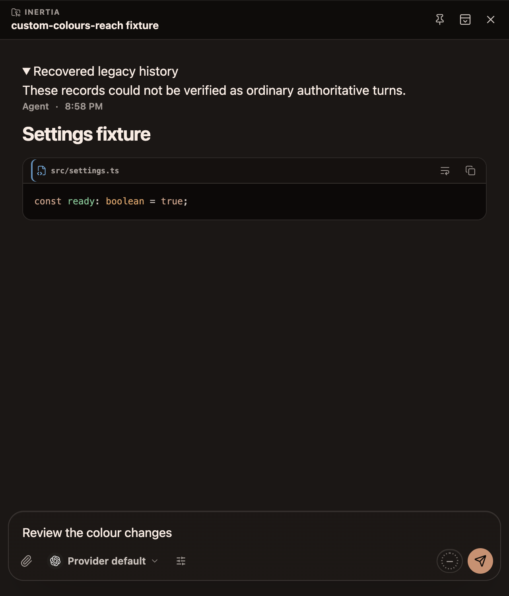 |

What changed: a custom colour drives the same 55 palette tokens as a preset,
and surfaces, borders and selection tints keep preset strength. The accent
roles (accent, focus ring, hover, links, the selected-row edge, the terminal
cursor and the send button) now start from the picked colour's own lightness
and chroma instead of a fixed preset lightness. The accent moves only when
it would fall below 3:1 on the app, sidebar, surface, raised surface or
terminal background, and links (`--accent-strong`) only when they would fall
below 4.5:1, in each case to the nearest passing lightness. Text on the
accent is the near-white or near-black candidate that reaches 4.5:1, so a
light accent carries dark text.

| Pick | Mode | Before | After, vivid | After, muted |
| --- | --- | --- | --- | --- |
| Teal #0d9488 | Light | #10635a | #099387 | #5c8b84 |
| Teal #0d9488 | Dark | #2bc7b8 | #0d9488 | #5c8b84 |
| Orange #f97316 | Light | #873d0c | #d65f00 | #b37353 |
| Orange #f97316 | Dark | #f5905b | #f97316 | #d08e6c |

Muted colours halves the chroma of every hue-derived token, the accent
included, and keeps the same guards. Presets do not take this path and stay
byte-identical; seeding a custom colour with any preset accent returns that
accent unchanged, because every preset accent already passes the guards.

The composer holds a drafted message in every capture so the send button
shows the accent fill. The terminal prompt is set to `$` before capturing.
