# Help search

Platform: macOS 27 (Apple silicon), device scale 2, Electron from `npm ci`,
renderer from `npm run build:bundle`.

Spec: `tests/e2e/layout.spec.ts`, "searches Help, moves through the results
and opens an entry's setting". It uses the synthetic `conversation` fixture
(no provider is started), a fixed clock, and switches themes in place with
`setAppearanceInPlace`. The same run asserts that the dialog and the results
list fit the viewport at every size, that the page has no horizontal overflow,
that the live region reads "2 results", "No matches" and "1 result", that
Escape clears the query and keeps the open topic, and that ArrowDown, ArrowUp
and Enter open Settings → General from the "Custom colors" result.

## Before and after

The "before" images are the Help captures recorded when Help shipped
(`docs/pr-evidence/help-guide/`); Help had no search field.

| State | Before | After |
| --- | --- | --- |
| Topics, dark, wide | 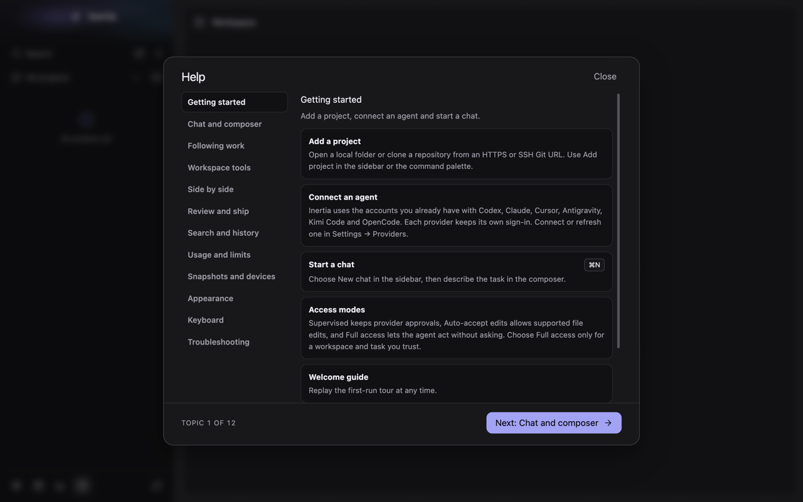 | 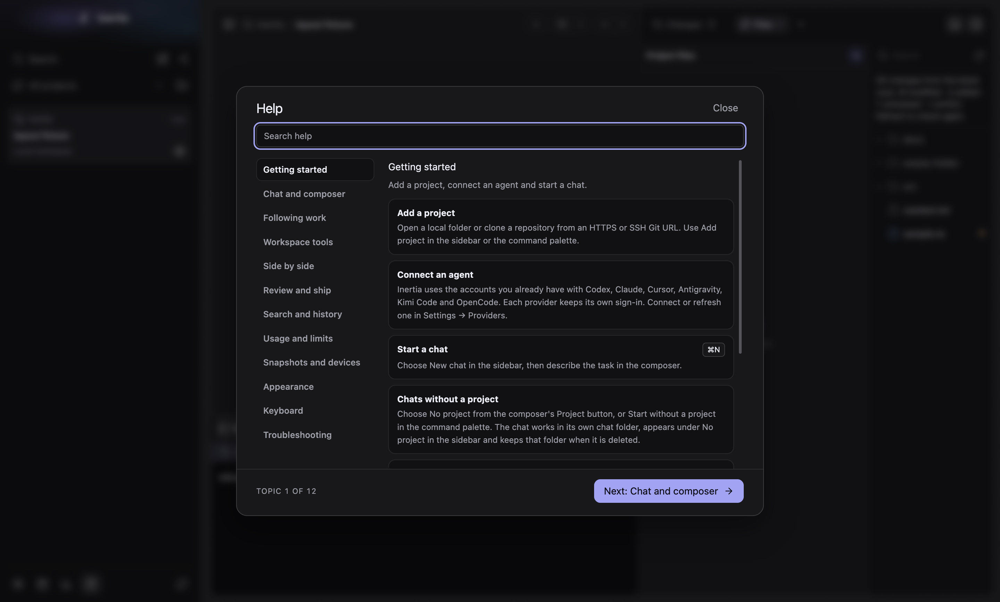 |
| Topics, light, wide | 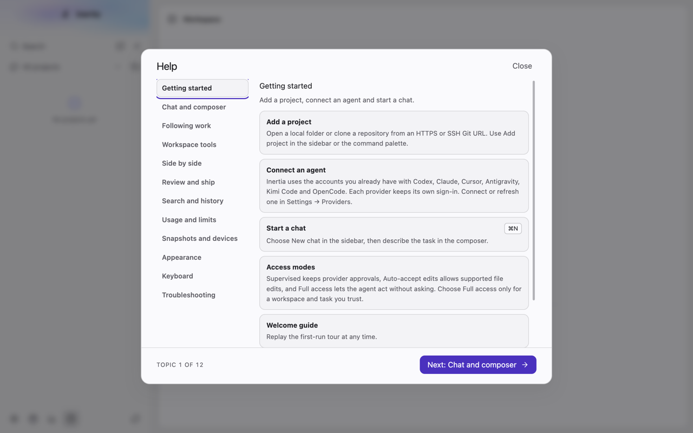 | 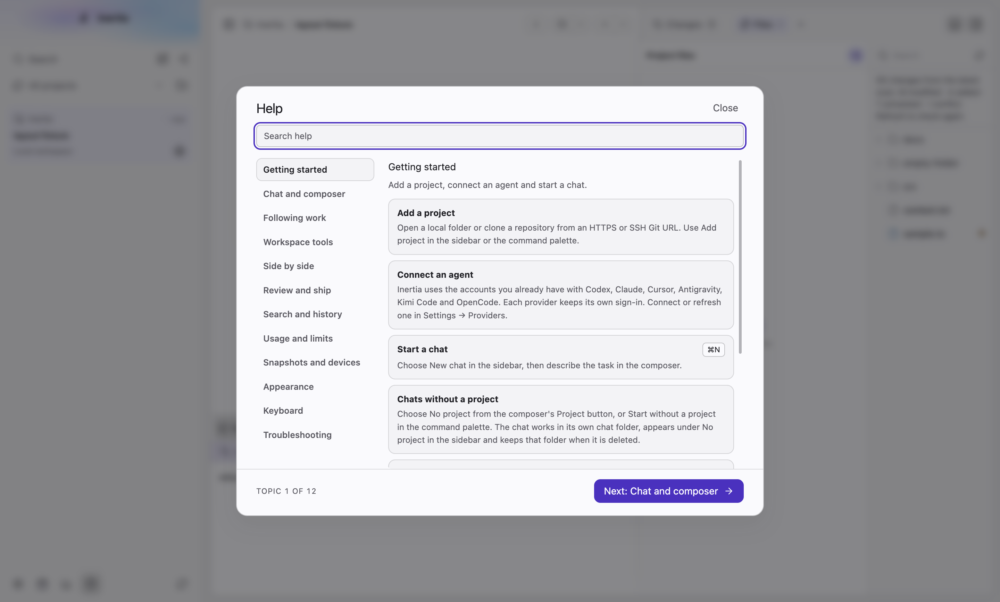 |

## Results

| Size | Dark | Light |
| --- | --- | --- |
| Wide (1440×920) | 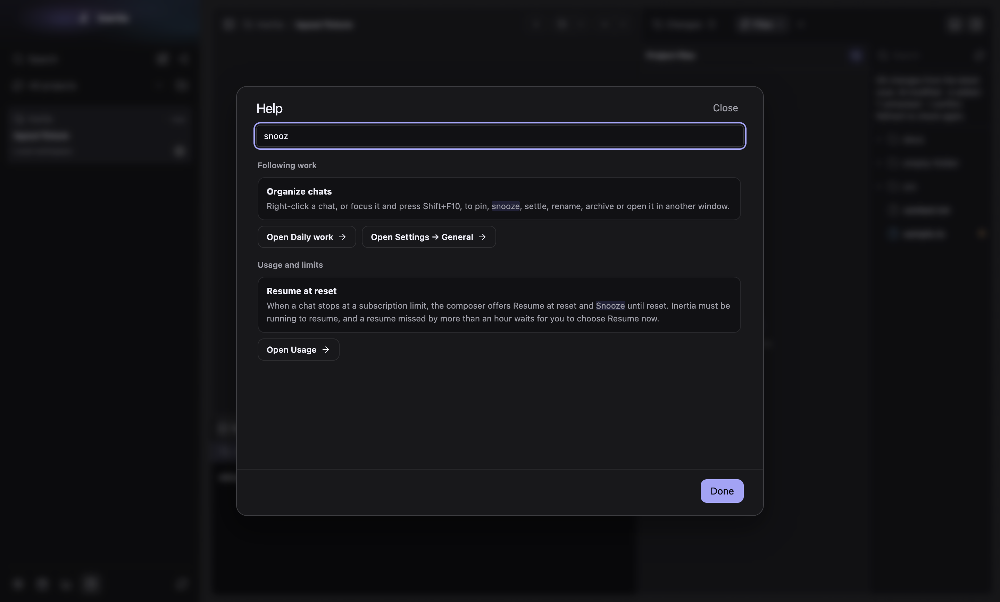 | 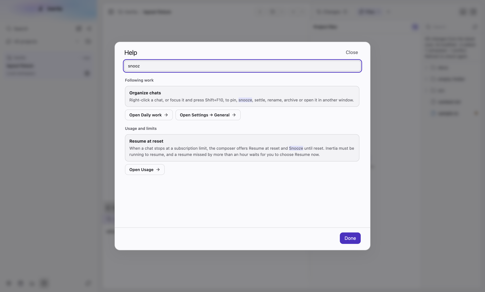 |
| Narrow (1000×800) | 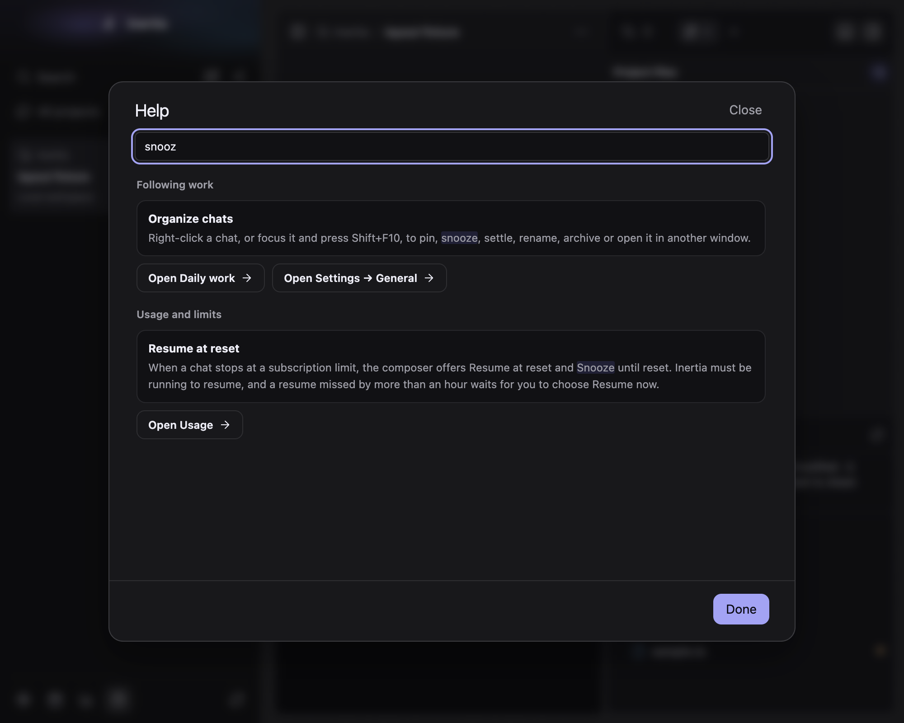 | 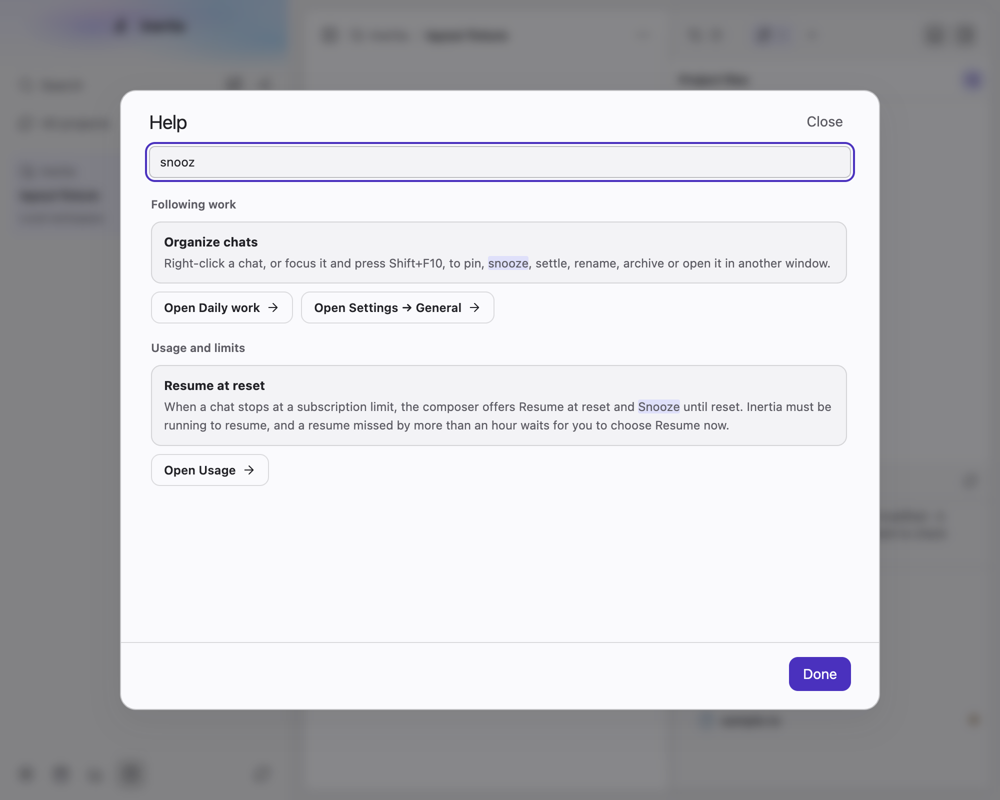 |
| Tight (760×600) | 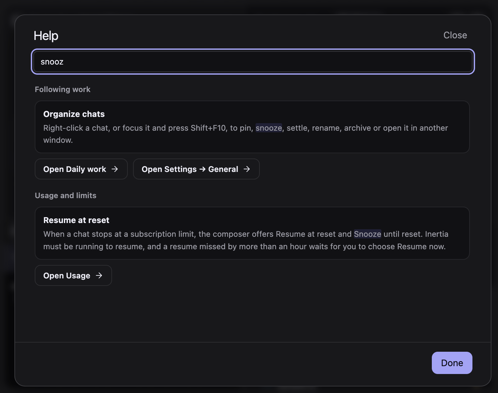 | 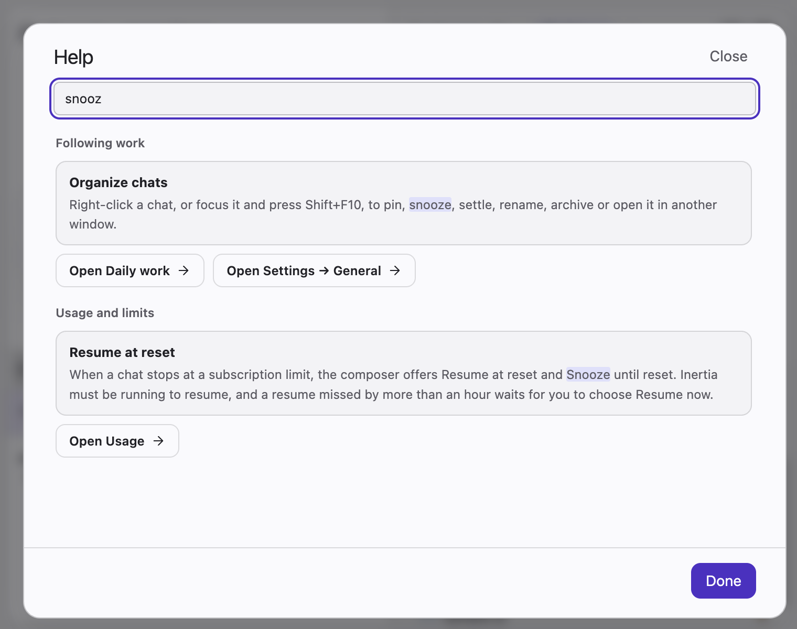 |

No matches: 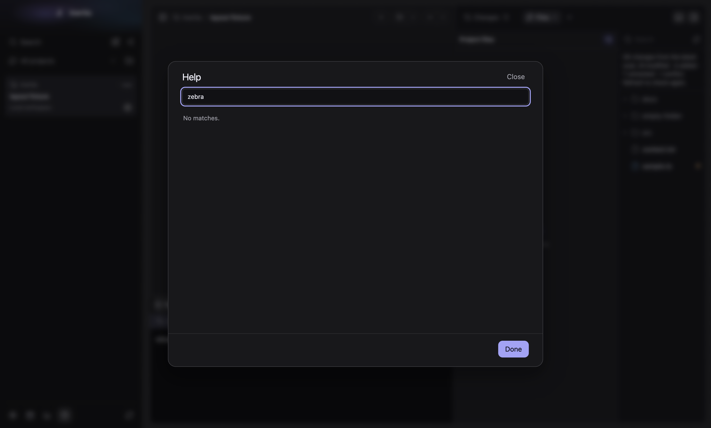

## What changed

- A search field sits above the topic tabs and takes focus when Help opens.
- While the query has words, the tabs are replaced by matching entries grouped
  under their topic, with matched words marked. Each group keeps its topic's
  action buttons. The footer shows only Done.
- The field uses `--surface`, `--border-strong`, `--radius-small` and
  `--control-height`; marks use `--accent-soft`, as in the command palette.
