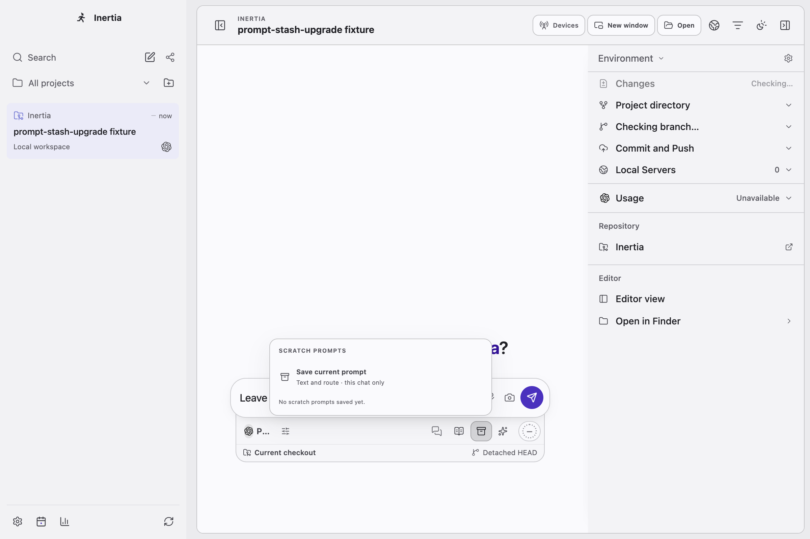
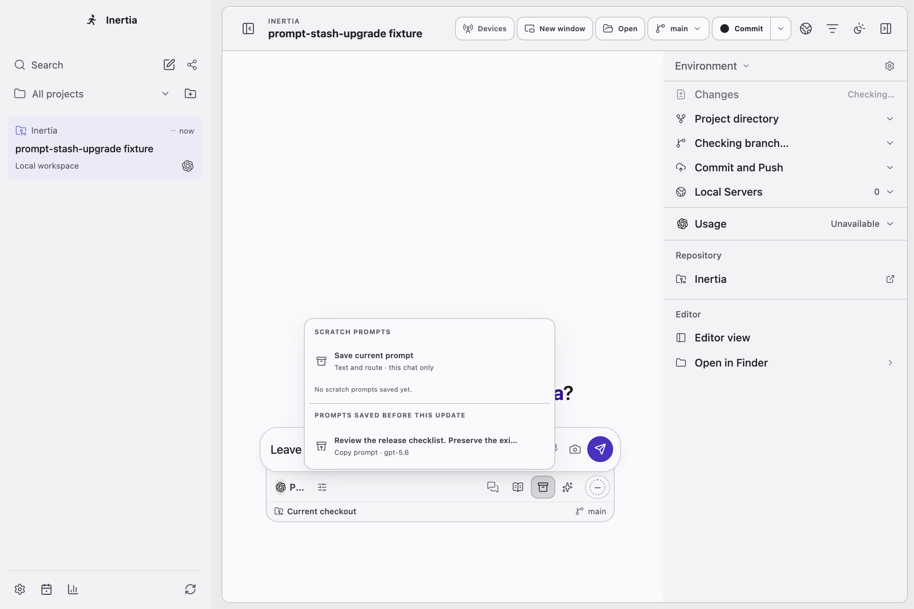

# Recover prompts saved before v0.0.55

Both images are native Electron captures on macOS ARM64 with a synthetic conversation,
provider fixture and a valid v0.0.54 localStorage payload. No live account or user prompt
is shown. The old global key is `inertia:prompt-stash:v1`.

- `before.png`: frozen v0.0.55 application source, which shows no way to retrieve the saved prompt.
- `after.png`: the explicit copy section, with the current unfinished draft retained.

The regression test fails against the original source. The corrected native scenario
checks keyboard activation, the full native clipboard text, unchanged legacy storage,
unchanged current draft, no viewport overflow, recovery after restart and no renderer
errors. DOM coverage also checks rejected and unsuccessful clipboard operations, and
ensures no legacy prompt is assigned to an arbitrary conversation.

The legacy recovery is deferred until Scratch opens. Its new chunk has a separate
1.5 KiB ceiling; all pre-existing bundle ceilings remain unchanged. Content-hashed CSS
filenames reduce repeated preload metadata without changing styles or packaged assets.

