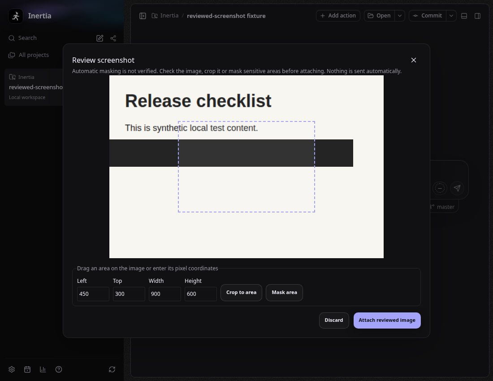
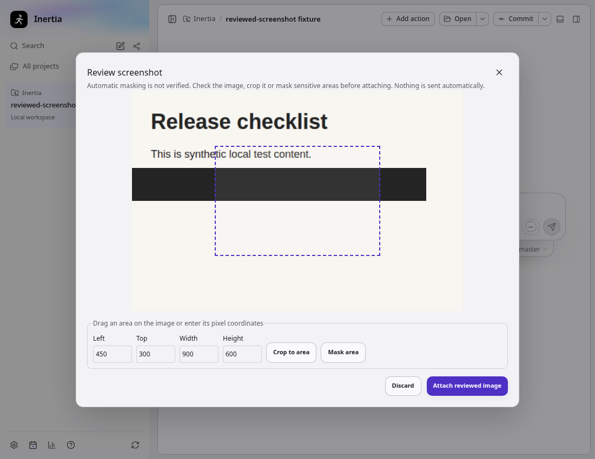

# Linux reviewed screenshots

## Local audit

The reporter's running AppImage is Inertia 0.0.64 on Ubuntu 24.04, GNOME,
X11, x64. Saved protected Snapshots were disabled, the session accessibility
bus reported `IsEnabled=false`, and retained runtime logs contained no snapshot
attempts. Those observations do not establish the cause of earlier attempts.
The Screenshot portal advertises version 2, so a version-3 active-window-only
implementation would not serve this desktop.

Source inspection confirms the supplied notes' X11/accessibility prerequisite,
complete masking scans, shortcut dependency, and absent manual capture action.
The existing geometry tests already cover uniform fractional scaling. Wayland
exclusion is real for protected capture, but does not explain this X11 session.
The notes' T3 implementation claims were reference material, not independently
reverified for this change.

## Result

The Linux composer offers **Take reviewed screenshot** independently of protected
capture settings, shortcut registration, and AT-SPI. Protected capture keeps its
existing policy. There is no automatic downgrade after a failed protected scan.

- X11 presents window/screen previews, then captures the selected source.
- Wayland uses Electron's PipeWire/system picker result exactly once. Only one
  selected source is accepted; cancellation/denial never triggers a fallback.
- Local review supports pointer selection and keyboard coordinates, cropping,
  and opaque masks. Each edit requires review of a new revision.
- Only explicit approval imports the exact preview into the original chat using
  existing attachment leases. No guessed window identity or accessibility data
  is added to reviewed images.
- Unapproved pixels remain in bounded memory. Document loss, destination changes,
  cancellation, inactivity, disable, and shutdown revoke the review. Late capture
  or import results cannot reach another chat.

This uses the existing Electron runtime and introduces no dependencies or preload
methods. Electron documents its [single-source PipeWire behavior](https://www.electronjs.org/docs/latest/api/desktop-capturer#linux).
Its capture API has no cancel method: Inertia releases review state immediately,
discards late results, retains a lock against another picker, and reports
unconfirmed shutdown/disable cleanup when the native picker has not settled.
Close the system dialog to finish that cleanup. The review window is hidden while
acquiring a screen so it is not included in its own screenshot.

## Verification

The full required gate passed with `taskset -c 0-3 npm run check`: architecture,
lint, all TypeScript projects, 11,508 passing tests (106 platform-specific skips),
production builds, and renderer budgets. An earlier unrestricted run hit timing
failures in `git-worktree-cleanup` and `workspace-header-git`; both passed in this
complete run with fewer concurrent workers. All six desktop snapshot scenarios
also passed. The installed application profile was not used as a test fixture.

- Focused main/renderer tests cover approval revisions, exact document/chat
  ownership, disabled protected capture, no import before approval, stale results,
  denial/cancellation without fallback, deadlines, opaque masking, crop bounds,
  focus restoration, keyboard editing, and hidden-window restoration.
- Xvfb/Openbox with a private D-Bus session: real global shortcut, protected pixel
  masks, refusal without accessibility, and reviewed capture without accessibility.
  The native fixture verifies mask pixels, cropped dimensions, and byte equality
  between the reviewed PNG and the import receipt.
- The same negative-accessibility fixture passed on the reporter's physical GNOME
  X11 session, in an isolated Electron profile, without changing installed app
  preferences or enabling the desktop accessibility bus.
- Full Electron UI in dark/light: actual native screen source selection, no
  attachment before approval, coordinate masking/cropping sized from the captured
  image, pointer coordinate mapping, final attachment import, and 760×600 viewport
  checks. The UI scenario selects the screen because hosted CI runs it on bare Xvfb,
  where Chromium lists no windows without a window manager's `WM_STATE`; window
  selection is covered by the Openbox fixture above.
- Linux packaging contract tests: 13 passed.

Physical GNOME/KDE Wayland selection, mixed-monitor scaling, and a newly packaged
AppImage have not been exercised. The Wayland single-source and negative paths
are deterministic fixtures. No GNOME extension, KDE helper, compositor-specific
backend, or Wayland global shortcut is included. The installed AppImage remains
unchanged.

## Renderer cost

Both builds use the same installed dependency graph and base `5d51f21e`.
See [exact measurements](renderer-bundle.json). The new review dialog is 7,151
bytes and remains outside both initial route closures. Its former 1,490-byte
error dialog moves from the shared budget into the explicitly checked review
budget. Routing and disabled-state wiring add 178 bytes to each initial route;
previous headroom is preserved. Settings adds 886 bytes. Shared dependencies
remain charged to core, whose budget is reduced by 1,312 bytes.

## UI evidence

All captured content is synthetic test data.

## Changed files

| Area | Files |
| --- | --- |
| Capture, review ownership and cleanup | `src/main/snapshot-review.ts`, `src/main/snapshot-ipc.ts`, `src/main/snapshot-service.ts` |
| Validated review requests and deliveries | `src/shared/snapshot-review.ts`, `src/shared/snapshots.ts` |
| Composer controls, editing and routing | `ReviewedScreenshotControl.tsx` / `.css`, `SnapshotControl.tsx`, `ComposerToolbar.tsx`, `useComposerSnapshots.ts` in `src/renderer/src/components/composer/` |
| Settings | `src/renderer/src/components/SnapshotSettings.tsx` |
| Unit and DOM coverage | `tests/main/snapshot-review.test.ts`, `tests/main/snapshot-ipc.test.ts`, `tests/renderer/snapshot-review.dom.test.tsx` |
| Native and desktop coverage | `tests/e2e/snapshots-native.spec.ts`, `tests/e2e/snapshots-compaction.spec.ts`, `tests/e2e/support/snapshot-native-main.ts`, `tests/e2e/support/snapshot-reviewed-native.ts` |
| Bundle contracts | `electron.vite.config.ts`, `scripts/check-renderer-bundle.mjs` |
| Documentation | `README.md`, `docs/SNAPSHOTS_AND_COMPACTION.md` and this evidence directory |
