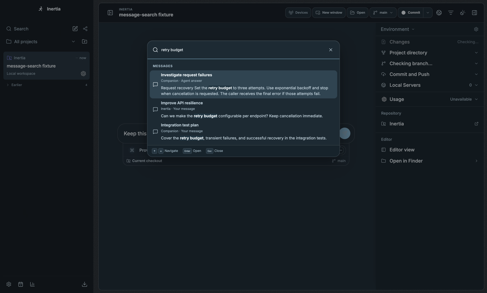
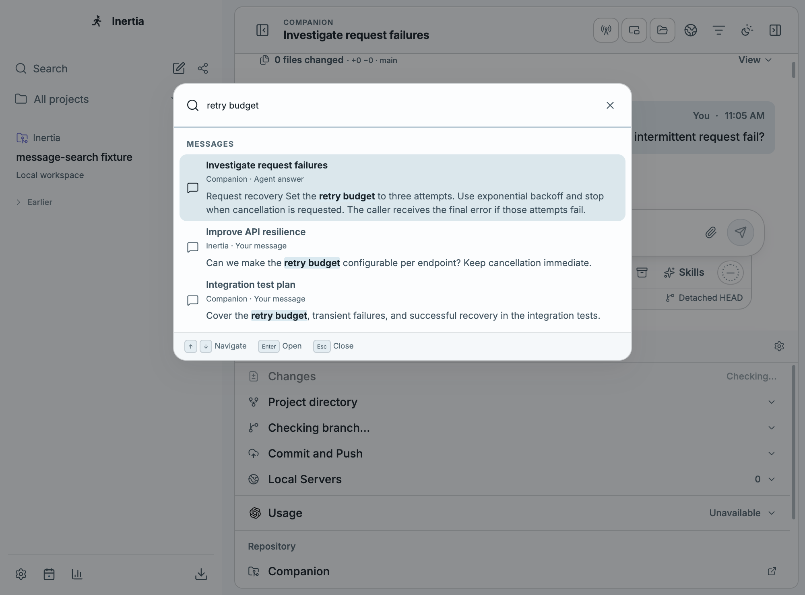
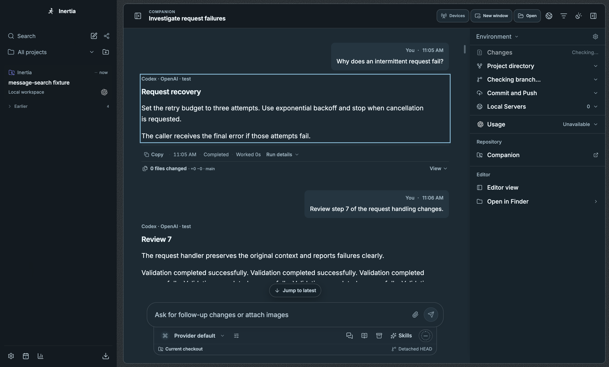
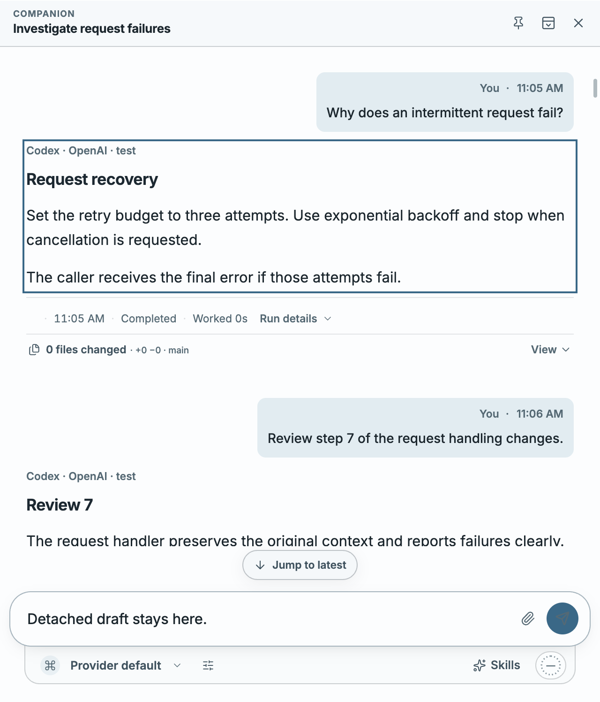
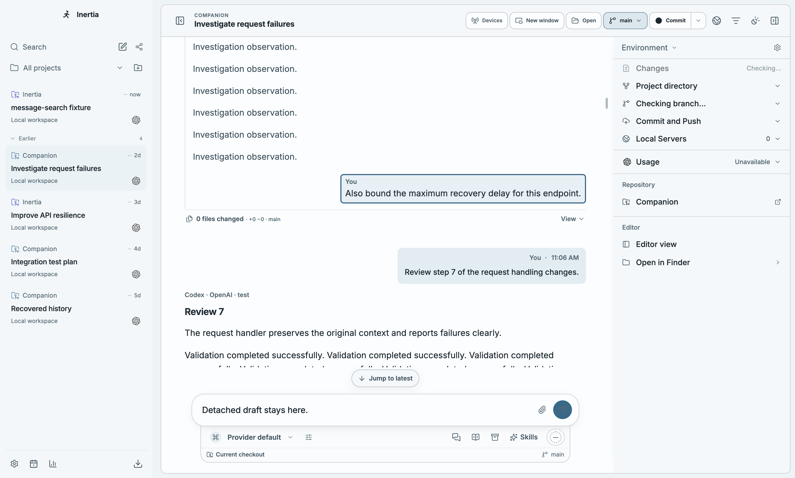
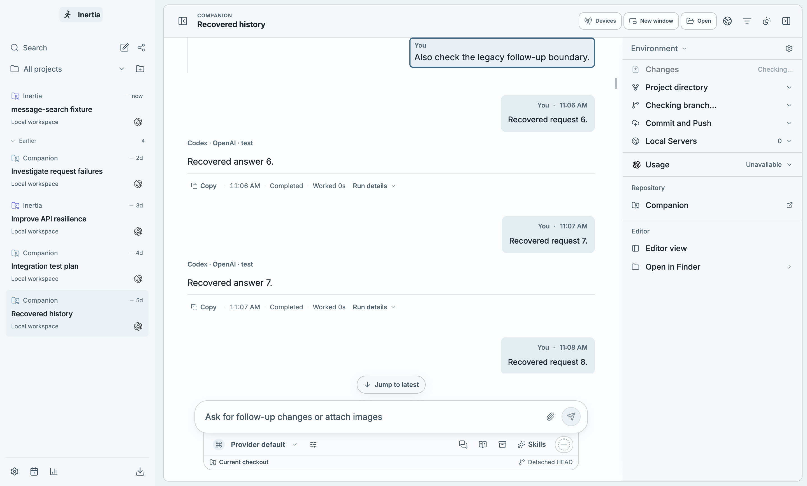
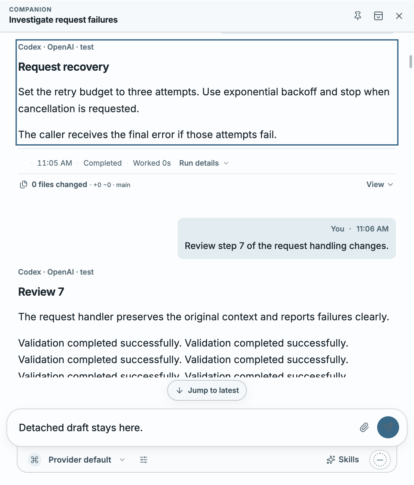

# Message search

Ctrl/Cmd+K now finds literal phrases in saved user messages and canonical final
agent answers across unarchived chats. Results include a highlighted text snippet,
project, chat title and message role. Opening a result focuses the exact saved
message, including in an existing split pane or detached window. Follow-up and
inferred legacy messages open their collapsed history sections; long requests
expand their full text. Composer drafts stay in their owning conversation.
Search also preserves an unsent new-chat draft across later chat and project
navigation until returning to New chat.

## Implementation

The runtime searches the existing database through a dedicated read-only worker.
It reconstructs ordered content chunks, supports migrated turn IDs, and never
loads every conversation into the renderer. No database migration, additional
index, dependency or preload method is introduced.

Queries are 2–200 UTF-16 code units after trimming. Results are ordered newest
first and capped at 20, with snippets capped at 240 code units. Searches stop
after a two-second scan budget or 256 MiB of text, skip individual messages over
16 MiB, and report incomplete results explicitly. There are at most two workers,
one current search per connection, and a five-second outer worker timeout.
Closing the palette, changing the query, disconnecting, or shutting down cancels
obsolete work. Query text and message content are not logged.

Result navigation validates project, conversation, turn and message ownership
again before switching chats or windows. The lookup reads identities without
materializing message content. Detached clients cannot request global
searches, and focus notifications only reach the window owning the chat.
After the native window confirms ownership, an explicit detached focus request
retains the latest target through a loading or reconnecting client. Delivery
follows runtime hydration, expires after ten seconds and is bounded to twenty
pending conversation identities. Ordinary main-window validation queues nothing.
The detached subscription remains stable across snapshot and connection-status
updates so hydration cannot clear a pending navigation before the timeline mounts.

## Verification

- Focused unit, DOM and contract checks passed, including 54 cases for the final
  navigation, hydration and legacy-history corrections. Coverage includes literal punctuation and Unicode; readable Markdown previews;
  canonical/chunked answers; archived and settled chats; legacy IDs; scan and
  result bounds; cancellation and shutdown; stale responses and result ownership;
  visible keyboard order; composition input; retry and focus; split/detached
  ownership; and the shared validators affected by bundling.
- The actual emitted worker searches a synthetic 100,000-message history while
  timers and concurrent database writes remain responsive. A final worker and
  persistence rerun passed after tightening the scan byte limit.
- `npm run check:quality`: passed (migration lineage, architecture, lint and all
  TypeScript projects).
- `npm run build:bundle`: passed with every existing budget unchanged. Unused
  schema construction is omitted, utility assets use compact hashed names, and
  search navigation loads on demand. The measured main route is 735.6 KiB and
  core JavaScript is 1,974.2 KiB; the limits remain 736 and 1,977 KiB.
- Fresh Electron Playwright: all seven scenarios passed on macOS ARM64 in 11.4 s.
  They cover unloaded historical turns, saved and unsent-draft retention across
  projects, split/detached focus, compact layout, a full application restart,
  a follow-up buried inside a collapsed long historical turn, inferred legacy
  requests/answers/follow-ups (including a collapsed long request), and focus
  delivered after the owning detached window reconnects. The reconnect test
  holds the socket until the server acknowledges the focus intent and then
  checks both delivery and actual native focus. It reproduced the hydration
  cleanup defect before the subscription fix and passes afterward.
- Full `npm run check`: passed on Node 22.23.2. All 722 active test files passed
  (7,704 tests passed; 12 files / 122 tests skipped by existing platform and
  environment conditions), followed by the production build and bundle gates.
  The test phase took 107.05 s with two workers.
- Windows, Linux and packaged installers have not been exercised locally.
  No live provider calls are needed or made by this feature.

## Actual application screenshots

These are unedited Electron screenshots produced by the feature-owned E2E test
using synthetic conversations and isolated temporary projects.

### Dark palette

### Compact light palette

### Matching historical turn

### Detached window

### Follow-up in a long historical turn

### Inferred legacy history

### Reconnected detached window

