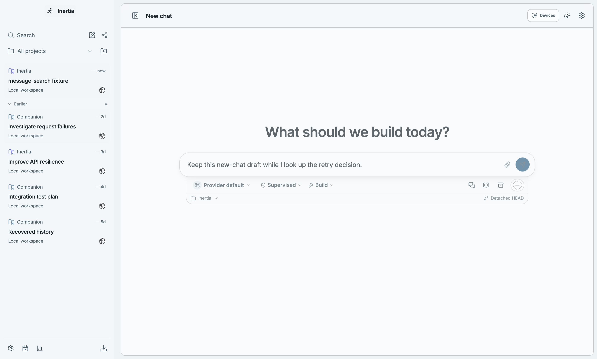

# Message search

Ctrl/Cmd+K now finds literal phrases in saved user messages and canonical final
agent answers across unarchived chats. Results include a highlighted text snippet,
project, chat title and message role. Opening a result focuses the exact saved
message, including in an existing split pane or detached window. Follow-up and
inferred legacy messages open their collapsed history sections; long requests
expand their full text. Composer drafts stay in their owning conversation.
Search also preserves an unsent new-chat draft across later chat and project
navigation and a full application restart until returning to New chat. The draft
keeps its original project and identity; ordinary draft dismissal still clears
only its own saved state.

## Implementation

The runtime searches the existing database through a dedicated read-only worker.
It reconstructs ordered content chunks, supports migrated turn IDs, and never
loads every conversation into the renderer. Append-only migration 70 adds a
covering chronology index; migrations 1–69 are unchanged. Search streams raw
message identities in index order and checks the deadline even for excluded
rows. Base text and ordered chunks are read individually with byte bounds and
deadline checks, without SQL sorting or aggregate text materialization. No new
dependency or preload method is introduced.

Queries are 2–200 UTF-16 code units after trimming. Results are ordered newest
first and capped at 20, with snippets capped at 240 code units. Searches stop
after a two-second scan budget or 256 MiB of text, skip individual messages over
16 MiB, and report incomplete results explicitly. There are at most two workers,
one current search per connection, and a five-second outer worker timeout.
Closing the palette, changing the query, disconnecting, or shutting down cancels
obsolete work. Query text and message content are not logged.

Result navigation validates project, conversation, turn and message ownership
again before switching chats or windows. The palette closes and the active draft
and view change only after selection succeeds. Failed selection keeps the query,
reports a retryable error, and preserves the draft and view; closing the palette,
changing its query, or a newer navigation invalidates pending frontend completion.
This does not cancel a conversation-selection command already sent to the runtime.
After an accepted selection, palette closure preserves the result’s pending focus;
Escape and cancellation still restore the prior control.
The lookup reads identities without
materializing message content. Detached clients cannot request global
searches, and focus notifications only reach the window owning the chat.
After the native window confirms ownership, an explicit detached focus request
retains the latest target through a loading or reconnecting client. Delivery
follows runtime hydration, expires after ten seconds and is bounded to twenty
pending conversation identities. Ordinary main-window validation queues nothing.
The detached subscription remains stable across snapshot and connection-status
updates so hydration cannot clear a pending navigation before the timeline mounts.
A pending target remains until the WebSocket send callback confirms a successful
transport write. Closing sockets and failed asynchronous writes retain it for
reconnect; a late completion for an older target cannot consume a newer one.
Transport write completion is not renderer acknowledgment.

## Verification

- Focused unit, DOM and contract checks passed. Coverage includes literal
  punctuation and Unicode; readable Markdown previews;
  canonical/chunked answers; archived and settled chats; legacy IDs; scan and
  result bounds; cancellation and shutdown; stale responses and result ownership;
  visible keyboard order; composition input; retry and focus; split/detached
  ownership; and the shared validators affected by bundling.
- The actual emitted worker searches a synthetic 100,000-message history while
  timers and concurrent database writes remain responsive. A final worker and
  persistence rerun passed after tightening the scan byte limit. The fixture
  uses actual RuntimeStore initialization and current migrations with explicit
  insertion columns; the workload and strict assertions remain unchanged.
- Two deterministic tests using the actual runtime transport and synchronization
  hub reproduced the dropped focus target with a controlled CLOSING socket, both
  during live delivery and hydration. All 28 focused transport/core cases then
  passed, including an asynchronous write failure and a late successful write
  that must not consume a newer target. Independent source review was clean.
- Query-plan and excluded-row regressions failed against the previous scan;
  a further chunk-history deadline case failed before individual bounded reads.
  Migration 70 preserves every released lineage entry and message row. Synthetic
  downgrade fixtures remove the unreleased index; blocked-startup and live-WAL
  checks compare the complete schema before and after the operation. The updater
  viability fixture uses public v0.0.54’s schema 69 as the actual predecessor and
  retains a failing migration control against an index-name conflict.
- Failed-selection DOM regressions reproduced premature palette closure and lost
  draft/view preservation. Cancellation, superseded import, retry and frontend
  ownership checks pass. The first desktop run caught two accepted-result focus
  failures (five of seven scenarios passed). A regression combining the palette
  with the real timeline focus controller reproduced prior-focus restoration
  interrupting a still-mounting result. After preserving accepted focus, all
  42 focused focus/overlay/controller cases and all seven desktop scenarios pass.
  The original failure logs and traces remain retained as verification evidence.
- `npm run check:quality`: passed (migration lineage, architecture, lint and all
  TypeScript projects).
- `npm run build:bundle`: passed with every existing budget unchanged. Unused
  schema construction is omitted, utility assets use compact hashed names, and
  search navigation loads on demand. Recovery actions also load on demand while
  their outcome-specific warning and native-preview suspension remain immediate.
  The measured main route is 734.1 KiB and
  core JavaScript is 1,976.0 KiB; the limits remain 736 and 1,977 KiB.
- Fresh Electron Playwright: all seven scenarios passed on macOS ARM64 in 12.1 s.
  They cover unloaded historical turns, saved and unsent-draft retention across
  projects, split/detached focus, compact layout, a full application restart,
  a follow-up buried inside a collapsed long historical turn, inferred legacy
  requests/answers/follow-ups (including a collapsed long request), and focus
  delivered after the owning detached window reconnects. The reconnect test
  holds the socket until the server acknowledges the focus intent and then
  checks both delivery and actual native focus. It reproduced the hydration
  cleanup defect before the subscription fix and passes afterward. The unsent
  new-chat draft scenario restarts the complete application and navigates to
  another chat before reopening New chat. Against the preserved `3c346e24` build
  (147 emitted JavaScript files checked by SHA-256), it failed at the composer
  assertion with an empty value. After the durable ownership fix and integration
  of main `7cf8cf91`, the identical test passed in 4.6 s. Three real-hook remount
  cases also verify direct restoration, later navigation, a restart with no
  selected chat, original project/model/identity, and unrelated draft retention.
- Full `npm run check`: passed on Node 22.23.2. All 722 active test files passed
  (7,748 tests passed; 14 files / 127 tests skipped by existing platform and
  environment conditions), followed by the production build and bundle gates.
  The test phase took 346.41 s with two workers.
- Windows, Linux and packaged installers have not been exercised locally.
  No live provider calls are needed or made by this feature.

## Actual application screenshots

These are unedited Electron screenshots produced by the feature-owned E2E test
using synthetic conversations and isolated temporary projects.

### Dark palette

### Compact light palette

### Matching historical turn

### Detached window

### Follow-up in a long historical turn

### Inferred legacy history

### Reconnected detached window

### Restored new-chat draft after restart

