# PR feedback tasks and provider continuation

Real screenshots of the built Electron app on macOS 27.0.1 (arm64) at device
scale 2, captured by `tests/e2e/pre-merge-confidence.spec.ts` and
`tests/e2e/provider-continuation.spec.ts` with `animations: "disabled"`. The
specs use deterministic review discussions and a synthetic conversation seeded
through `RuntimeStore`, with real runtime commands, checkout checks, context
persistence and restart validation. No live profile, credentials or provider
CLI is used. The same specs assert the layout they picture: no viewport
overflow, the composer dock invariant, one primary action in the route prompt,
the shared dialog backdrop, a single-baseline footer and no nested buttons.

The first Linux x64 captures of this feature came from
[CI run 36835732317](https://github.com/eduardtomas1/inertia/actions/runs/36835732317)
at `bdb033985b37911535a63504d33462612c13a3ab`.

## Review feedback in the Confidence dialog

The selection row aligns its checkbox with the thread checkboxes and uses the
dialog's own type sizes. "Address selected feedback" is a compact secondary
action, because Done stays the dialog's one primary button. Each thread is a
quiet card without the coloured stripe; the selected card takes the selection
surface, the checkbox sits on the first text line and the body and "Open
thread" link align with the author.

| Before | After |
| --- | --- |
| 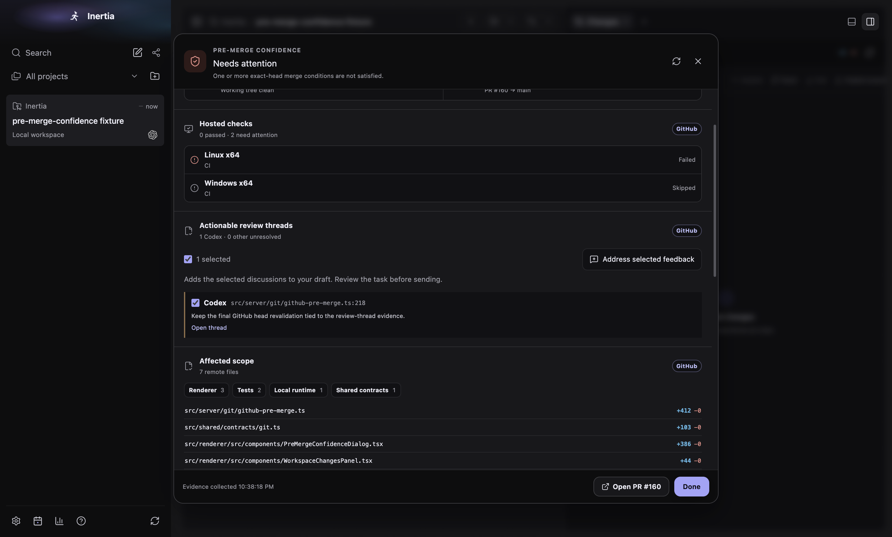 | 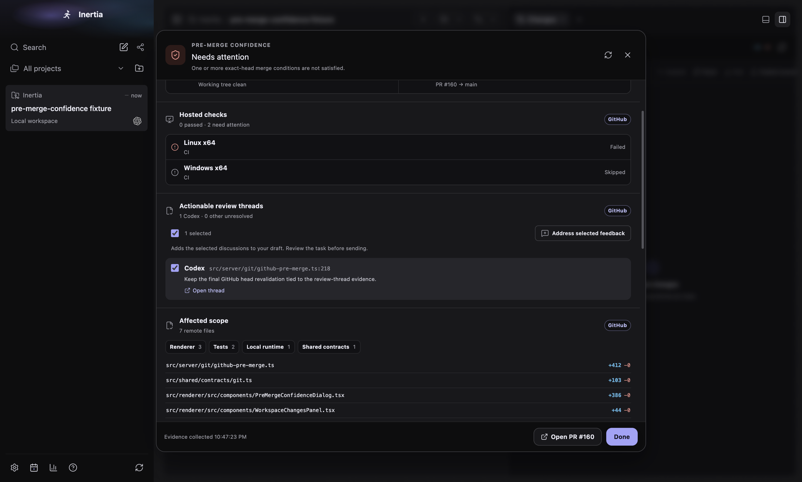 |
| 1440 × 920 dark | 1440 × 920 dark |
| 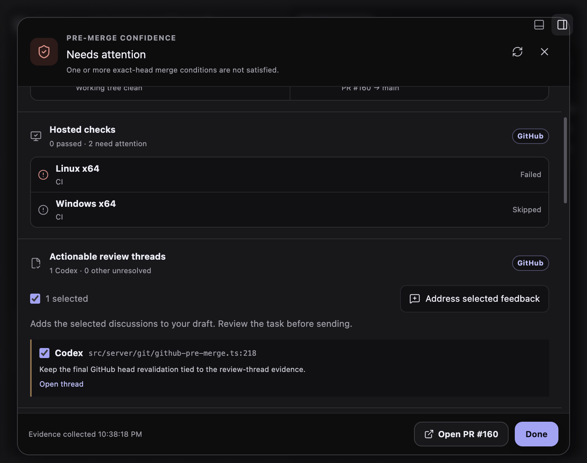 | 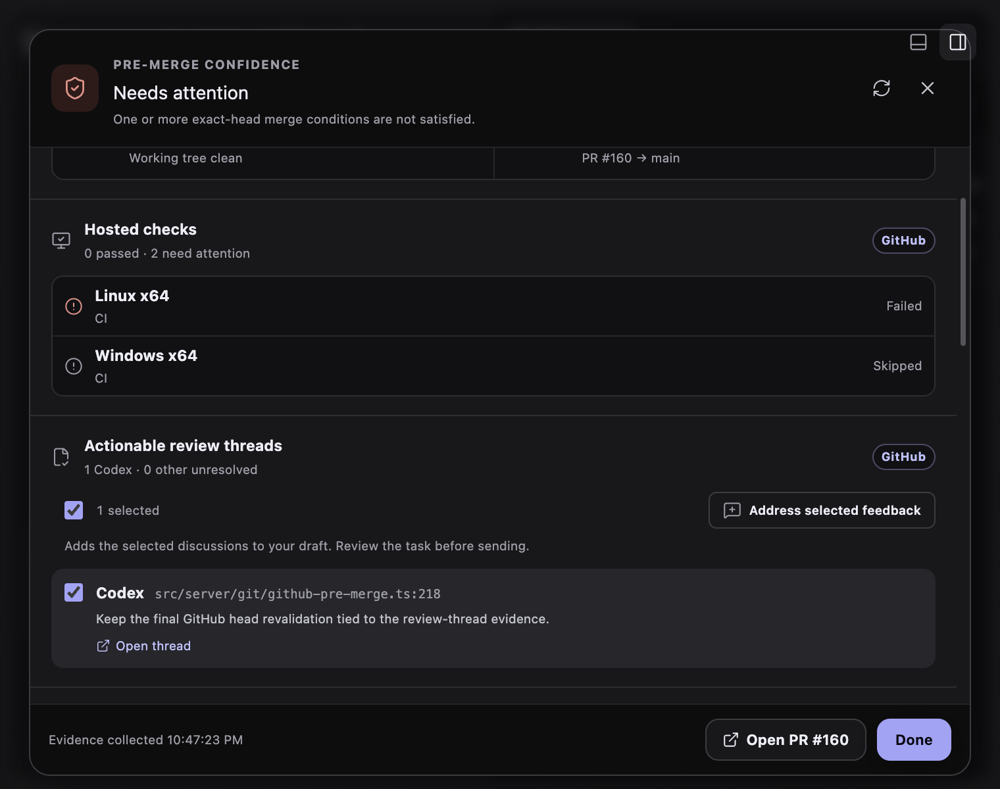 |
| 760 × 600 dark | 760 × 600 dark |

Other states: `pr-feedback-threads-dark-wide.png` (nothing selected),
`pr-feedback-selected.png` (light), `pr-feedback-selected-light-narrow.png`
and `pr-feedback-selected-dark-narrow.png` (1000 × 800). At 1000 × 800 the
sidebar paints over the Confidence dialog; that dialog is not portaled on
`main` either, so the overlap predates this change.

## Continue with context

The route prompt keeps one primary button. "Continue with context…" is now a
secondary action between Cancel and New chat, with an ellipsis because a dialog
follows.

The dialog now uses the shared `.dialog-backdrop` and `.commit-dialog` layer
instead of its own backdrop at z-index 1500 and its own shadow. The header
follows the dialog recipe (icon tile, title, one muted line "From … · Build ·
Supervised") and replaces the grey route slab. The body is the dialog's only
scroll container; messages are plain rows with a hover fill, five-line
excerpts and "Show more" for long ones, and unselected messages dim. The
instruction field uses the form-field recipe and grows with its content
instead of showing a resize grip. The footer is Cancel then "Create
continuation" on one baseline.

| Before | After |
| --- | --- |
| 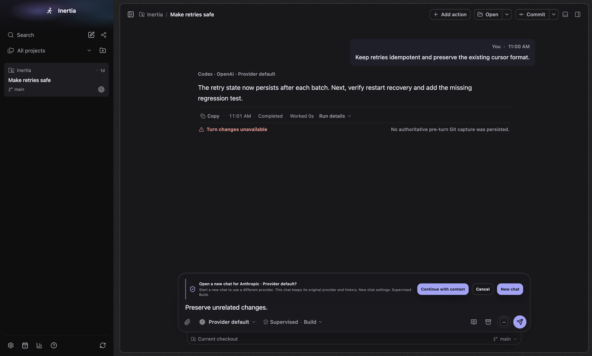 | 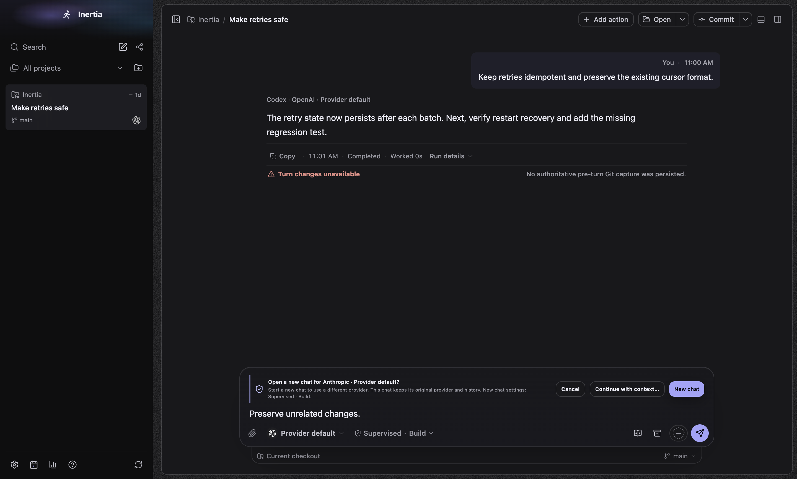 |
| 1440 × 920 dark. Two primary buttons | 1440 × 920 dark |
| 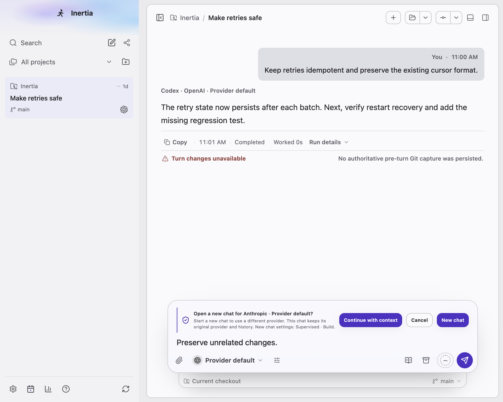 | 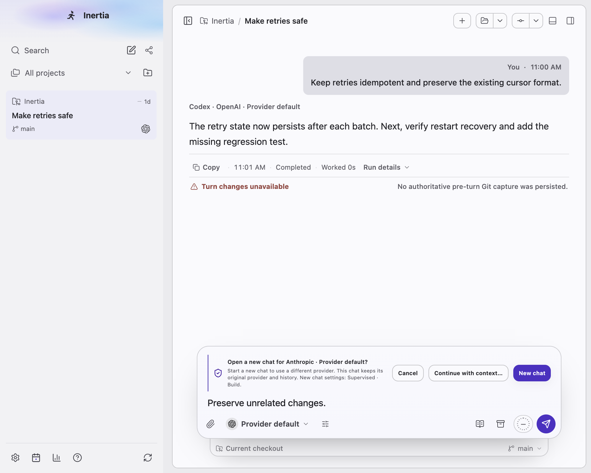 |
| 1000 × 800 light | 1000 × 800 light |
| 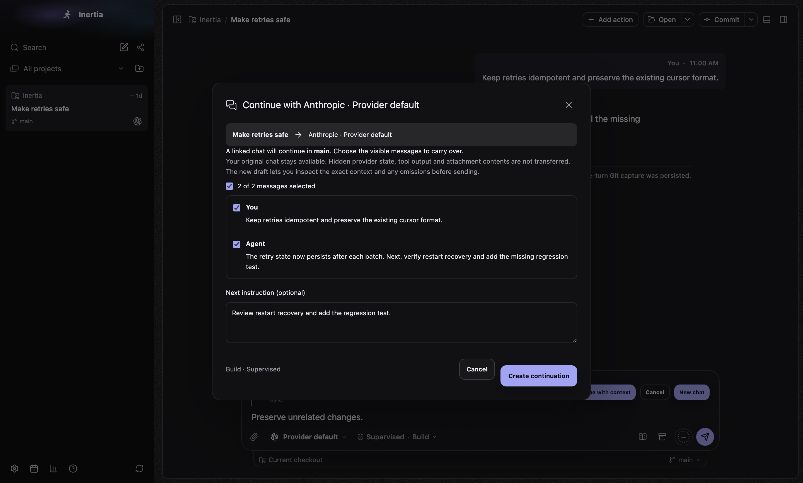 | 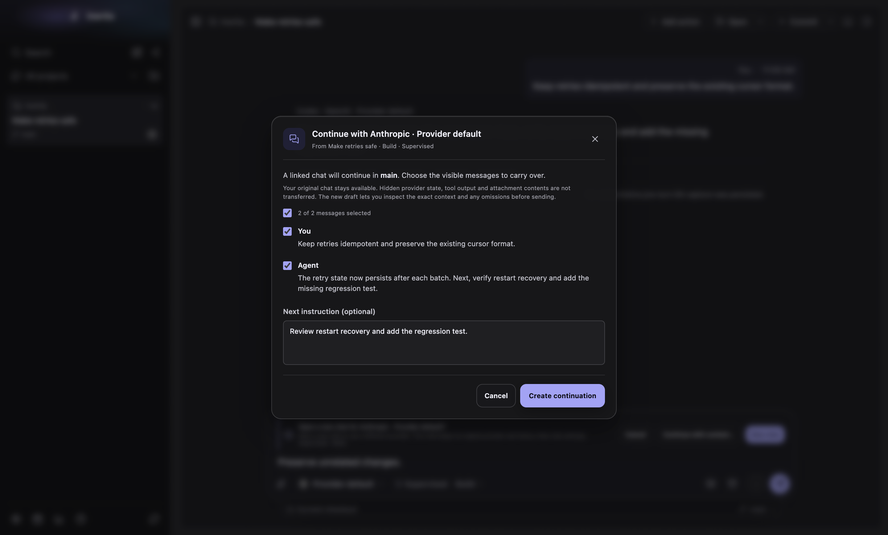 |
| 1440 × 920 dark | 1440 × 920 dark |
| 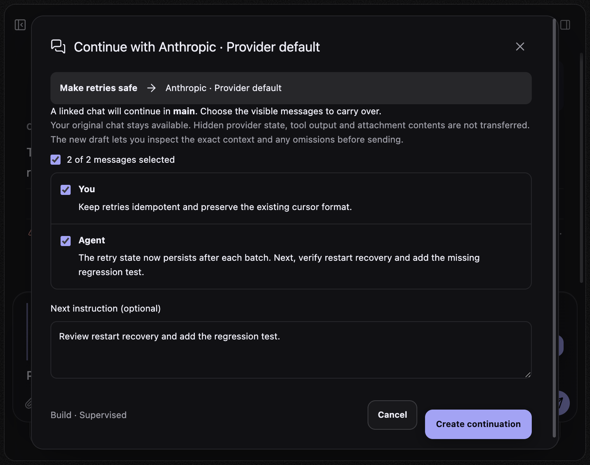 | 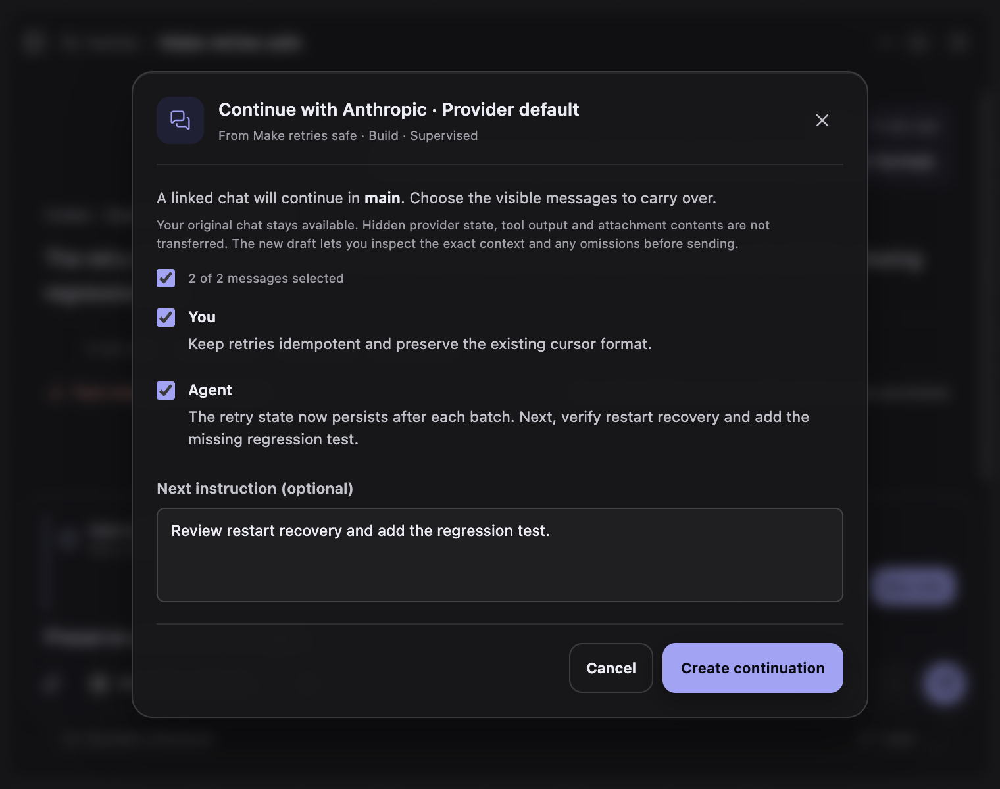 |
| 760 × 600 dark. The whole dialog, footer included, is one scroller | 760 × 600 dark. Only the body scrolls; header and footer stay put |

Other states: `provider-continuation-prompt-light-wide.png`,
`provider-continuation-preview.png` (light), `provider-continuation-preview-light-narrow.png`
and `provider-continuation-preview-dark-narrow.png` (1000 × 800), and
`provider-continuation-draft.png` (the linked context packet and preserved
draft after creation).

`renderer-bundle.json` records the production bundle measurements of the
feature and, under `uiPolish`, of this polish.
