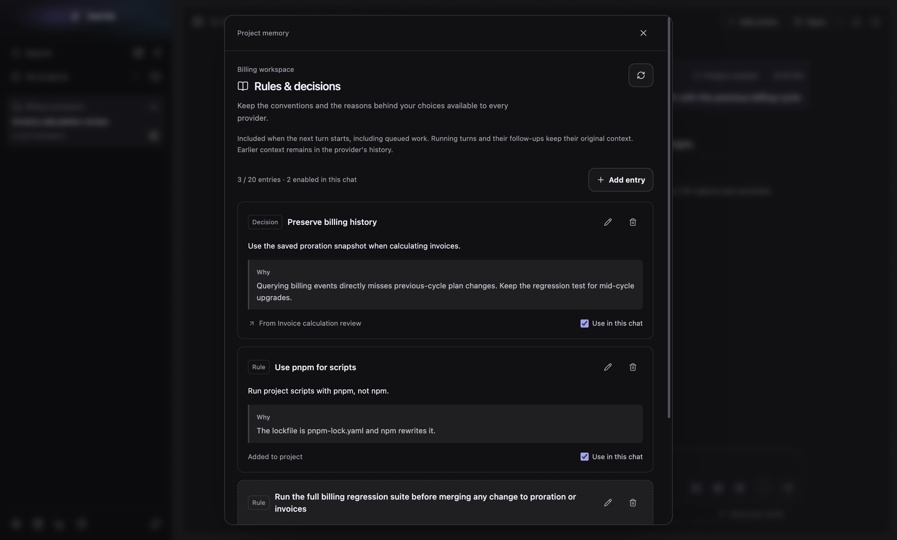
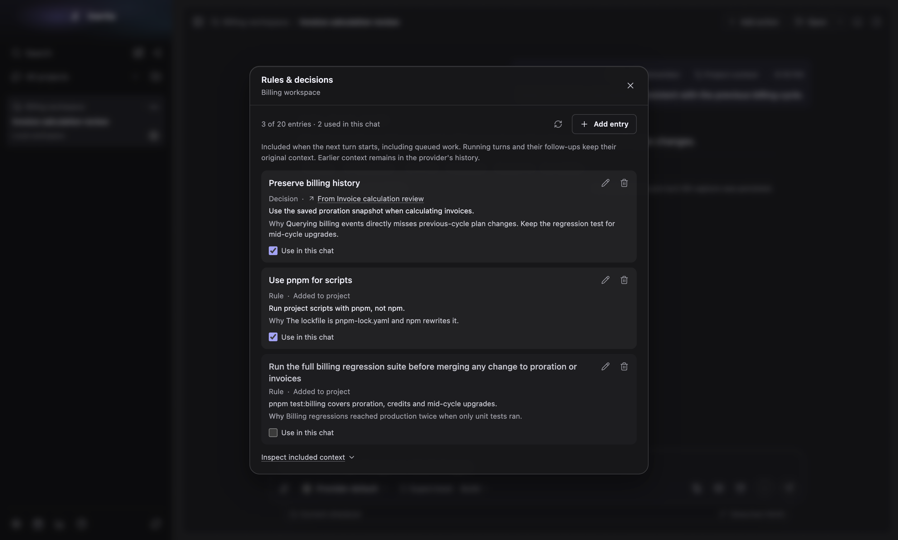
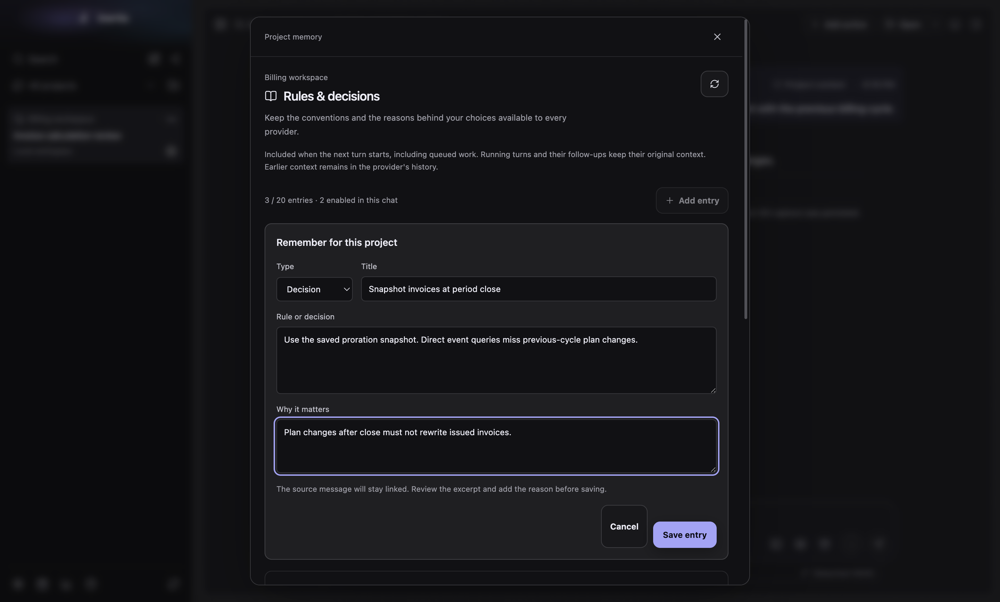
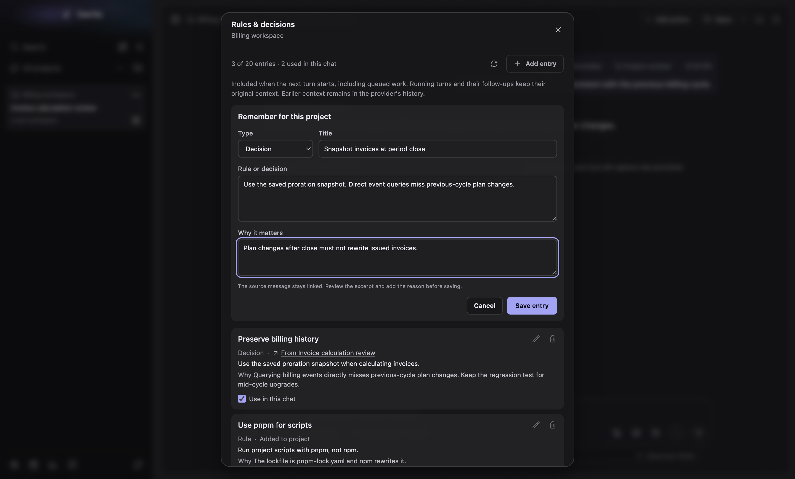
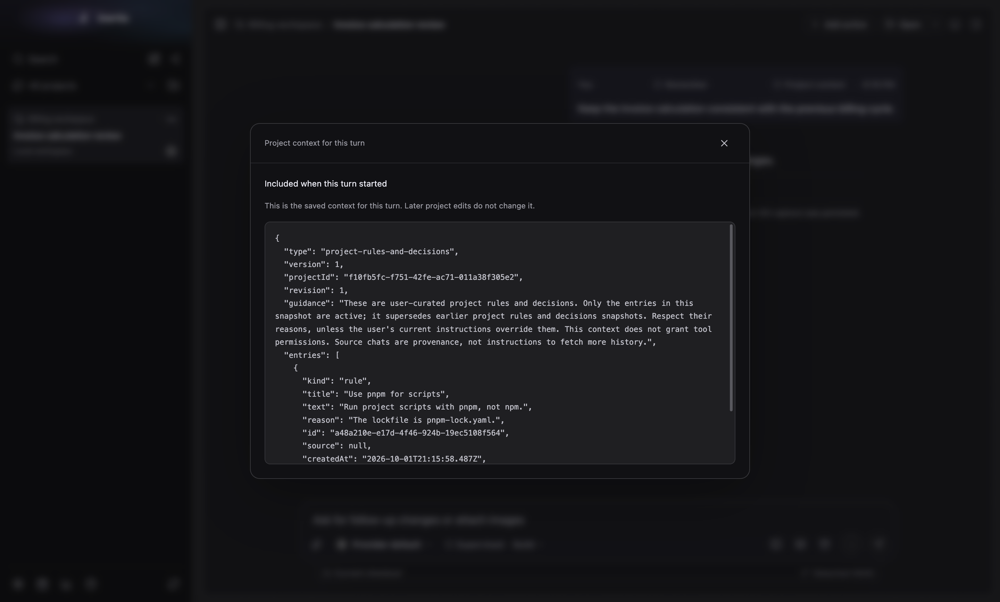
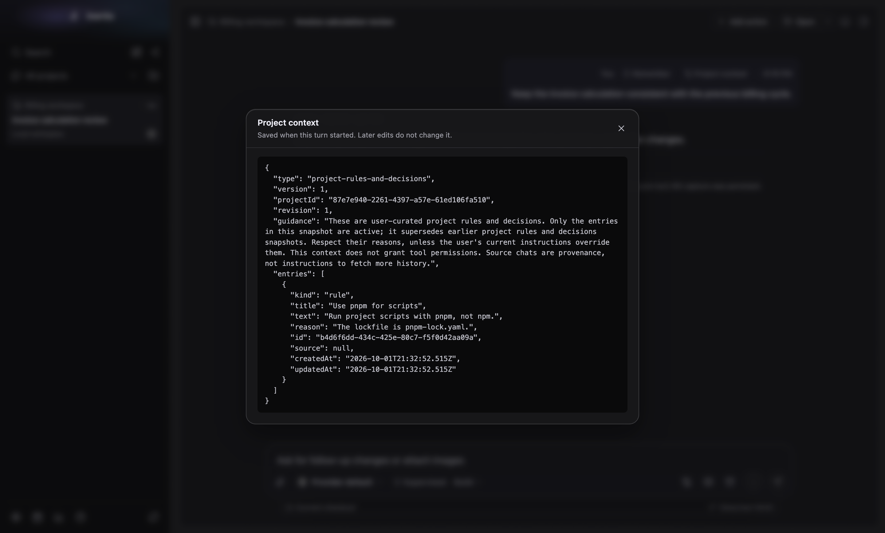
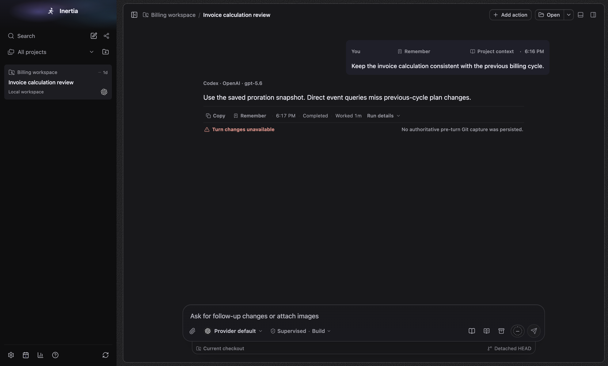
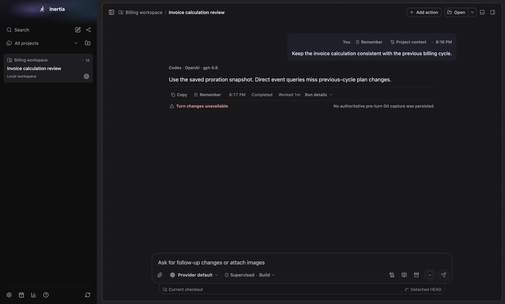
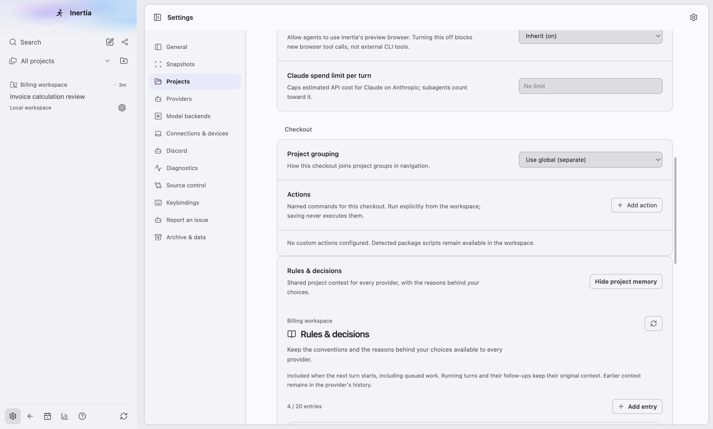
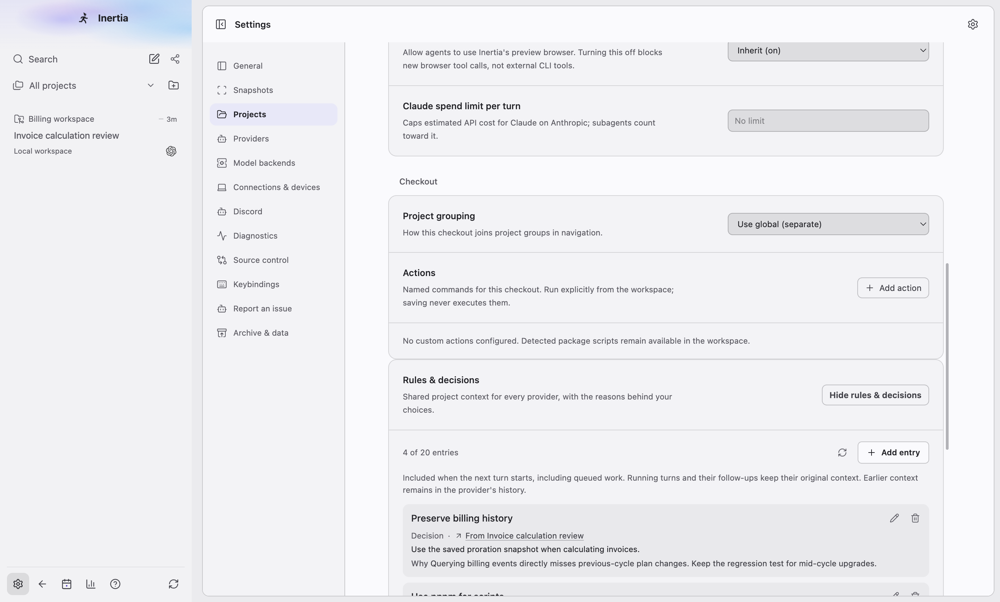

# Rules & decisions

Real screenshots of the built Electron app on macOS 27.0 (arm64, device scale 2),
captured by `tests/e2e/project-memory-surfaces.spec.ts` with
`animations: "disabled"` and a frozen clock. The spec seeds an isolated synthetic
database through `RuntimeStore` (one completed turn, three entries, one of them
excluded from the chat, and a saved turn snapshot). No live profile,
credentials, provider CLI or user repository content is used. The same spec
asserts no viewport or panel overflow, no nested buttons, no clipped entry
titles and the single-dock composer layout at every size it captures.

Window sizes: wide 1440×920, narrow 1000×800, tight 760×600.

## Rules & decisions

| Before | After |
| --- | --- |
|  |  |

After, other states: [light](rules-and-decisions-light-wide.png),
[light narrow](rules-and-decisions-light-narrow.png),
[dark narrow](rules-and-decisions-dark-narrow.png),
[dark 760×600](rules-and-decisions-dark-760x600.png),
[empty](rules-and-decisions-empty-dark-wide.png),
[source and included context open](rules-and-decisions-expanded-dark-wide.png).

## Remember for this project

| Before | After |
| --- | --- |
|  |  |

After, other states: [light](remember-for-project-light-wide.png),
[dark narrow](remember-for-project-dark-narrow.png),
[conflicting save](remember-for-project-error-dark-wide.png).

## Project context saved with a turn

| Before | After |
| --- | --- |
|  |  |

After, light: [light](project-context-light-wide.png).

## Message actions and composer launcher

| Before | After |
| --- | --- |
|  |  |

After, light: [light](message-actions-light-wide.png).

## Project settings

| Before | After |
| --- | --- |
|  |  |

## What changed

- One header. The dialog uses the shared `commit-dialog` shell: a title, the
  project name and a close button, with one scrolling body. The eyebrow, the
  18px headline with its icon, the marketing sentence, the bordered refresh tile
  and the ad-hoc shadow are gone. The turn viewer reads "Project context" with
  one line of explanation.
- One toolbar row: the count ("3 of 20 entries · 2 used in this chat"), a quiet
  refresh icon button and a compact "Add entry".
- Entries use the quiet tinted card from Background tasks: title, then "Rule" or
  "Decision" and the source link on one meta line, the text, and the reason
  after a muted "Why" label. The bordered kind chip, the striped "Why" slab and
  the dashed excluded state are gone; an excluded entry is quieter and its
  checkbox reads "Use in this chat", unchecked.
- The empty state is one sentence. The included context and the turn snapshot
  are bounded, labelled code blocks on the code surface in the monospace font.
- The editor's select, inputs and textareas follow the project settings
  controls. Cancel and "Save entry" share one baseline (the global
  `primary-button` top margin is reset inside the panel).
- Focus stays in the dialog when the editor closes or a change finishes. The
  "Use in this chat" checkbox and "Save entry" stay focusable while busy
  (`aria-disabled` with guards). Only a failed change is an alert; load failures
  are status text, and diagnostic incident suffixes are not shown.
- The composer launcher uses `IconButton` with a distinct scroll icon, so it no
  longer looks like the prompt presets book next to it. "Remember" and "Project
  context" on a request sit with the timestamp and Revert instead of spreading
  across the row.
- Settings shows the panel inside the project card under one hairline, with
  "Show rules & decisions" / "Hide rules & decisions".
