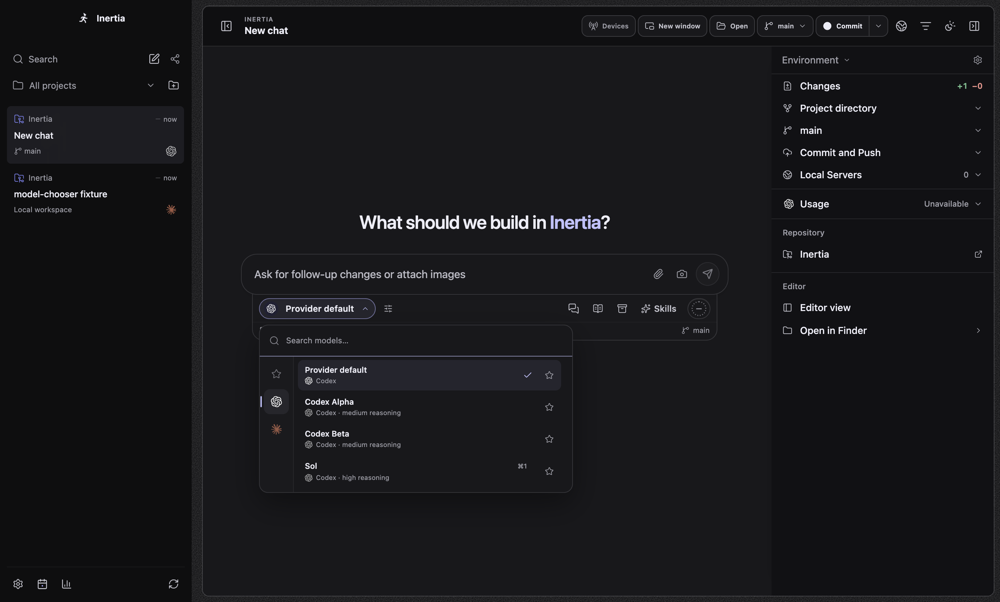
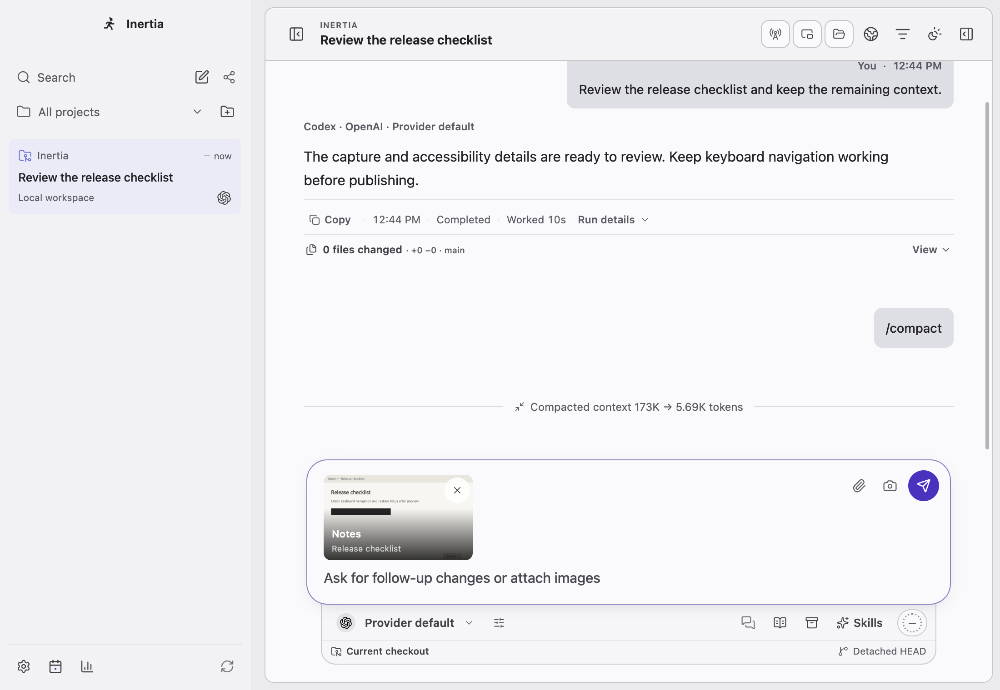
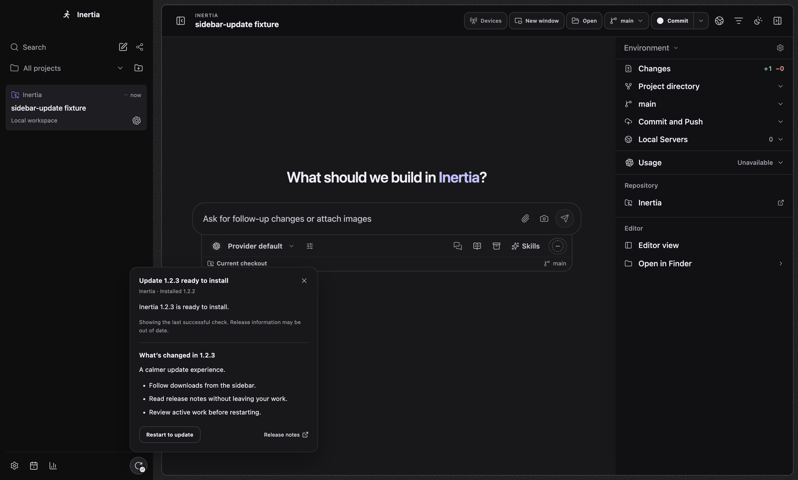

# Integrated v0.0.55 desktop evidence

Captured on macOS ARM64 from integration commit `60a244a1d0529af708705da3a99ea844b9ba5178`, with a clean Node 22 dependency installation and actual Electron rendering. The sample provider catalogs, update version and captured Notes window are controlled test fixtures. These images do not claim live-provider or published-update validation.

The six scenarios in `model-chooser.spec.ts`, `sidebar-update.spec.ts` and `snapshots-compaction.spec.ts` passed together with one worker in 29.6 seconds. Coverage includes both themes, narrow-window geometry, keyboard/focus, native IPC, attachment import/preview, retained compaction receipts and native Snapshot binding loading. Actual OS screen capture is permission-gated and was not exercised here.

