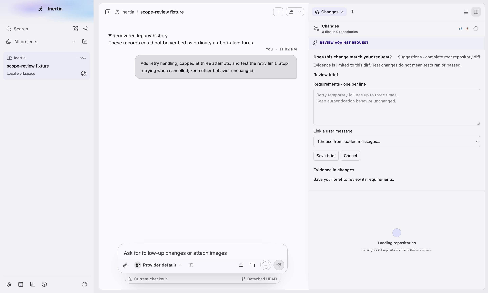
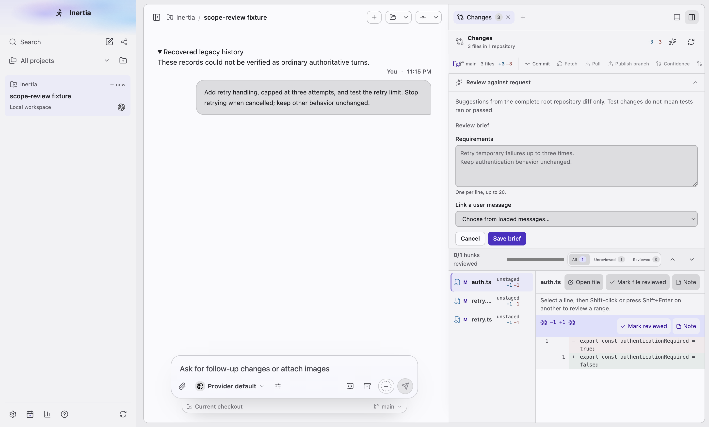
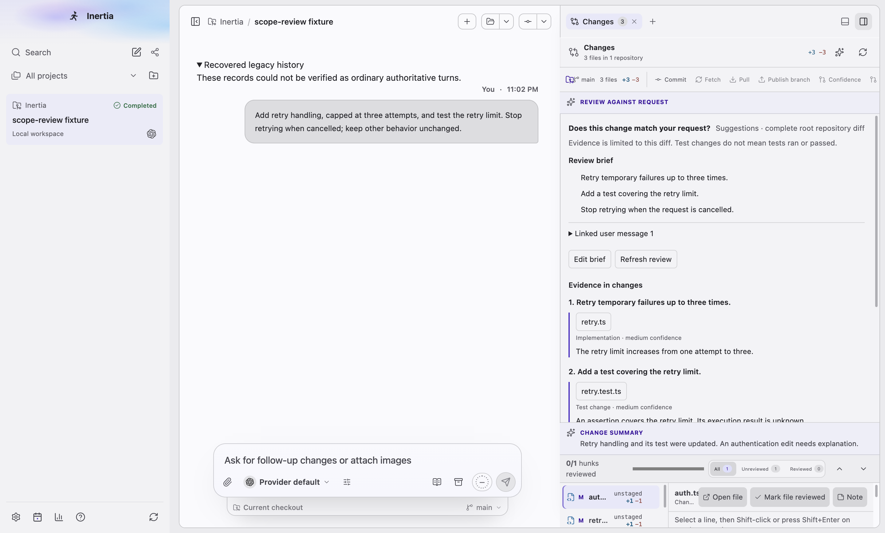
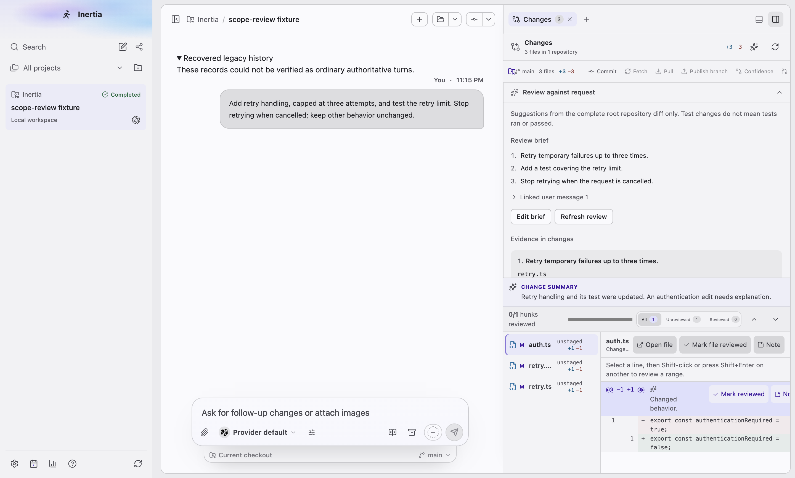
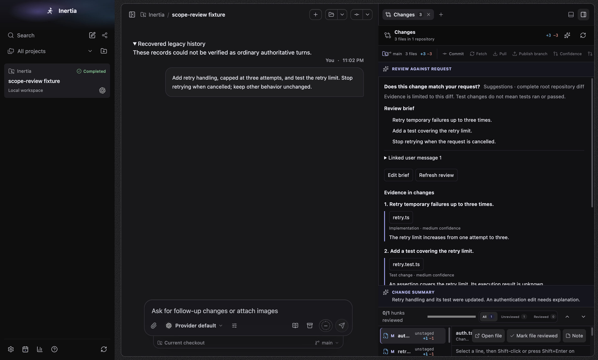
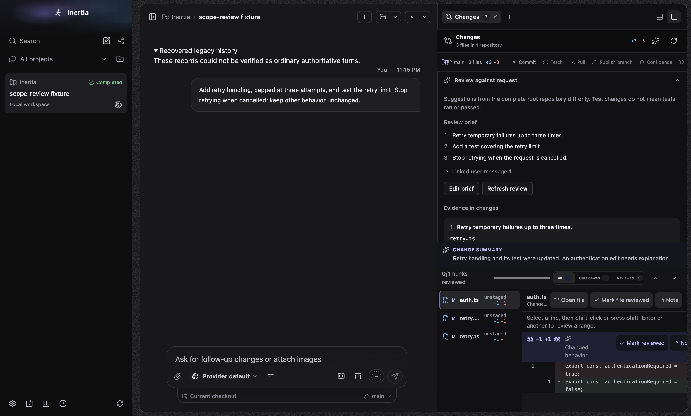
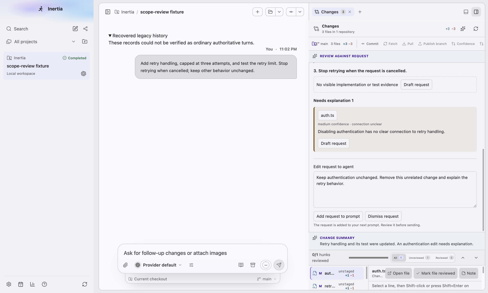
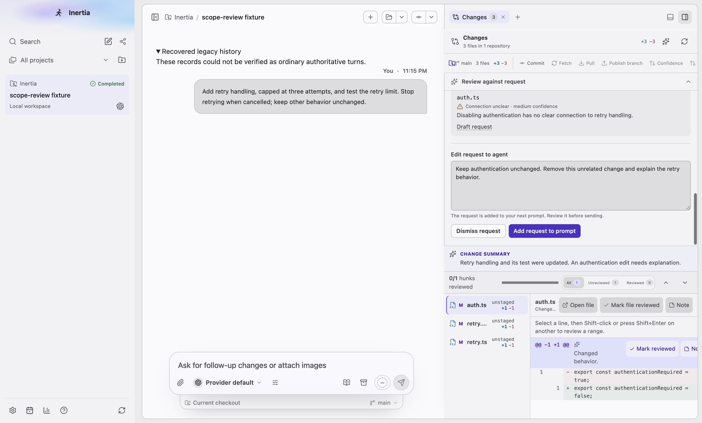
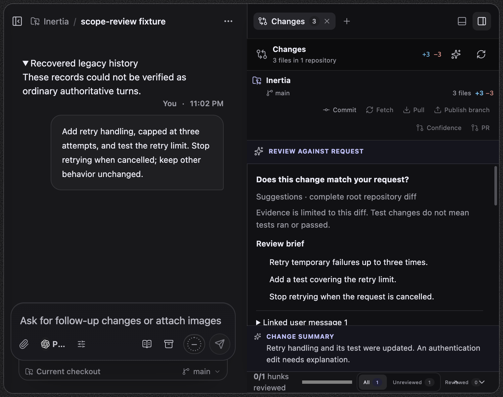
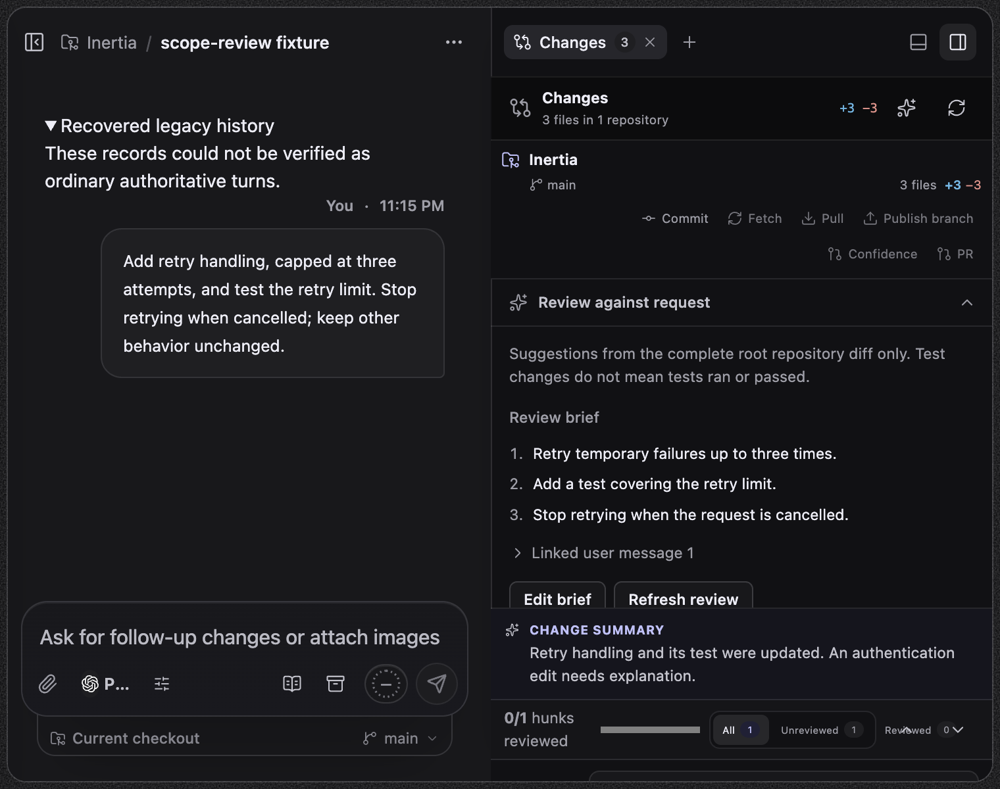

# Review changes against the request

The Changes panel accepts an editable review brief with links to user messages.
Review suggestions map changed hunks to those requirements, identify requirements
with no visible evidence, and surface unconnected changes under **Needs
explanation**. A finding becomes an editable request added to the next prompt.
Confidence and the limits of diff-only evidence remain visible: a test change
does not mean tests ran or passed.

## Screenshots

Real screenshots of the built Electron app on macOS 27.0.1 (arm64) at device
scale 2, captured by `tests/e2e/scope-review.spec.ts` with
`animations: "disabled"` and a frozen clock. The spec seeds a synthetic Git
workspace (`retry.ts`, `retry.test.ts`, `auth.ts`) and one user message through
`RuntimeStore`, and answers reviews with a deterministic Codex protocol fixture
that never contacts a live model. It holds the first review open until the spec
releases it, so the generating state is captured too.

"Wide" asks for 1440 × 1100; this display clamps the window to 1440 × 868.
"Narrow" is 1000 × 800 and "760 × 600" is the smallest supported window. Each
capture also asserts no viewport or panel overflow, no element escaping the
panel, no nested buttons, that the composer still ends at its dock, and that the
review takes at most 40% of the Changes panel so the diff stays visible.

### Before and after

"Before" is the branch at `06d50109`, captured with the same spec.

| Before | After |
| --- | --- |
|  |  |
| Empty brief, light. An uppercase accent "REVIEW AGAINST REQUEST" banner, then a second heading and a question | Empty brief, light. A quiet disclosure row, one muted caveat, labels above styled fields, Cancel then Save brief |
|  |  |
| Results, light. Requirements without numbers, a native summary triangle, bordered chip buttons; the review takes 58% of the window height | Results, light. Numbered requirements, a chevron disclosure, Refresh review as a secondary action; the diff stays in view |
|  |  |
| Results, dark | Results, dark |
|  |  |
| Draft request, light. A beige warning slab with a 3px stripe, a dashed missing-evidence box, two equal buttons | Draft request, light. Quiet cards, an icon and a word for "Connection unclear", Dismiss request then the one primary action |
|  |  |
| 760 × 600, dark. The review fills the panel | 760 × 600, dark |

### Every state after the polish

| State | Light | Dark |
| --- | --- | --- |
| Empty brief | [wide](scope-review-brief-empty-light-wide.png) | [wide](scope-review-brief-empty-dark-wide.png), [narrow](scope-review-brief-empty-dark-narrow.png) |
| Editing with a linked message | | [wide](scope-review-brief-editing-dark-wide.png) |
| Validation error after Save brief | [wide](scope-review-brief-error-light-wide.png) | |
| Generating | | [wide](scope-review-generating-dark-wide.png) |
| Results: brief and first requirement | [wide](scope-review-results-light-wide.png), [narrow](scope-review-results-light-narrow.png) | [wide](scope-review-results-dark-wide.png), [narrow](scope-review-results-dark-narrow.png), [760 × 600](scope-review-results-dark-760x600.png) |
| Results: requirement mapping, missing evidence, needs explanation | [wide](request-and-mapped-changes.png) | [wide](scope-review-findings-dark-wide.png) |
| Draft request from a finding | [wide](unexpected-change-request.png) | [wide](scope-review-draft-dark-wide.png) |
| Stale brief or diff with a kept draft | | [wide](scope-review-stale-dark-wide.png) |
| Refreshed review after the correction | [wide](refreshed-review-after-correction.png) | |

## UI polish

- The disclosure is a quiet full-width row (`.scope-review-toggle`): sentence
  case, muted icon, a chevron that turns with `aria-expanded`, hover and inset
  focus ring. It no longer borrows the uppercase accent "Change summary" banner.
- The panel drops its second header ("Does this change match your request?")
  and keeps one muted caveat line. Section labels are muted, sentence case.
- Fields follow the form recipe: label above, `--surface-muted` fill,
  `--border-strong`, control height token, help text linked with
  `aria-describedby` ("One per line, up to 20."). The requirements field is now
  named "Requirements", as its visible label reads.
- Requirements, evidence and unexplained changes use the quiet card (5% text
  fill, `--radius-medium`, no border); the accent and warning stripes, the
  beige slab and the dashed box are gone. Missing evidence and unclear
  connections carry an icon and a word. File paths and "Draft request" are
  quiet text links; "Linked user message" uses a chevron instead of the native
  triangle.
- One primary action at a time, secondary first: Cancel then Save brief, Edit
  brief then Review request (secondary once results or a draft exist),
  Dismiss request then Add request to prompt. Buttons share the small control
  size and the shared disabled opacity.
- Review request, Save brief, Cancel, Unlink, file paths and Add request to
  prompt use `aria-disabled` with guarded handlers, so focus stays on them when
  they become unavailable. The requirements field becomes read-only, not
  disabled, while saving.
- The stale-draft message is an inline warning notice above the actions; the
  findings column reads "Reviewing the changes against your brief…" while a
  review runs; errors appear in the danger colour next to the actions.
- All sizes, colours, radii and durations are tokens; motion is cancelled under
  reduced motion and cards keep a border under forced colours. The panel is a
  named container that splits into two columns from 640px and stays bounded at
  40% of the Changes panel with a thin scrollbar.

## Validation

- `tests/e2e/scope-review.spec.ts` with `--repeat-each=3`: 3 passed normally
  and 3 passed under 12 CPU-burning processes.
- `tests/renderer/scope-review.dom.test.tsx` covers focus staying on the review
  and request actions while they are unavailable, the field label and help,
  one primary action and action order, and the worded unexplained status.
- `npm run check:quality` and `npm run build:bundle` pass; see
  [measurements](bundle.json).

Review briefs use append-only schema 86. Source links must reference this chat's
user messages, input and output remain bounded, stale brief/diff results are
discarded, and concurrent windows receive detail invalidations. Existing legacy
summaries remain readable. No dependency or provider protocol changes.

## Not exercised

- Linux and Windows rendering; forced colours and reduced motion in a real
  window.
- A failed review from a real provider; the error presentation is captured
  through the brief validation error, which uses the same alert.
