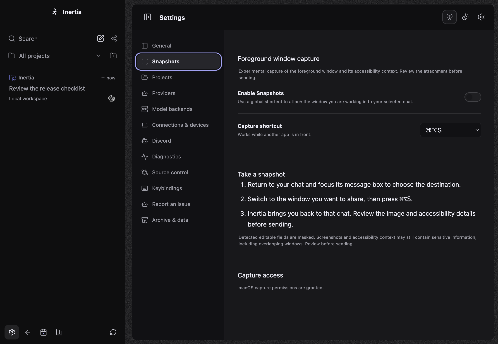
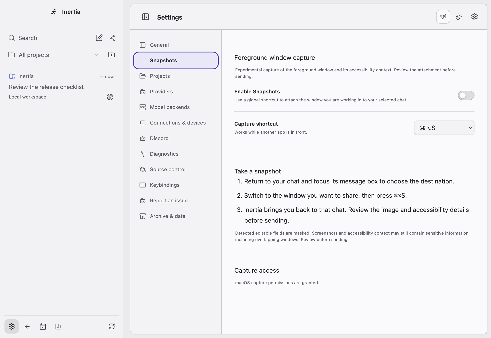
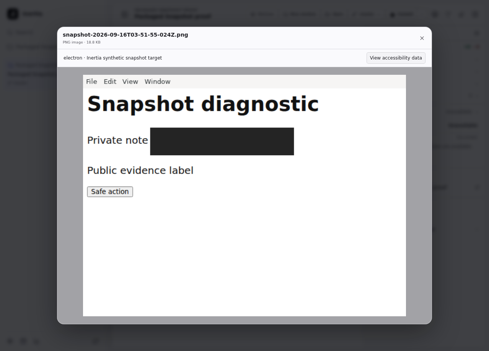

# Snapshots native capture and configuration review

Linux Chromium can expose a complete AT-SPI tree while its frame reports
`active: false`. With xa11y 0.14.0, `App.foreground()` then rejects even after
clicking/focusing the window. The former PR classified that failure but did not
restore capture. The X11 reader now obtains the window manager's active client,
PID, title and screen geometry and requires one matching accessibility window.
Its native window identity remains part of every pre/post-capture check. The
worker retains both accessibility scans, mask comparison, bounded retries and
fail-closed behavior. No raw native errors or window identities enter diagnostics.

The reader follows the [EWMH foreground/PID properties](https://specifications.freedesktop.org/wm/latest-single/)
and [Xlib property allocation rules](https://xorg.freedesktop.org/archive/X11R6.8.1/doc/XGetWindowProperty.3.html).
Xlib format-32 properties occupy native longs; reads check type, format, count and
remaining bytes, cap allocation, and free each returned buffer. It runs only in
the existing bounded utility worker on Linux x64/ARM64.

## Exercised behavior

- Ubuntu 24.04 ARM64, Electron 44.3.0, Xvfb/Openbox with real AT-SPI and private
  D-Bus session: the OS Ctrl+Alt+S event reaches `SnapshotService` and the actual
  utility worker. A native Chromium target is captured; editable text is absent
  from context and its pixels are masked. Disabling renderer accessibility
  refuses capture. This regression is committed in `snapshots-native.spec.ts`
  and Linux CI/release test prerequisites include its desktop tools.
- Negative control: run that same regression with the previous capture worker.
  It fails with “could not identify one active window” before the positive
  capture. Restoring the new worker passes.
- Actual unpacked Linux ARM64 package, unchanged Electron fuses: enable capture
  through the new Settings page, focus a real chat, activate a separate synthetic
  Electron window, send the OS shortcut, and inspect its received attachment in
  the real preview. The 640×480 PNG masks the private input, preserves public
  labels, and its context excludes the input sentinel. No capture/IPC response
  was injected. The isolated package uses the existing test profile/provider
  facility and local container `--no-sandbox` launch.
- macOS ARM64 Electron: three scenarios pass for dark/light configuration,
  keyboard navigation, persistent shortcut selection, attachment/compaction
  behavior, focus restoration, and utility-runtime native binding loading.
  Linux runs all four scenarios, including the native regression.
- Linux focused suite: 78 passed, one platform-specific skip. Covers failure
  propagation, changed identity, duplicate targets, missing accessibility,
  geometry and masking, worker cleanup, and settings state races.
- Full Node 22 `npm run check`: architecture, lint, types, unit/integration tests,
  build and renderer budgets pass (9,116 tests; 144 skips on macOS). The final
  cross-platform worker-to-alert test adjustment also passes focused on both
  Linux and macOS.

## UI and bundles

The composer camera/configuration button is removed. Settings → Snapshots owns
enablement, shortcut choice, capture instructions and permission guidance.
Failures still appear in the owning chat, including detached windows. Configuration
refreshes on returning from system permissions and rejects stale refresh responses.

The new page is lazy loaded and separately capped at 5.2 KiB (4.9 KiB measured).
No existing ceiling was increased: main first load 793.4/793.6 KiB, detached
607.1/607.3 KiB, core 2064.9/2067.1 KiB. Only the new module is subtracted from
core; shared dependencies remain charged there. The checker rejects eager imports.

## Limits

Native capture was exercised on Ubuntu ARM64/Xvfb, not the reporter's physical
x64 AppImage desktop. Hosted Linux x64 native coverage is a merge requirement.
Native macOS/Windows foreground capture was not exercised locally; existing
platform contracts, package checks and CI remain required. Chromium targets must
expose their accessibility tree; missing trees continue to refuse pixels with
specific instructions. Wayland remains unsupported.
