# Usage-limit reset actions

A failed chat on a supported native provider with a current, reported exhausted quota window gains **Resume at reset** and **Snooze until reset** in a row inside the composer, above the message field, like the composer's provider-readiness row. It appears in main, split and detached chats. It stays absent when there is no usable reset time.

Resume is explicit and cancellable. A durable plan pins the failed turn, route and reported account identity. At the reset, the runtime checks fresh quota and sends one continuation through the normal turn admission path. The plan's acceptance and the new turn are committed in one database transaction. A restart cannot repeat an accepted continuation; unaccepted work remains recoverable. Changed chats, account changes, unknown quota and interrupted cleanup require attention instead of guessing. Inertia must be running; reopening within an hour of a reset checks quota before proceeding. When a plan could first run more than an hour after its reset (the app was closed or the computer asleep), nothing is sent: the row shows "Resume missed" with "Resume now", which re-runs the same account and quota checks. A dispatch that returns without an accepted turn is marked for attention instead of being replayed after a restart. Snoozing only changes the existing sidebar snooze state and acknowledges the failed run; it never authorizes a continuation or spends reset credits.

## Reference

Inspected public [pingdotgg/t3code at c57a04b7](https://github.com/pingdotgg/t3code/tree/c57a04b722f2172e3be2c8f73c936d10b4582431), including the composer usage limits, thread error banner and sidebar snooze behavior. The supplied OV2 screenshot shows the two reset actions, but those actions were not present in that public revision. This implementation adapts the screenshot to Inertia's own persistence, runtime admission and renderer architecture.

## Account and quota limits

The scheduling path is shared across providers. Native account coverage:

| Provider | Source and scope |
| --- | --- |
| Codex | Native account/rate-limit RPCs; ChatGPT subscription routes. |
| Claude | Native SDK account and usage; first-party subscription routes. |
| Cursor | Dashboard usage API, CLI credential precedence, native macOS Keychain or the CLI's platform credential file. Overall and model-family windows are attributed separately. |
| Kimi Code | The official CLI's usage endpoint, selected managed model and configured OAuth/API credentials. The provider owns OAuth renewal; expired or rotated credentials require attention rather than a guessed account. |
| OpenCode Go | The chat workspace's effective native SDK inventory selects the Go model, endpoint and credential, including project overrides. Other OpenCode backends cannot borrow Go quota. |
| Antigravity | Its current CLI protocol exposes no subscription reset time. Limits reports this explicitly; no timer is invented. |

Inspected T3's `cursorUsageLimits.ts` and `openCodeUsageLimits.ts`, and official [MoonshotAI/kimi-cli at 9ab1286b](https://github.com/MoonshotAI/kimi-cli/tree/9ab1286b8fe4e6bcd116949a27ce5e0ac3389c82), including its shell usage reader, configuration, ACP model IDs and credential precedence. OpenCode uses Inertia's existing managed SDK process and installation ownership instead of assuming a global credential file matches the chat. Provider credentials stay in their existing stores and are never saved to Inertia's database or exposed to the renderer. Cursor's macOS Keychain login is read only when the user opens or refreshes Limits. The chat row's automatic read, the periodic Limits refresh and the scheduler never touch the Keychain. One explicit read asks the Keychain once; it may show the normal macOS access prompt. Because the scheduler cannot read that login at the reset, Keychain-backed Cursor accounts offer snooze but not automatic resume. The native binding is packaged and loaded only on macOS.

Native API quota windows determine the time: when several applicable windows are exhausted, use the last reset. Unknown timestamps, stale reports, custom backend routes and unknown exhausted model windows do not invent an offer. Numeric overflow, negative usage and non-finite or out-of-range remaining percentages cannot authorize a resume. Known Claude windows for other model families are excluded.

Cursor, Kimi and OpenCode usage responses carry no account ID. Every resume identity is an HMAC-SHA-256 keyed by a random per-install secret that Electron's credential vault creates and holds, so the database never stores a token or its plain hash. For an API key (Kimi API key, OpenCode Go key) the HMAC covers the key, which stays the same until the user replaces it. For a session token (Cursor login, Kimi OAuth) it covers the token's issuer and subject claims, decoded without being trusted for anything else, so a renewal for the same account keeps the identity. A session token without those claims offers snooze only and the row says why. Without the vault key, automatic resume is unavailable and snooze remains. The identity pins credential continuity without granting reset-credit authority. It stays in the privileged account cache and resume-plan identity; public usage snapshots omit it and the IPC schema rejects it. Chat-scoped account reads use a private cache and never replace the Limits page's accounts. Verified Codex account IDs are used when available. Otherwise, the same keyed HMAC over the native API's reported email, organization and plan detects changes in those fields.

The row reads an account automatically only when the provider tagged the failure as a usage limit through a structured signal: Codex's `usageLimitExceeded` error info and Claude's typed `rate_limit` assistant error. Cursor, Kimi Code and OpenCode Go report no structured signal. Their rows use the account report from the last Limits read (opening or refreshing Limits) or an earlier chat read, and otherwise stay hidden until Limits is opened. Their quota windows do not depend on the chat's model: the chat model only selects the credential and route, and OpenCode quota applies only to Go models. Resume at reset and Snooze always re-read the account with the chat's exact model and folder before acting. This is not a verified account ID and is never used to authorize credit redemption. A provider workspace change that preserves all reported fields cannot be distinguished by these APIs. Missing account metadata disables automatic resume while leaving snooze available.

## Screenshots

Captured on macOS (Apple silicon) at device scale 2 from the production Electron renderer by `tests/e2e/limit-reset-appearance.spec.ts`. The spec seeds synthetic failed turns and a blocked plan through `RuntimeStore` and uses a fake Codex app server that reports an exhausted five-hour window; no real provider runs. The renderer clock is frozen. The same run asserts the composer dock invariant (`expectComposerEndsAtDock`), no viewport overflow, that the row stays inside the dock without clipped or nested buttons, and that focus stays on the action through busy and replaced states. The Codex quota toast is dismissed before capture. "Before" images are the previous head (`c8946f6f`) captured by the same scenario.

| State | Before | After |
| --- | --- | --- |
| Offer, dark | 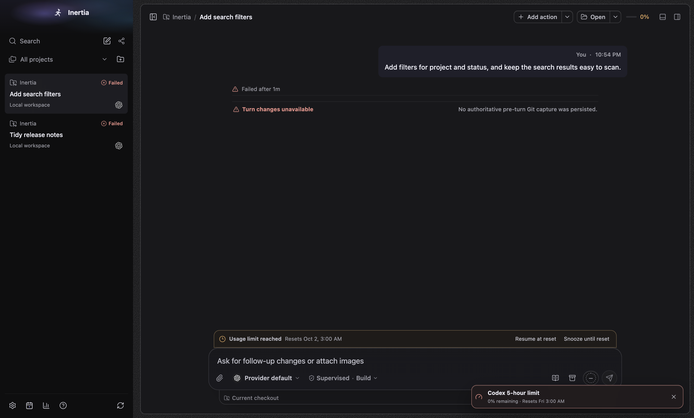 | 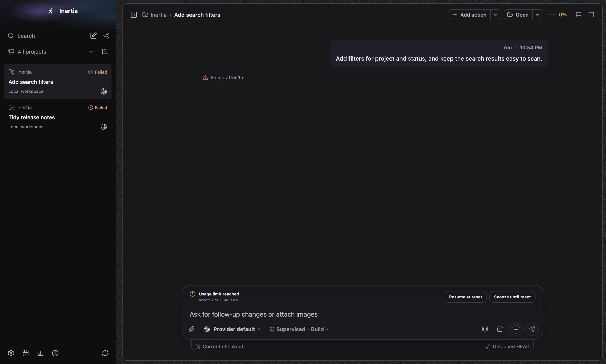 |
| Offer, light | 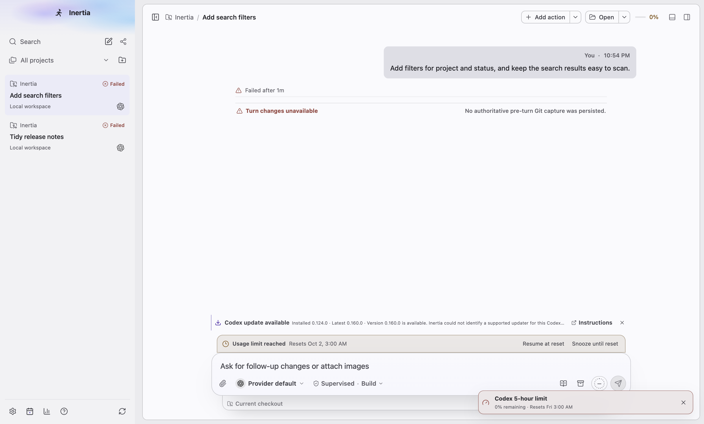 | 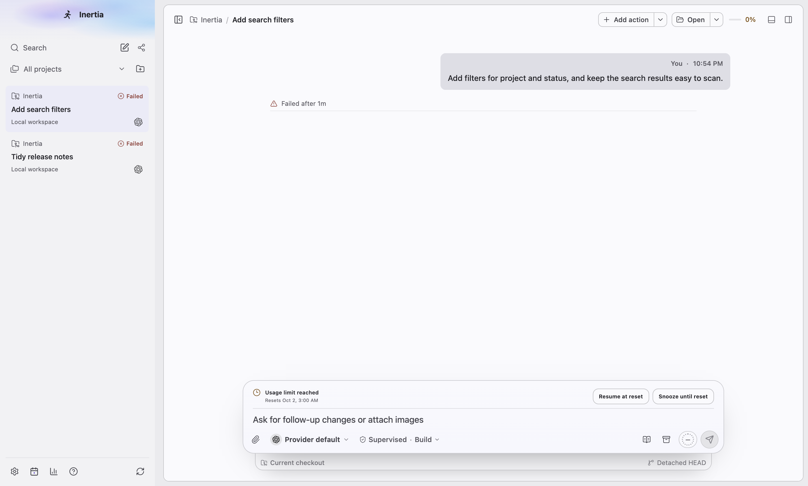 |
| Offer, 760×600 | 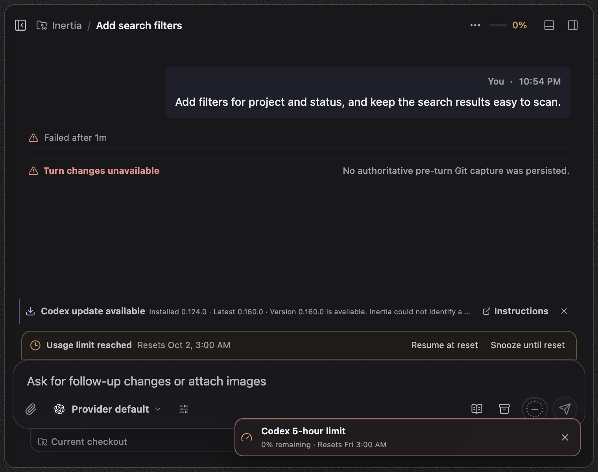 | 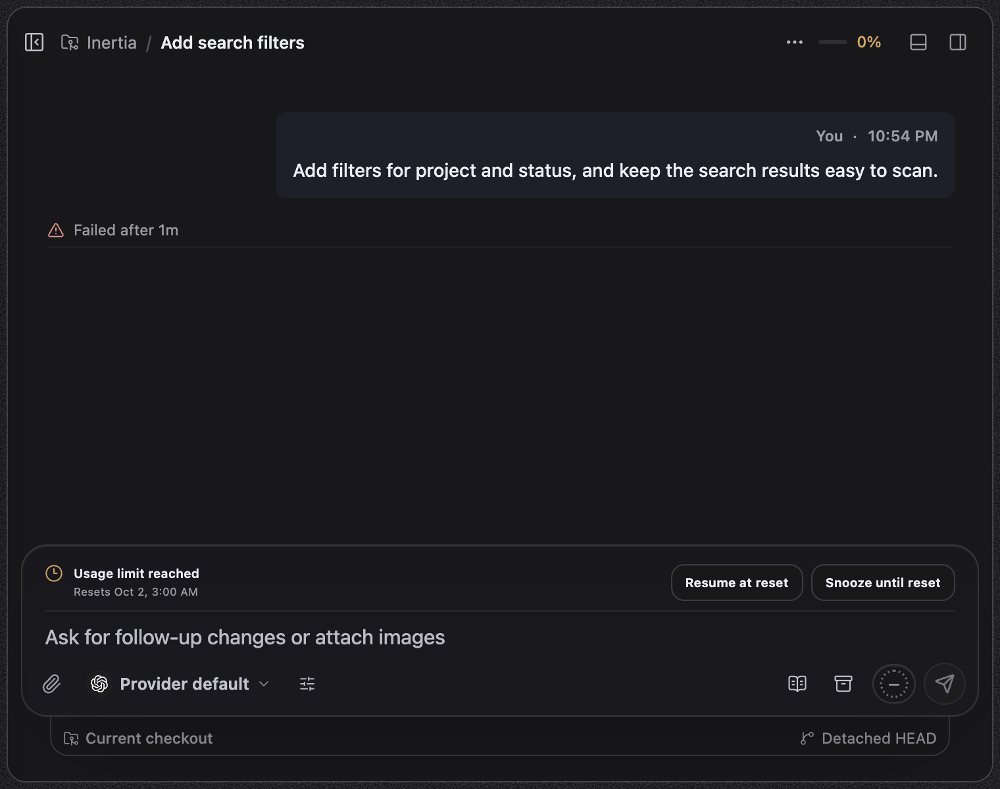 |
| Failed action, dark | 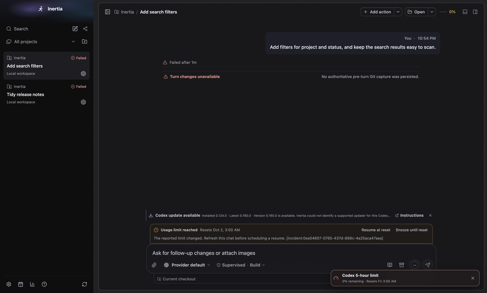 | 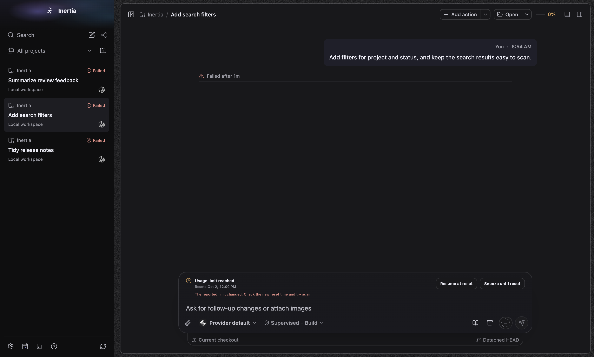 |
| Scheduled, dark | 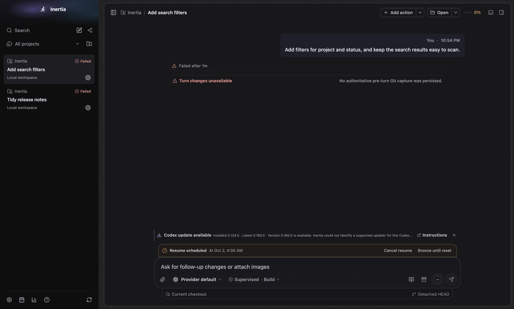 | 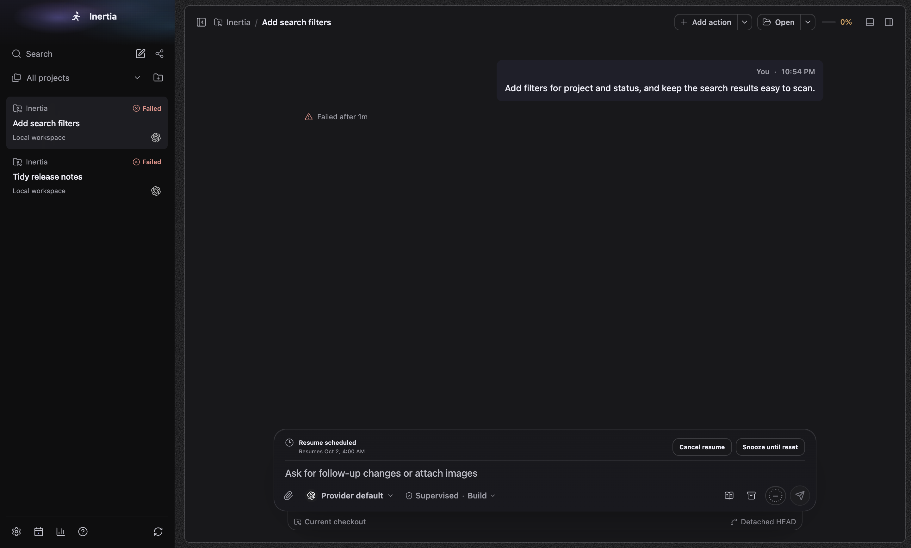 |
| Scheduled, narrow dark | 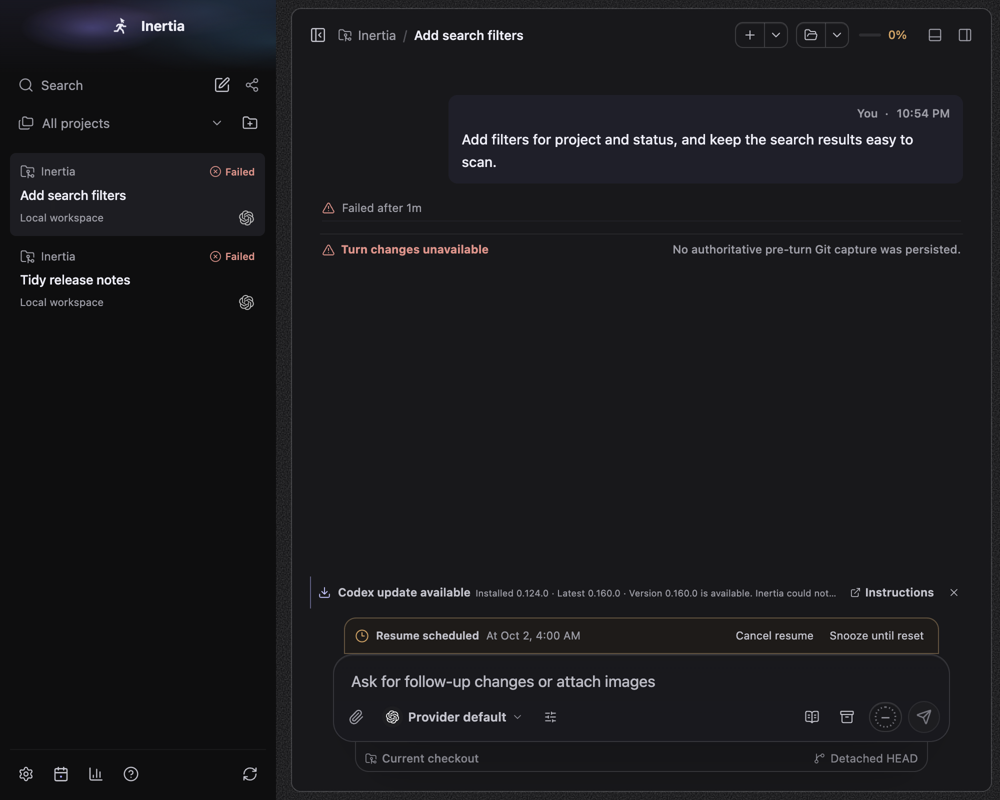 | 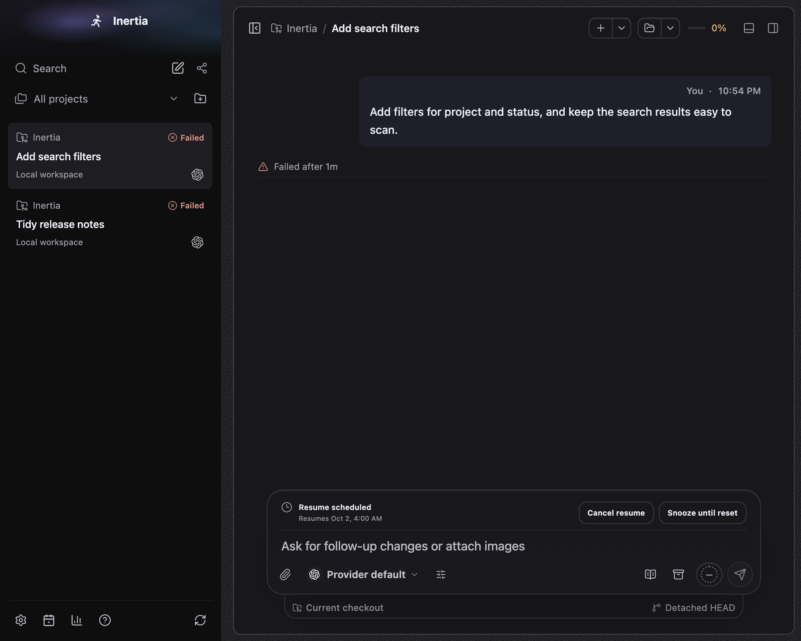 |
| Blocked, light | 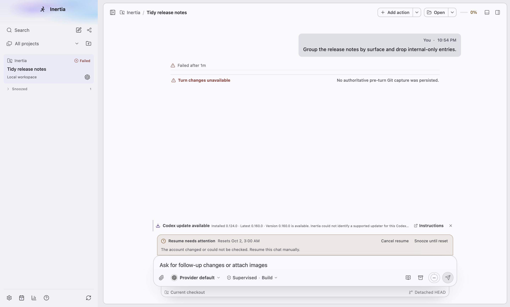 | 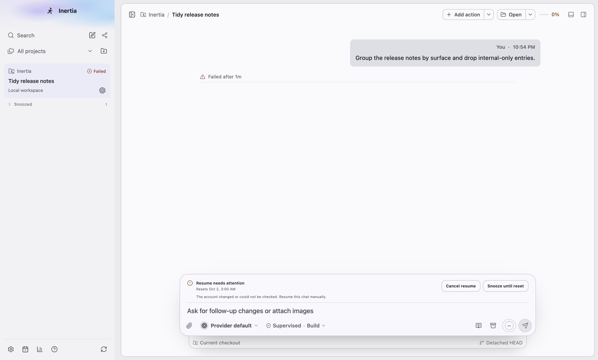 |

Further after captures: `limit-reset-offer-light-narrow.png`, `limit-reset-offer-dark-narrow.png`, `limit-reset-light.png`, `limit-reset-light-narrow.png`, `limit-reset-snoozed-dark.png`, `limit-reset-blocked-dark.png`, `limit-reset-blocked-light-760x600.png`.

## UI polish

- The row moved from a tab-shaped amber box above the dock into the composer's input zone as a zone row with the composer separator, so `.composer-shell` again ends at the dock and only `.chat-goal-control` may precede it.
- Title in `--text`, reset time in `--text-muted` with tabular numerals, all sizes from the interface-scale tokens; no literal font sizes, radii or tinted panel.
- The actions are compact secondary buttons with a resting outline, hover, pressed (motion-safe) and focus states. Unavailable actions use `aria-disabled` with click guards at `--disabled-opacity`, so focus stays on the button while a command is busy and moves straight to "Cancel resume" after scheduling.
- A failed command is an alert in danger text without the `[incident:…]` reference; a blocked plan's explanation stays a passive status line. Blocked plans show an alert icon; scheduled plans use a muted clock; the scheduled time reads "Resumes …".
- The row is a labelled group ("Usage limit") inside the composer region instead of a second region landmark.

## Validation

Focused tests cover durable restart, atomic acceptance, cancellation during preparation and persistence, stale routes and accounts, bounded quota retries, independent snooze, actual standard turn admission, renderer ownership and polling races, strict IPC and migration lineage. Electron appearance tests cover both themes, the composer dock invariant, focus continuity and narrow-window overflow. Renderer budget deltas are recorded in `renderer-bundle.json` and preserve the prior headroom.

After merging main (1113506e), on macOS arm64 with Node 22: quality checks, the full suite (12,226 passed, 149 skipped, 0 failed), the production build with renderer budgets, the portable suite (2,363 passed, 10 skipped), the Windows Codex, Linux packaging and native architecture checks all pass. Both limit-reset Electron specs pass three times normally and three times under 12 CPU-burning processes, with no real provider. Live provider accounts, a real macOS Keychain prompt, and Windows and Linux packages require their normal CI or platform validation.
